# 1、Vue核心

## 1.1、Vue简介

### 1.1.1、Vue官网

中文：https://cn.vuejs.org/

英文： https://vuejs.org/

### 1.1.2、介绍

动态构建用户界面的渐进式 JavaScript 框架

### 1.1.3、Vue特点

+ 遵循 MVVM 模式
+ 编码简洁, 体积小, 运行效率高, 适合移动/PC 端开发
+ 它本身只关注 UI, 也可以引入其它第三方库开发项目

### 1.1.4、与其他JS框架关联

+ 借鉴 Angular 的模板和数据绑定技术
+ 借鉴 React 的组件化和虚拟 DOM 技术

### 1.1.5、Vue周边库

+ vue-cli: vue 脚手架
+ vue-resource
+ axios
+ vue-router: 路由
+ vuex: 状态管理
+ element-ui: 基于 vue 的 UI 组件库(PC 端

官网收录的插件库：

+ [vuejs/awesome-vue: 🎉 A curated list of awesome things related to Vue.js (github.com)](https://github.com/vuejs/awesome-vue)
+ [awesomejs.dev](https://awesomejs.dev/for/vue/)

## 1.2、Vue实例和容器的关系

Vue实例(`new Vue()`)和容器(挂载点`el`)必须一一对应：

+ 多对一，不行
+ 一对多，不行

## 1.3、*模版 语法*

html 中包含了一些 JS 语法代码，语法分为两种，分别为：

+ 插值语法（双大括号表达式{{}}）
+ 指令语法（以 v-开头）

### 1.3.1、插值语法

+ 功能: 用于解析标签体内容

+ 语法: {{xxx}} ，***xxxx 会作为 js 表达式解析，xxx为表达式***

  > xxx其实就是vue实例的属性，所以xxx可以为vue实例中的任何属性：
  >
  > 

### 1.3.2、指令语法

+ 功能：*** 解析标签属性、解析标签体内容、绑定事件***
+ 举例：v-bind:href = 'xxxx' ，***xxxx 会作为 js 表达式被解析***
+ 说明：Vue 中有有很多的指令，此处只是用 v-bind 举个例子

## 1.4、数据绑定

### 1.4.1、单向数据绑定

即vue中定义的变量值变化可以应用到dom页面元素中，但是**dom页面元素中值的变化不会影响到vue中的变量值**

+ 语法：`v-bind:xxx='***'`或者简写为`:xxx='***'`

  > 其中xxx表示标签属性，***为表达式

+ 特点：**指定从vue中的data流向页面**

### 1.4.2、双向数据绑定

即vue中定义的变量值变化可以应用到dom页面元素中，**dom页面元素中值的变化也会影响到vue中的变量值**

+ 语法：`v-model:value='xxx'`或者简写为`v-model='xxx'`

  > 注意：
  >
  > 1. xxx为变量，不能写表达式
  > 2. `v-model:value`只适用于表单类标签，有value属性的，能让用户输入的

+ 特点：**数据不仅可以从vue中data流向页面，当页面数据发生变化也会应用到vue中的data**

## 1.5、el与data的两种写法

### 1.5.1 el

#### 1.5.1.1 第一种写法

```html
 <script type="text/javascript">
        const app = new Vue({
            el: '#root', //挂载点在内部
            data: {name:'yaord'}   
        });
    </script>
```

#### 1.5.1.2 第二中写法

原理就是借助底层方法，推荐：

```html
<script type="text/javascript">
    const app = new Vue({
        //el: '#root', 
        data: {name:'yaord'}   
    });

    //可以使用函数玩花活,2秒后才会变化
    setTimeout(()=>{
        app.$mount('#root');
    },2000);
</script>
```


### 1.5.2 data

#### 1.5.2.1 第一种写法

```html
 <script type="text/javascript">
        const app = new Vue({
            el: '#root', //挂载点在内部
            data: {name:'yaord'}   
        });
    </script>
```

#### 1.5.2.2 第二种写法

```html
<script type="text/javascript">
    const app = new Vue({
        data: function(){ 
            //这里的this是app，即vue实例
            return {
                name: "yaord"
            }
        }
    });
    setTimeout(()=>{
        app.$mount('#root');
    },2000);
</script>
```

> **注意：**
>
> 1. 如果data后面的函数是箭头函数，即匿名函数，因为**箭头函数没有this指向**，所以内部的this会指向上一级，在浏览器中上一级就是window对象
>
> 2. data后面的函数可以简写为：
>
>    ```javascript
>    data(){ 
>        //这里的this是app，即vue实例
>        return {
>            name: "yaord"
>        }
>    }
>    ```

## 1.6、MVVM模型

+ M：模型(Model) ：对应 data 中的数据
+ V：视图(View) ：模板
+ VM：视图模型(ViewModel) ： Vue 实例对象


## 1.7 数据代理

### 1.7.1 Object.defineProperty

+ 正常定义对象：

​		**这样定义对象，里面的属性可以正常*遍历*，*修改*，*删除***

```javascript
let person = {
    name: "yaord",
    sex: "male",
    age: 18
}
```

​		控制台查看：


+ 通过Object.defineProperty定义属性

  ```javascript
  let person = {
      name: "yaord",
      sex: "male",
      //age: 18
  }
  
  /**
   * param1:需要修改的对象
   * param2:要添加的属性名
   * param3:属性的配置信息
   * 
   **/
  Object.defineProperty(person,'age',{
      value:18, //设置新属性的值
      enumerable:true,//设置新属性是否可以进行枚举，默认false，即通过in方法无法遍历到此属性
      writable:true,//设置新属性是否可以进行修改值，默认false，无法二次修改
      configurable:true//设置新属性是否可以删除，默认是false，无法将其删除
      ...//当然还有很多，
  })
  ```

  

### 1.7.2 属性定义方法（getter和setter方法）

```javascript
let number = 18;
let person = {
    name: "yaord",
    sex: "male",
    //age=number 如果直接这样赋值，则number更改了，age不会，因为这不是引用类型
}

Object.defineProperty(person,'age',{
    //当有人给person的age属性赋值，就会调用该方法
    set(value){
        console.log("正在进行赋值操作！");
        number = value;
    },
    //当有人访问到person的age属性，就会调用该方法
    get(){
        console.log("正在进行读取操作！");
        return number;
    }
})
```

**调用：**


### 1.7.3 数据代理**

***通过一个对象代理对另一个对象中属性进行读写的操作***

```javascript
let obj_1 = {x:100};
let obj_2 = {y:200};

//想要通过obj_2操作obj_1中的x属性
Object.defineProperty(obj_2,'x',{
	get(){
		return obj_1.x;
	},
	set(value){
		obj_1.x = value;
	}
})
```


### 1.7.4 vue中数据代理


## 1.8 *事件处理***

### 1.8.1 绑定监听

可以使用`v-on:xxx="函数"`或`@xxx="函数"`来实现事件监听绑定，其中xxx为事件监听如click等。

***`v-on:`支持原有js所有的事件，如`click,input,mouseover,mouseleave,...`***

+ 默认事件形参: event
+  隐含属性对象: $event

```html
<body> 
    <div id="root">
       <button v-on:click="func1">点我</button>
       <!-- 简化写法，如果传递参数不写$event会导致event丢失-->
       <button @click="func2(66,$event)">点我2</button>
    </div>

    <script type="text/javascript">
        //func(){}//写在这里不行，因为只能接受vue中的函数
        const vm = new Vue({
            el: '#root', 
            data: { 
                World: new Date().toLocaleDateString()
                //func(){}//可以写在这里，但是会对其进行数据代理操作，浪费性能
            },
            methods:{
                func1(event){ //默认传递一个event参数
                    console.log(event);
                    alert("hello 1");
                },
                func2(num,event){ //默认传递一个event参数
                    console.log(num);//第一个参数66
                    console.log(event); //第二个参数event
                    alert("hello 2");
                },
            }         
        });
    </script>  
</body>
```

### 1.8.2 事件修饰符

事件，即js原生事件如：click，mouseover，scroll等等。

修饰符就代表怎么处理事件的默认操作，如a标签，默认点一下会调转网页，如果我不想跳转就需要用到`*event*.preventDefault();`，而在vue中通过修饰符`prevent`来实现。

***Vue中的事件修饰符（必须在挂载点范围内）：***

***可以连着写`@click.prevent.stop=''`***

+ `pervent`：阻止事件的默认行为（常用）

  ```html
  <!-- 执行func函数后不会跳转网址--> 
  <a href="baidu.com" @click.prevent="func">友链</a>
  ```

+ `stop`：阻止事件冒泡（常用）

  + **事件捕获是从外到内**
  + **事件冒泡是由内到外**

  如父事件和子事件同时监听click操作，当点击子事件时，会先执行子事件的回调函数，然后再向上冒泡给父事件，父事件再调用回调函数

  ```html
  <div class="c1" @click="f1('c1')">
      1 <br>
      <!-- 如果不阻止事件冒泡，click事件会逐次上传-->
      <button @click.stop="f1('c2')">2</button>
  </div>
  ```

+ `once`：事件只触发一次（常用）

  ```html
  <button @click.once="f1(1)">只有第一次会生效</button>
  ```

+ `capture`：使用事件捕获模式

  + **事件捕获是从外到内**
  + **事件冒泡是由内到外**

  ```html
  <!-- 当点击按钮时，加上capture会先触发div的click-->
  <div class="c1" @click.capture="f1('c1')">
      1 <br>
      <button @click.stop="f1('c2')">2</button><!-- 此时可以不加stop，因为事件只会执行一次，且已经执行-->
  </div>
  ```

+ `self`：只有`event.target`是当前操作的元素时才触发事件

  ```html
  <!-- 此时点击按钮，这就是触发button的click事件，div的click不会触发
  这是因为 点了button  event.target是 button元素，由内向外冒泡后还是button元素
  不会发生变化，冒泡到div比较click事件不是self自身，所以不会触发
  -->
  
  <div class="c1" @click.self="f1('c3')">
      3 <br>
      <button @click="f1('c4')">4</button>
  </div>
  ```

+ `passive`：事件的默认行为立即执行，无需等待事件回调函数执行完毕

  ```html
  <!-- 加上passive可立刻向下滚动一次，无需等到onScroll执行完-->
  <div @scroll.passive="onScroll">...</div>
  ```

### 1.8.3 按键修饰符

就是对按键事件起的别名，一般用keyup事件

#### 1.8.3.1 vue中定义的键

+ `enter`：按下回车
+ `delete`：按下删除和退格键
+ `esc`：按下esc
+ `space`：按下空格键
+ `tab`：按下tab，必须配合keydown事件（因为tab本来有切换焦点的功能）
+ `up`：按上方向键
+ `down`：按下方向键
+ `left`：按左方向键
+ `right`：按右方向键

#### 1.8.3.2 vue中未定义的键

对于其他没有定义的键，可以使用`event.key`和`event.keycode`来查看键盘按键的名字及其对应的数字，

当然也可百度查看键码表查看

#### 1.8.3.3 系统修饰键

***可以连着写`@keyup.ctrl.y=''`,只有ctr+y才会生效***

以下系统修饰键的使用逻辑：

> 1. 配合keydown使用，正常触发
> 2. 配合keyup使用，按下修饰键的同时，再按别的键，再松开别的键，事件才会触发

+ `ctrl`
+ `alt`
+ `shift`
+ `win`或`meta`

#### 1.8.3.4 自定义按键别名

```javascript
Vue.config.keyCodes.huiche=13;//定义一个回车
```

## 1.9 计算属性 - computed

对vue中data属性计算而来，称之为计算属性，放在computed属性中：

***计算属性中get方法调用时机：***

+ 第一次读取计算属性时，然后会把该属性**保存在缓存中（下面再次调用会从缓存中取，而不会再次调用get方法）**
+ 当计算属性所依赖的数据如first发生变化时，也会调用get方法

```html
<body> 
    <div id="root">
        姓：<input type="text" v-model="first"> <br>
        名：<input type="text" v-model="last"> <br>
        全名：{{fullName}} <br>
        全名：{{fullName}}<!--从缓存中取-->
    </div>

    <script type="text/javascript">
        const vm = new Vue({
            el: '#root', 
            data: { 
               first:'',
               last:''
            },
            /**
             * 计算属性调用时机：
             *   1.第一次读取计算属性时，然后会把该属性保存在缓存中
             *   2.当计算属性所依赖的数据如first发生变化时，也会调用
             * */
            //计算属性
            computed:{
                //属性名，也会挂载到vm上，和data中属性数据一样
                fullName:{
                    //此处也是用 数据代理
                    get(){
                        //此处的this为vm
                        console.log(this);
                        return this.first + ' - ' + this.last;    
                    },
                    
                    /**
                     * set调用时机：
                     *    修改fullNam的值的时候
                     * @params value fullName修改后的值
                     * */
                    set(value){
                        //此处的this为vm
                        console.log(this);
                        this.first = value.split('-')[0].trim();
                        this.last = value.split('-')[1].trim();
                    }
                }
            }
        });

    </script>
    
</body>
```

***优点：*** 与methods实现相比，计算属性内部有缓存机制（复用），效率更高，调试方便

> ***备注：***
>
> + 计算属性最终会出现在vm上，直接读取使用即可
> + 如果计算属性要被修改，那必须要写set函数去响应修改，且set中要修改计算时依赖的data数据

### 1.9.1 计算属性简写

当确定计算属性只读取，不修改时，即只有get函数没有set函数，可以简写为：

```html
<script type="text/javascript">
    const vm = new Vue({
        el: '#root', 
        data: { 
            first:'',
            last:''
        },
        computed:{
            //对象中方法的简写形式（注意是函数的返回值）
            fullName(){
                console.log(this);
                return this.first + ' - ' + this.last;    
            }
        }
    });
</script>
```

## 1.10 监视属性 - watch

用于监视vue中属性及计算属性发生的变化，**属性必须存在**。

### 1.10.1 watch普通写法

```html
<body> 
    <div id="root">
        当前天气：{{info}} <br>
        <button @click="isHot = !isHot">点我切换</button>
    </div>
    <script type="text/javascript">
        const vm = new Vue({
            el: '#root', 
            data: { 
               isHot: true
            },
            computed:{
                info(){
                    return this.isHot?"炎热":"凉爽";
                }
            },
            //属性监视
            watch:{
                isHot: {
                    //立即监视，即初始化时就调用handler方法
                	immediate:true,
                    //用于监视属性和计算属性
                    handler(newValue,oldValue){
                        console.log('发生了变化，',newValue,oldValue);
                    }
                }
            }     
        });
    </script>
</body>
```

### 1.10.2 watch进阶写法

```javascript
const vm = new Vue({
    el: '#root', 
    data: { 
        isHot: true
    },
    computed:{
        info(){
            return this.isHot?"炎热":"凉爽";
        }
    }
});
// console.log(vm.isHot);//true
/**
 * watch参数
 * @params1 要监视的属性名，需要带引号，否则就是属性的值了
 * @params2 包含hadler配置属性对象
 **/	
//vm.$watch(vm.isHot,{ //这样是属性的值，而不是属性的名
vm.$watch('isHot',{
    immediate:true,
    handler(newValue,oldValue){
        console.log("isHot发生了变化 ",newValue,oldValue);
    }
})
```


### 1.10.3 深度监视 watch-deep

用于监视多级结构中的所有属性的变化（**而不是对象本身的内存地址**）

```html
<body> 
    <div id="root">
        当前天气：{{numbers.a}} <br>
        <button @click="numbers.a++">点我+1</button>
    </div>
    <script type="text/javascript">
        const vm = new Vue({
            el: '#root', 
            data: { 
               numbers:{
                a:1,
                b:1
               }
            }
        });
        vm.$watch('isHot',{
            ...
            }
        })
    </script>
</body>
```

+ **监视多级结构中的某个属性的变化**，如：numbers中的a

  ```javascript
  vm.$watch('numbers.a',{//多级结构
      handler(newValue,oldValue){
      console.log("a发生了变化 ",newValue,oldValue);
      }
  })
  ```

+ **监视多级结构中的所有属性的变化**，如：numbers中的a和b的值变化

  ```javascript
  //如果不加deep属性，监控的是numbers对象本身，而其本身是地址引用，内部值变化检测不到
  vm.$watch('numbers',{
      deep:true,//表示监控多级结构的属性，而不是多级结构对象本身
      handler(newValue,oldValue){
          console.log("numbers属性发生了变化 ",newValue,oldValue);
      }
  })
  ```

### 1.10.4 深度监视简写形式

不使用watch的其他配置属性：如immediate、deep属性时，可以用一下简写，即handler可以省略：

```javascript
//定义vue加watch
const vm = new Vue({
    el: '#root', 
    data: { 
        isHot: true
    },
    computed:{
        info(){
            return this.isHot?"炎热":"凉爽";
        }
    },
    watch:{
        //直接省略了handler，代价无法配置了
        isHot(newValue,oldValue){
            console.log(1,newValue,oldValue);
        }
    }
});


//$watch简写形式，即省略了handler
vm.$watch('isHot',function(newValue,oldValue){

});
```

### 1.10.5 computed与watch的区别

+ computed能完成的功能，watch都能完成
+ watch能完成的功能，computed不一定能完成，例如：watch可以进行异步操作

> 1. 所有被vue管理的函数，最好写成普通函数，这样this指向的才是vm 或 组件实例对象
> 2. 所有不被Vue所管理的函数（定时器的回调函数、ajax的回调函数、Promise的回调函数），最好写成回调函数，这样this指向才是vm或组件实例对象

## 1.11 class与style绑定

在应用界面中, 某个(些)元素的样式是变化的，class/style 绑定就是专门用来实现动态样式效果的技术

### 1.11.1 class绑定

+ **字符串用法，**适用于**样式的类名不确定，需要动态指定**
+ **数组用法，**适用于**要绑定的样式个数不确定，名字也不确定**
+ **对象用法，**适用于**要绑定的样式确定，个数确定，名字也确定，但是要动态决定用不用**

```html
<body> 
    <div id="root">
        <!-- 注意:class其实就是 v-bind:class的缩写
            :class里面加引号的是字符串，不加引号的是变量，注意区分
            -->
        <div class="demo" :class="'demo1'">
            string形式
        </div> <br>
        <!--  可以用数组，使用多个样式-->
        <div class="demo" :class="styleArr">
            arr形式
        </div> <br>
        <!--  可以用对象，使用多个样式-->
        <div class="demo" :class="styleObj">
            object形式
        </div> <br>
    </div>
    <script type="text/javascript">
        const vm = new Vue({
            el: '#root', 
            data: {
                //
                styleArr:['demo1','demo2'], 
                //对象用法
                styleObj:{
                    demo:false,
                    demo1:true,
                    demo2:true
                }
            }
        });
    </script>
    
</body>
```

### 1.11.2 style绑定

常用的就是object写法

```html
<body> 
    <div id="root">
        <!-- 就是v-bind-->
        <div class="demo" :style="styleObj">
            Style绑定object形式
        </div> <br>
    </div>
    <script type="text/javascript">
        const vm = new Vue({
            el: '#root', 
            data: {
                styleObj:{
                    //key必须是实际存在的
                    fontSize:40+'px',//对应style原本的属性 font-size 的驼峰写法
                    backgroundColor:'red'
                }
            }
        });
    </script>
</body>
</html>
```

## 1.12 条件渲染

### 1.12.1 条件渲染指令

+ `v-show='xxx'`，xxx为表达式，返回结果true或false决定当前元素是否显示

  ```html
  <!--底层原理就是 style='display:none'-->
  <h1 v-show="1 === 2">你好</h1>
  ```

+ `v-if='xxx'`，xxx为表达式，返回结果true或false决定当前元素是否显示

  ```html
  <!--dom中就没这个元素了，彻底删除 -->
  <h1 v-if="1 === 2">再见1</h1>
  <h1 v-else-if="1 === 2">再见2</h1>
  <!-- 无论v-else的条件是true 或false都会显示-->
  <h1 v-else>再见3</h1> 
  ```

  > ***注意：***使用`v-if`,`v-else-if`,`v-else`必须紧挨着
  >
  > ```html
  > <h1 v-if="1 === 2">再见1</h1>
  > <h1>@</h1> <!-- 不允许，后面不会显示，会报错-->
  > <h1 v-else-if="1 === 2">再见2</h1>
  > <h1 v-else>再见3</h1> 
  > ```

### 1.12.2 比较v-if和v-show

+ `v-if`会彻底删除dom节点
+ `v-show`只是通过style样式控制是否显示，频繁改变用`v-show`

### 1.12.3 template

***template必须配合`v-if`使用***

```html
<!-- 控制整体的显示，但是最终会在dom中多一层div，会影响css选择器的层次-->
<div v-show='1 ===2 '>
    <h1>再见1</h1>
	<h1>再见2</h1>
	<h1>再见3</h1>
</div>

<!-- vue中特有template标签，搭配v-if进行条件判断，最后dom中不会有template标签-，所以不会影响层次-->
<template v-show='1 ===2 '>
    <h1>再见1</h1>
	<h1>再见2</h1>
	<h1>再见3</h1>
</template>
```

### 1.12.4 动态添加属性

`:checked=true`表示给标签加上`checked`属性

`:checked='todo.done'`表示根据todo.done的值动态给标签加上`checked`属性

```html
  <div>
    <li>
      <label>
          <input type="checkbox" :checked='todo.done'/>
          <span>{{todo.title}}</span>
      </label>
      <button class="btn btn-danger" style="display:none">删除</button>
    </li>
    <!-- <input type="checkbox" /> test <button>删除</button> -->
  </div>
```


## 1.13 列表渲染

### 1.13.1 `v-for`

`v-for`可用于**数组，对象，字符串以及纯数字**

+ **数组**：第一个形参person就是值，第二个形参index就是序号、下标
+ **对象**：第一个形参person就是值value，第二个形参index就是key
+ **字符串**：第一个形参person就是值，第二个形参index就是下标、序号
+ **纯数字**：第一个形参person就是数值（从1开始），第二个形参index就是下标、序号（从0开始）

```html
<!-- 
	:key表示当前循环的唯一标志，不能重复，可以用对象person本身的id，也可以用序号index，肯定不会重复（必须加上）
	-->
<!-- item in items 等同于 item of items-->
<li v-for="(person,index) in persons" :key="index">
	{{person.name}} --- {{person.age}}
</li>
```

> 遍历纯数字：
>
> ```html
> <li v-for="(number,index) in 5" :key="index">
> 	{{number}} --- {{index}}
> </li>
> ```
>
> 

### 1.13.2 ==`v-for`中的key==

官网：https://v2.cn.vuejs.org/v2/api/#key

问题：如原来的顺序是：张三，李四，王五，现在要把赵六放在数组第一个，那么就会出现问题


+ **如果没有指定`v-for`中的key，vue默认会使用序号index**
+ **如果出现破环原有顺序的数据，如添加，删除等，使用index作为key则会导致虚拟dom复用失败，数据结构出现错乱**
+ **推荐使用唯一标识**


### 1.13.3 列表过滤*

```html
<body> 
    <div id="root">
        <h2>人员列表</h2>
        模糊搜索：<input type="text" placeholder="请输入人名" v-model:value="filter">
        <ul>
            <!-- 也可以用watch和computed写 -->
            <li v-for="(person,index) in persons" :key="person.id" v-show="person.name.indexOf(filter)>-1">
                {{person.name}} -- {{person.age}} -- {{person.sex}}
            </li>
        </ul>
    </div>
    <script type="text/javascript">
        const vm = new Vue({
            el: '#root', 
            data: {
                persons:[
                    {id:001,name:'马冬梅',age:18,sex:'女'},
                    {id:002,name:'周冬雨',age:19,sex:'女'},
                    {id:003,name:'周杰伦',age:20,sex:'男'},
                    {id:004,name:'温兆伦',age:21,sex:'男'}      
                ],
                filter:''
            }
        });
    </script>
</body>
```

### 1.13.4 列表排序

```html
<body> 
    <div id="root">
        <h2>人员列表</h2>
        模糊搜索：<input type="text" placeholder="请输入人名" v-model="filter">
        <button @click="sortType=2">年龄升序</button>
        <button @click="sortType=1">年龄降序</button>
        <button @click="sortType=0">原顺序</button>
        <ul>
            <!-- 也可以用watch和computed写 -->
            <li v-for="(person,index) in filPersons" :key="person.id">
                {{person.name}} -- {{person.age}} -- {{person.sex}}
            </li>
        </ul>
    </div>
    <script type="text/javascript">
        const vm = new Vue({
            el: '#root', 
            data: {
                persons:[
                    {id:001,name:'马冬梅',age:19,sex:'女'},
                    {id:002,name:'周冬雨',age:20,sex:'女'},
                    {id:003,name:'周杰伦',age:18,sex:'男'},
                    {id:004,name:'温兆伦',age:21,sex:'男'}      
                ],
                filter:'',
                sortType:0//0代表原顺序，1代表降序，2代表升序
            },
            computed:{
                filPersons(){
                    let arr = this.persons.filter((item)=>{
                            return item.name.indexOf(this.filter) > -1;
                        });
                    if(this.sortType) {
                        arr=arr.sort((x,y)=>{
                            //这样其实有个问题，每次都会比较
                            return this.sortType===1?y.age - x.age:x.age - y.age;
                        });
                    }
                    return arr;
                }
            }
        });
    </script>
</body>
```

## 1.14 ==vue检测到数据变化的原理==

+ 加工data，增加对应属性的get和set方法（内部增加响应式代码，用于在数据改变时重新生成dom）
+ 让vm._data=data
+ 页面渲染
+ data数据变化，就会调用对应属性的setter方法，然后setter内部重新解析模版
+ 生成新的虚拟dom
+ 虚拟dom和真实dom对比
+ 生成页面


### 1.14.1 vue中检测对象变化原理--对象**

```html
<!-- 
	核心是通过反向代理data的set函数中检测对象数据变化，下面进行模拟
-->

<script>
    let data = {
        name:"yaord",
        age:18
    }

    //创建一个监视 的实例对象，用于监视data中属性的变化【核心 new】
    const obj = new Observer(data);
    //console.log(obj);
    const vm = {};
    vm._data = data = obj;

    function Observer(obj){
        //汇总对象中所有的属性形成一个数组
        const keys = Object.keys(obj);
        //遍历
        keys.forEach((item)=>{
            //数据代理，代理在当前的Observer对象本身this，如果代理在data商会造成无限调用，导致栈溢出
            //console.log(this);
            Object.defineProperty(this,item,{
                enumerable:true,
                configurable:true,
                get(){
                    return obj[item];
                },
                set(val){
                    console.log("数据被改变，准备解析模版，生成虚拟dom。。。。");
                    obj[item] = val;
                }
            })
        }); 
    }
</script>
```

> 上面只是简单的模拟vue中的检测数据变化，且只能处理一层对象，对于**数组中的多重对象，多重对象都无法对内部的属性设置get和set**。**但vue中可以，因为底层是递归，直至最后一层不是对象**

### 1.14.2 `Vue.set()`**

在vue中，当我们底层没有定义一个属性变量，但是在运行时又想加入。如：student添加sex属性

```javascript
/*
	不会报错，且值存进去了，但是页面不会发生变化{{student.sex}},这是因为：
		这个我们新加的属性，没有被vue进行数据代理和数据劫持过，所以没有对应的getter和setter（里面进行页面渲染）方法，那么当我们修改，添加新属性是就无法动态响应新增加，修改的内容。
*/
vm._data.student.sex='男'；

//***解决方法 Vue.set(对象，键，值) 或者vm.$set(对象，键，值)
//vm._data.student === vm.student
Vue.set(vm._data.student,'sex','男');
vm.$set(vm.student,'sex','男
        //上面两个方法会自动添加getter和setter
```

> ***`Vue.set()`方法的局限*** 
>
> ```javascript
> const vm = new Vue({
>         el: '#root', 
>         data: {
>         person:{
>         name:'yaord',
>         age:18
>         }
>     }
> });
> ```
>
> https://v2.cn.vuejs.org/v2/api/#Vue-set
>
> 此方法只能给data中的对象，第二层级（第三层级，。。。）如person添加，不能给data添加
>
> ```javascript
> Vue.set(vm._data,'sex','male')//错误的
> Vue.set(vm,'sex','male')//错误的
> ```
>
> 

### 1.14.3 vue中检测数组变化原理--数组**

如下图，可以明显看出**vue中data中数组没有代理对应的getter和setter方法**

```javascript
//值会变，但页面不会重新渲染 因为没有触发
vue._data.student.hobby[0]='学习'
```


+ ***使用下面7大方法进行数组操作，可以页面可以自动渲染***

  ```javascript
  vue._data.student.hobby.pop();//删除最后一个元素
  vue.student.hobby.shift();//删除第一个元素
  ```

  

+ ***使用`Vue.set()`或`vm.$set()`

  ```javascript
  //此时 key就变成了数组的下标
  Vue.set(vue._data.student.hobby,1,'学习');
  vm.$set(vue._data.student.hobby,0,"打球");
  ```

### 1.14.4 数据劫持

数据劫持：数据中的每个数据都被vue代理了

如果有人修改了data中的属性，就会被setter劫持到

底层原理都是：`Object.defineProperty()`


### 1.14.4 Vue中数据检测总结**


## 1.15 v-model收集表单数据

***收集表单数据：***

+ 若：`<input type="text"/>`，则v-model收集的是value值，用户输入的就是value值。
+ 若：`<input type="radio"/>`，则v-model收集的是value值，且要给标签配置value值。
+ 若：`<input type="checkbox"/>`
  + 1.没有配置input的value属性，那么收集的就是checked（勾选 or 未勾选，是布尔值）
  + 2.配置input的value属性:
    + (1)v-model的初始值是非数组，那么收集的就是checked（勾选 or 未勾选，是布尔值）
    + (2)v-model的初始值是数组，那么收集的的就是value组成的数组

```html
<body>
    <div id="root">
        <form>
            <!-- 实现点击文字，实现聚焦input -->
            <label for="user">账号：</label>
            <input type="text" id="user" v-model="user"><br>
            密码：<input type="password" v-model="passwd"><br>
            年龄；<input type="number" v-model.number="age"><br>
            <br>
            性别：男<input type="radio" name="sex" value='male' v-model="sex"> 女 <input type="radio" name="sex" value="female" v-model="sex">
            <br>
            爱好：
                <!-- 如果不配置value属性，v-model默认读取checked属性值 -->
                抽烟<input type="checkbox" name="hobby" value="smoke" v-model="hobby"> 
                喝酒<input type="checkbox" name="hobby" value="drink" v-model="hobby">
                烫头<input type="checkbox" name="hobby" value="hair" v-model="hobby">

            <br>
            tag：<select name="tag" v-model="tag">
                    <option value="">请选择</option>
                    <option value="a">a</option>
                    <option value="ab">ab</option>
                    <option value="abc">abc</option>
                    <option value="abcd">abcd</option>
                </select>
            <br>
            其他信息：<textarea v-model.lazy="other"></textarea>
            <br>
            <!-- 如果不配置value属性，v-model默认读取checked属性值 -->
            <input type="checkbox" name="agree" v-model="agree"> 阅读并接受<a href="#">《用户协议》</a>
            <br>
            <button type="button" @click="print">提交</button>
        </form>
    </div>

    <script>
        const vm = new Vue({
            el:'#root',
            data:{
                user:'',
                passwd:'',
                age: '',
                sex:'',
                hobby:[],
                tag:'',
                other:'',
                agree:''
            },
            methods:{
                print(){
                    // 不推荐直接使用_data，建议封装成一个对象
                    console.log(JSON.stringify(this._data));
                }
            }
        });
    </script>
</body>
```


## 1.16 v-model绑定事件(修饰符)

+ `number`，规定输入的类型必须是数字

  ```html
  <!-- 不加修饰符.number则vue接受到数据类型是string，加了之后是number-->
  年龄；<input type="number" v-model.number="age"><br>年龄；<input type="text" v-model="age"><br>            
  ```

+ `lazy`，不会实时渲染数据，等到用户输入结束（失去焦点）才会渲染。提高性能

  ```html
  其他信息：<textarea v-model.lazy="other"></textarea>
  ```

+ `trim`，去掉字符串前后空格

## 1.15 过滤器

功能: 对要显示的数据进行特定格式化后再显示
注意: 并没有改变原本的数据, 是产生新的对应的数据

> https://bootcdn.cn第三方库
>
> + moment.js - 处理时间
> + day.js - 比moment.js轻量化

***用法：***

==*只能用于：*==

+ 插值语法，`{{}}`
+ 数据绑定，`v-bind:xxx=''[:xxx='']`

```html
<!-- 过滤器本质上是一个函数，通过将‘属性值’拿到，并把其当作参数，传递到过滤器1中-->
{{属性值 | 过滤器名字1 | 过滤器名字2 | 过滤器名字3 | ...}} <!-- | 是管道符-->
```

***用法：***

```html
<body>
    <div id="root">
        <h2>显示格式化后的时间</h2>
        时间戳：{{time}} <br>
        <!-- 多个过滤器 | 连续拼接，顺序执行， 前一个作为后一个参数，被vue自动调用
            如果响应传递别的参数，直接传递即可，但是底层默认第一个参数是|管道符前一个的值
            -->
        时间：{{time|datetime('YYYY-MM-DD HH:mm:sss ')|mySlice}} <br>
    </div>
    <script>
        //全局过滤器，任意组件都可以使用
        //过滤器名 参数
        Vue.filter('mySlice',function(value) {
            return value.slice(4,17)
        })

        const vm = new Vue({
            el:'#root',
            data:{
                time:Date.now()
            },
            //局部过滤器，此时别的组件无法使用这个过滤器
            filters:{
                //vue自动调用过滤器，并把第一个当作参数传递
                //多参数，第一个默认是管道符前一个的值 （es6新特性，参数默认值）
                datetime(value, str='YYYY年MM月DD日 HH时mm分ss秒'){
                    return dayjs(value).format(str);
                }
            }
        });
    </script>
</body>
```


## 2.16  ==*Vue内置指令*==

+ `v-text='xxx'`将xxx都当作该标签的文本内容，即便里面有html标签

  ```html
  <body>
      <div id="root">
          <!-- 最终页面会把 <h3> hello </h3> 全部显示-->
          <div v-text="text"></div>
      </div>
      <script>
          const vm = new Vue({
              el:"#root",
              data:{
                  text:'<h3> hello </h3>'
              }
          })
      </script>
  </body>
  ```

+ `v-html='xxx'`，会把xxx当成html进行解析。会引起跨站攻击

  ```html
  <body>
      <div id="root">
          <!-- 最终页面会把 hello 以3级标题显示-->
          <div v-text="text"></div>
      </div>
      <script>
          const vm = new Vue({
              el:"#root",
              data:{
                  text:'<h3> hello </h3>'
              }
          })
      </script>
  </body>
  ```

+ `v-cloak` 防止闪现, 与 css 配合(就是script阻塞，避免页面显示不正常)

  ```html
  <body>
      <div id="root" v-cloak>
          <!--v-once第一次渲染后，就视为静态内容，不再渲染 -->
          <h2 v-once>静态渲染：{{n}}</h2>
          <h2>动态渲染：{{n}}</h2>
          <button @click='n++'>点我n+1</button>
      </div>
  
      <script>
          const vm = new Vue({
              el:"#root",
              data:{n:1}
          })
      </script>
  </body>
  </html>
  ```

+ `v-once`所在的节点在初次动态渲染后，就视为静态内容（不会随着数据变化而变化了）

  ```html
  <body>
      <!-- 目的：就是v-cloak配合css选择器，在js堵塞时阻止不正确的显示
          原理：css给属性v-cloak添加不展示的属性，当vue创建出来就会立马接管root容器，从而删除所有的v-cloak属性，将数据进行展示
          -->
      <div id="root" v-cloak>
          {{hello}}
      </div>
  
      <!-- js阻塞，导致vue加载延迟，页面显示不好看 -->
      <script src="https://djiaj.jdiaj.js"></script>
      <script>
          const vm = new Vue({
              el:"#root",
              data:{
                  hello:'你好'
              }
          })
      </script>
  </body>
  ```

+ `v-pre` 跳过其所在节点/标签的渲染过程

  ```html
  <body>
      <div id="root" v-cloak>
          <!-- v-pre可以利用它跳过没有 指令语法，插值语法的节点，会加快编译 -->
          <h2 v-pre>我是完全静态内容</h2>
          <!-- 完全不解析 了-->
          <h2 v-pre>动态渲染：{{n}}</h2>
      </div>
      <script>
          const vm = new Vue({
              el:"#root",
              data:{n:1}
          })
      </script>
  </body>
  ```

## 2.17 ==*Vue外置指令*==

***注意事项**

+ 长指令用-连接，如：`v-bind-number`，那么directives中最好用对象形式（当然js函数简写也可以，但必须用引号包起来）

+ 所以指令相关的回调函数中（包括自定义指令函数），this为window

+ 下面定义在new Vue中的big和fbind都是局部指令，不能被其他容器或组件使用

  ```javascript
  //全局自定义指令 和过滤器完全一样
  Vue.directive('big',(element,bingding)=>{})
      Vue.directive('fbind',{
      bind(element,bingding){},
      inserted(element,bingding){},
      update(element,bingding){}
  })
  ```

+ 配置对象中常用的3个回调：

  + bind：指令与元素成功绑定时调用。
  + inserted：指令所在元素被插入页面时调用。
  + update：指令所在模板结构被重新解析时调用。

***例子：***

```html
<body>
    <div id="root">
        <!-- 
            需求1：定义一个v-big指令，和v-text功能类似。但会把绑定数值放大10倍
            需求2：定义一个v-fbind指令，和v-bind功能类似，但可以让其所绑定的input元素默认获取焦点
         -->

         <h2>
            当前的值是：
            <span v-text="n"></span>
         </h2>
         <h2>
            放大十倍后的值是：
            <span v-big="n"></span>
         </h2>
         <button @click="n++">点我+1</button>
         <hr>
         <input type="text" v-fbind:value="n">
    </div>
    <script>
        const vm = new Vue({
            el:"#root",
            data:{n:1},
            directives:{
                //两种形式：对象、函数
                /**
                 * <strong>
                 *     自定义指令调用的两次时机：
                 *       ① 指令与元素成功绑定时（一上来就执行）bind函数
                 *       ② 指令所在的模版template(如果没有应该是整个容器root)被重新解析时会被调用 update函数
                 * </strong>
                 * @param1 element 使用v-big的标签内容
                 * @param2 bingding vue中的绑定关系对象
                 **/
                big(element,bingding){
                    console.log(element,'@',bingding);
                    //列出标签所有的属性
                    console.dir(element);
                    element.innerText = bingding.value * 10;
                },
                //直接使用函数，无法实现自动聚焦，因为调用自动聚焦的时机不对
                fbind:{
                    //调用时机
                    //调用时机：指令和元素成功绑定时（一上来）
                    bind(element,bingding){
                        //内存准备阶段，一般用于属性的设置
                        element.value=bingding.value;
                    },
                    //调用时机：指令所在元素被插入页面时
                    inserted(element,bingding){
                        //常用于元素挂在后的逻辑，如focus，提前调用会失效
                        element.focus();
                    },
                    //调用时机：指令所在模版被重新解析时
                    update(element,bingding){
                        //更新时 的逻辑 ，用于动态渲染
                        console.log("*****"+bingding.value);
                        element.value=bingding.value;
                        element.focus();
                    }
                }
            }
        })
    </script>
</body>
</html>
```


> 备注：
> 1.指令定义时不加v-，但使用时要加v-；
> 2.指令名如果是多个单词，要使用kebab-case命名方式，不要用camelCase命名。

## 1.18 ==*Vue实例生命周期*==

### 1.18.1 引出生命周期

+ **生命周期**又名：**生命周期回调函数**、**生命周期函数**，**生命周期钩子**。

+ 生命周期**本质**就是：*Vue在关键时刻帮我们调用的一些特殊名称的函数**

+ **生命周期函数的名字不可更改**，但是函数的具体内容是程序员根据需求编写的

+ 生命周期函数中的**this**指向是**vm**或**组件实例对象**

  > ***只会在初始时将真实dom放入页面后，调用。（==即只会在刚开始调用一次==）***

代码：

```javascript
const vm = new Vue({
    el:"#root",
    data:{
        opacity:1
    },
    //Vue完成模版的解析并把初始的真实dom元素放入页面后（挂载完毕）调用mounted
    //核心点：只在第一次执行（挂载），以后都是修改值都是更新（不是挂载），不会再次调用mounted
    mounted(){//与data平级，是个函数
        console.log(this);
        setInterval(() => {
            this.opacity -= 0.01;
            if(this.opacity <= 0) this.opacity=1;
        }, 50);
    }
})
```

### 1.18.2 分析生命周期

一共四大流程，8个钩子函数

+ 创建流程

  ```javascript
  //不是vm，而是指数据代理和数据检测的创建
  beforeCreate(){}
  created(){}
  ```

+ 挂载流程

  ```javascript
  beforeMount(){}
  mounted(){}
  ```

+ 更新流程

  ```javascript
  beforeUpdate(){}
  updated(){}
  ```

+ 销毁流程

  ```javascript
  beforeDestroy(){}
  destroyed(){}
  ```

  

***代码实例：***

```html
<body>
    <div id="root">
        <h2>当前n值为：{{n}}</h2>
        <button @click="add">点我n+1</button>
    </div>
    <script>
        const vm = new Vue({
            el:"#root",
            //可以用这个存放root内部的子孙标签，但是前提必须是在只能有一个根节点
            template:``,
            data:{n:1},
            methods:{
                add(){
                    this.n++;
                }
            },
            //数据侦测和数据代理创建前
            beforeCreate(){
                console.log("1. beforeCreate");
                console.log(this);//此时还无法访问data中数据和methdos方法
                // debugger;
            },
            //数据侦测和数据代理创建后
            created(){
                console.log("2. created");
                console.log(this);//此时可以访问data中数据和methdos方法
            },
            beforeMount(){
                console.log("3. brforeMount");
                console.log(this);//此时对页面的dom进行操作，最终都会被vue覆盖掉
                // debugger
            },
            mounted(){
                console.log("4. mounted");
                console.log(this);//此时对页面的dom进行操作有效，但是不推荐自己操作dom
            },
            beforeUpdate(){
                console.log("5. brforeUpdate");
                console.log(this);//
            },
            updated(){
                console.log("6. updated");
                console.log(this);//
            },
            beforeDestroy(){
                console.log("7. beforeDestroy");
                console.log(this);//
            },
            destroyed(){
                console.log("8. destroy");
                console.log(this);//
            }
        })
    </script>
</body>
</html>
```

### 1.18.3 总结

**常用的生命周期钩子：**

+ `mounted`，此时发送ajax请求、启动定时器、绑定自定义事件、订阅消息【初始化操作】
+ `beforeDestroy`，此时清除定时器、解绑自定义事件、取消订阅消息等【收尾工作】

**关于销毁Vue实例：**

+ 销毁后借助Vue开发者工具看不到任何消息
+ 销毁后**自定义事件会失效，但是dom原生事件依然有效**
+ 一般不会在`beforeDestroy`操作数据，**因为即便操作数据，也不会触发更新（update）流程**

# 2、Vue 组件化编程

## 2.0 组件的引入

传统方式编写应用存在的问题：

+ 依赖关系混乱，不好维护
+ 代码复用率不高


***组件：实现局部（特定）功能的==代码==和==资源==的==集合==***


## 2.1 模块化与组件

### 2.1.1 模块

将一个js，按照功能模块进行划分成多个js文件，每个js文件就叫一个模块。

作用: 复用 js, 简化 js 的编写, 提高 js 运行效率

### 2.1.2 组件

实现局部（特定）功能的代码和资源的集合

作用: 复用编码, 简化项目编码, 提高运行效率

### 2.1.3 模块化

当应用中的 js 都以模块来编写的, 那这个应用就是一个模块化的应用。

### 2.1.4 组件化

当应用中的功能都是多组件的方式来编写的, 那这个应用就是一个组件化的应用。

## 2.2 非单文件组件

### 2.2.1 非单文件组件使用

一个文件里面包含很多组件

***Vue中使用组件步骤：***

+ *通过Vue.extend创建组件*

  > ==*data必须是一个函数*==

+ *vue中配置components注册组件 【分为全局/局部注册】*

+ *通过组件标签，使用组件【如果你的组件名为person 则`<perosn></person>`使用】*

**代码实例：**

```html
<body>
    <div id="root">
        <!--组件标签，只能使用全局组件和注册到root上的组件 -->
        <person></person>
        <hr>
        <hometown></hometown>
        <hr>
        <hello></hello>
    </div>
    <script>
        /**
         * vue中使用组件：
         *  1.通过Vue.extend创建组件
         *  2.vue中配置components注册组件
         *  3.通过组件标签，使用组件【如果你的组件名为person 则<perosn></person>使用】
         * 
         **/ 
        //创建 person组件  【组件是包含代码和资源的】
        const person = Vue.extend({
            //el:'#root'//组件可被任意文件引用，所以不需要有挂载点
            template:`
                <div>
                    <h2>姓名：{{name}} </h2> 
                    <h2>年龄：{{age}} </h2>
                </div>
            `,
            //data必须为函数，且返回一个data对象。
            //必须为函数这是因为如果和vue一样是一个对象，那么被其他文件引用时其实共享的是同一个地址，修改一下值，则都会发生变化
            data(){
                return {
                    name: '张三',
                    age: 18
                }
            }
        })
        //创建 hometown组件
        const hometown = Vue.extend({
            template:`
                <div>
                    <h2>城市：{{city}} </h2> 
                    <h2>国家：{{nation}} </h2>
                </div>
            `,
            data(){
                return {
                    city: '上海',
                    nation: '上海'
                }
            }
        })

        //全局注册组件
        const hello = Vue.extend({
            template: `
                <div>
                    <h2>你好</h2>
                </div>
            `
        })
        //参数1：组件名  参数2：hello组件
        Vue.component('hello',hello);

        const vm = new Vue({
            el:"#root",
            //注册组件（局部注册）
            components:{
                //key为组件名，value为创建的组件id 省略就是id默认为组件名
                person,
                hometown,
            }
        })
    </script>
</body>
```

### 2.2.2 组件使用注意事项

#### 2.2.2.1 组件名

**单个单词：**

+ `school`
+ 推荐`School`

**多个单词：**

+ `my-school`
+ 推荐`MySchool` 【但是必须在脚手架搭建的项目才能用】

**注意：**

+ 组件名尽量避免和HTML中的元素名称（大写的也不行）。如`h2`，`H2`

+ 使用`name`属性可以指定vue开发者工具中该组件的名字，**实际用还是注册的那个**

  ```javascript
  const hello = Vue.extend({
      name:'vueTool-hello',
      template: `
                  <div>
                      <h2>你好</h2>
                  </div>
              `
  })
  
  const vm = new Vue({
      el:"#root",
      //注册组件（局部注册）
      components:{
          //key为组件名，value为创建的组件id
          hello //实际页面用还是这个名字
      }
  })
  ```

#### 2.2.2.2 组件标签使用

+ 双标签`<hello></hello>`
+ 单标签`<hello/>` **只能用于vue脚手架环境下，不然会出现错误**

#### 2.2.2.4 组件声明的简写形式

原理底层vue在对组件进行注册时，会先判断一下组建的类型，如果只是object对象，则自动调用`Vue.extend()`

```javascript
const hello = Vue.extend({})
//简写形式 直接一个对象
const hello = {}
```

### 2.2.3 组件嵌套

组件A内部使用了组件B，组件B内部使用了组件C，..，这种层级关系就叫做组件的嵌套。


```html
<body>  
    <!-- 空的，里面内容由vm中的template决定-->
    <div id="root"> </div>
    <script>
        //子组件  必须先与父组件
        const city = Vue.extend({
            name: 'city',
            template:`
            <div>
                <h2>
                    {{captionName}}
                </h2>
            </div>
            `,
            data(){ return { captionName:'北京' } }
        });
        //父组件
        const nation = Vue.extend({
            name: 'nation',
            //子组件在父组件中的使用位置
            template:`
            <div>
                <h2>
                    {{nationName}}
                </h2>
                <city></city> 
            </div>
            `,
            data(){ return { nationName:'中国'}},
            //注册子组件，局部
            components:{ city }
        });

        const vm = new Vue({
            template:`<nation></nation>`,
            el:"#root",
            //组件注册（局部）
            components:{
                nation
            }
        })
    </script>
</body>
```

### 2.2.4 VueComponent

+ `Vue.extend(options)`我们定义组件的本质，是一个名为`VueComponent`的构造函数，且不是程序员定义的，是Vue.extend生成的

  

+ 我们使用组件时`<hello></hello>`，**Vue解析时会帮我们创建hello组件的实例对象**，即**Vue帮我们执行的`new VueComponent(options)`**

  > 每次创建一个组件，都调用new关键字，则从此处可以看出每个组件实例对象`VueComponent`不一样。

+ **特别注意：每次调用Vue.extend，返回的都是一个全新的VueComponent！！！！**

+ **关于this指向：**

  + `Vue.extend(options)`,组件配置options中 **`data函数`,`methods对象`,`watch中函数`,`computed中的函数`他们的this指向都是【VueComponent的实例对象】**
  + `new Vue(options)`，vue实例配置options中，**`data函数`,`methods对象`,`watch中函数`,`computed中的函数`他们的this指向都是【vue的实例对象】**
  + **vue实例对象和VueComponent的实例对象结构是完全一样的，VueComponent可以理解为小vm**

+ VueComponent的实例对象，以后简称vc（也可称之为：组件实例对象）。Vue的实例对象，以后简称vm。


### 2.2.5 原型对象

原型对象链的自动调用

```javascript
function Demo(){
    this.a=1;
    this.b=2;
}
const d1 = new Demo();
//显式原型属性和隐式原型属性指向同一个 【原型对象】
console.log(Demo.prototype);//这个是显式原型属性
console.log(d1.__proto__);//这个是隐式原型属性

console.log(Demo.prototype === d1.__proto__);
//程序员通过显式原型属性操作原型对象，追加一个x，值为99
Demo.prototype.x = 99;
//因为是同一个原型对象，d1自身没有，会自动取__proto__上找x
console.log(d1.x);//等于d1.__proto__.x
```

### 2.2.6 ==***Vue和VueComponent的关系***==

***实例的隐式原型属性，永远指向自己缔造者的原型对象***


> ***注意，我们写的组件名hello，school等都是原型对象（==可以理解为类，不是实例==），dom标签中的==`<hello></hello>`==才是实例对象***

```javascript
const hello = Vue.extend(options);
hello.prototype.__proto__ === Vue.prototype === vm.__proto__
```

## 2.3 ***==单文件组件==***

一个文件里面只包含1个组件，且后缀名是vue。里面允许写以下三个标签：

+ `<template></template>` 里面用于写html内容
+ `<script></script>` 里面用于写js脚本
+ `<style></style>` 里面用于写css样式

> 注：vscode需要安装插件，用于提示代码

### 2.3.1 创建组件`School.vue`

```vue
<template>
    <div class="demo">
        <h2>学校名称：{{name}} </h2>
        <h2>学校地址：{{address}} </h2>
    </div>
</template>

<script>
    //分别暴露  Vue.extend可以省略
    export const school = Vue.extend({
        name:'School',
        data(){
            return {
                name: '蓝翔',
                address: '中国 山东'
            }
        }
    });

    /**
     * 默认暴露导入方式：
     *  import xxx from xxxx;
     * 统一或分别暴露导入方式：
     *  import {xxx} from xxxx;
     */
    //统一暴露
    //export {school};
    //默认暴露
    //export default school; 
</script>
<style>
    .demo{
        background-color: skyblue;
    }
</style>
```

### 2.3.2 创建`App.vue`

```vue
<template>
  <div>
    <School/>
  </div>
</template>

<script>
    //导入没有后缀（写不写都可以）
    import { School } from './School';
    //默认暴露，且省略Vue.extend()
    export default {
        name: 'App',
        components: {
            School
        }
    }
</script>
```

### 2.3.3 创建入口文件`main.js`

```javascript
//浏览器不直接支持es6语法
import App from './App.vue'

new Vue({
    el: "#root",
    template: `<App/>`,
    components: {
        App
    }
})
```

### 2.3.4 创建首页文件`index.html`

```html
<!DOCTYPE html>
<html lang="en">
<head>
    <meta charset="UTF-8">
    <meta http-equiv="X-UA-Compatible" content="IE=edge">
    <meta name="viewport" content="width=device-width, initial-scale=1.0">
    <title>Vue单文件组件</title>
</head>
<body>
    <div id="root">
        
    </div>
    <script src="../../lib/vue.js"></script>
    <script src="./main.js"></script>
</body>
</html>
```

### 2.3.5 运行

运行失败，提示`Uncaught SyntaxError: Cannot use import statement outside a module (at main.js:2:1)`

即：单组件需要使用vue脚手架`vue-cli`，直接运行会报错。因为浏览器不能直接运行es6语法`import`

# 3、使用Vue脚手架

## 3.1 初始化脚手架

### 3.1.1 说明

+ Vue脚手架是Vue官方提供的标准化开发工具（开发平台）
+ 最新的版本是4.x
+ 文档 https://cli.vuejs.org/zh/

### 3.1.2 使用步骤

+ 全局安装vue-cli `npm install -g @vue/cli`
+ **切换到要创建vue项目的目录，执行`vue create xxx`**
+ 启动项目 `npm run serve`(不是server)

> ***备注：***
>
> + 如果网速慢，设置淘宝镜像`npm config set registry https://registry.npm.taobao.org`
> + vue脚手架隐藏了所有webpac相关的配置，若想查看具体的webpack配置，请执行:`vue inspect > output.js`

### 3.1.3 模版项目的结构


### 3.1.4 index.html文件说明

```html
<!DOCTYPE html>
<html lang="">
  <head>
    <meta charset="utf-8">
    <!-- 针对ie浏览器的设置，告诉ie浏览器以最高级别（兼容）进行渲染 -->
    <meta http-equiv="X-UA-Compatible" content="IE=edge">
    <!-- 开启移动端的理想视口 -->
    <meta name="viewport" content="width=device-width,initial-scale=1.0">
    <!-- 网站favicon图标  <%= BASE_URL %>代表public目录（以/结尾）-->
    <link rel="icon" href="<%= BASE_URL %>favicon.ico">
    <!-- 配置网页标头 webpack获取package.json中的项目名name -->
    <title><%= htmlWebpackPlugin.options.title %></title>
  </head>
  <body>
    <!-- 当浏览器不支持js时，该标签内容会显示 -->
    <noscript>
      <strong>We're sorry but <%= htmlWebpackPlugin.options.title %> doesn't work properly without JavaScript enabled. Please enable it to continue.</strong>
    </noscript>
    <!-- 容器 -->
    <div id="app"></div>
    <!-- built files will be auto injected -->
  </body>
</html>

```

### 3.1.5 main.js解析之render()

```javascript
/**
 * mauin.js为vue项目的入口文件
 */
//导入Vue
import Vue from 'vue'
//导入App组件，是所有组件的父组件
import App from './App.vue'
//关闭vue生产提示
Vue.config.productionTip = false

//创建Vue实例对象
new Vue({
  //将App组件放入root容器中
  render: h => h(App),
}).$mount('#app')
```

#### 3.1.5.1 使用模版`template`配置项

+ 使用`template`配置项

  ```javascript
  import Vue from 'vue'
  new Vue({
    template:'<h1>你好</h1>'
    //render: h => h(App),
  }).$mount('#app')
  ```

+ 运行，发现报错

  

+ 找到导入的vue,在`node_modules/vue`文件夹中

+ 查看vue的配置文件`package.json`的`main`配置项

  

+ **解决方法1：在main.js中将vue更改为完整的vue.js**

  ```javascript
  //原理是 import Vue from 'vue'
  import Vue from 'vue/dist/vue'
  
  new Vue({
    template:'<h1>你好</h1>'
    //render: h => h(App),
  }).$mount('#app')
  
  ```

  成功解决

+ **解决方法2：使用render函数**

  ```javascript
  new Vue({
    render(createElement){
      console.log(createElement);
      /***
       * createElement是一个函数，用于创建页面元素
       * 参数可以是组件，html元素
       */
      //render必须有返回值,且是创建的元素
      return createElement('h1','你好');
    }
    //render: h => h(App), //简写形式
  }).$mount('#app')
  ```

#### 3.1.5.2 不同版本的vue

+ `vue.common.xxx.js`是CommonJS语法
+ `vue.esm.xxx.js`是EScript语法，m代表modules
+ `vue.js`是完整版的vue， （包含：核心功能+模版解析器）
+ `vue.runtime.esm/commom.js`是运行时的vue，（只包含：核心功能）

> 因为`vue.runtime.commom.js`没有模版解析器，所以不能用template配置项，需要使用render函数接受到`createElement`去创建html内容

### 3.1.6 修改vue-cli的全局配置

```shell
# 用于查看vue的webpack的配置
vue inspect > vue.config.webpack.json
```

比如想要修改入口文件名为`index.js`

配置参考指令：https://cli.vuejs.org/zh/config/

**示例：**

```javascript
//vue.config.js文件 和src目录平级
const { defineConfig } = require('@vue/cli-service')
module.exports = defineConfig({
  transpileDependencies: true,
  pages: {
    index: {
      //重置入门文件
      entry: 'index.js'
    }
  },
  //关掉js语法检查
  lintOnSave:false
})
```

## 3.2 ref与props属性

### 3.2.1 ==*ref标签属性*==

类似于与dom标签中原生的`id`属性，都是用来定位元素的。

+ ref被用来给元素或**子组件**注册引用信息（id的替代者）
+ ref应用在html标签上获取的是真实DOM元素，应用在**组件标签**上是组件实例对象vc（理解为java类的实例）

```javascript
//dom定位元素
document.getElementById(xx)
//this 是当前组件的VueComponent（显示原型链条） 用于在组件中代替原生dom操作扎到元素
console.log(this.$refs.stu);
```

***注意：***

+ ref用在html标签上，和id属性完全一样，**获取的是标签元素**

  ```html
      <h1 v-text="msg" ref="title" id='title'></h1>
  ```

+ **ref用在组件上，则ref获取到的是组件的实例对象vc（隐式原型链条），而id获取到的是整个组件html的标签元素(==主要用于组件间通信==)**

  ```html
  <School ref="stu" id='stu'/>
  ```


### 3.2.2 ==*props属性*==

用于***父组件向子组件传递属性***。子组件的数据由父组件在组件标签中，声明传递。

#### 3.2.2.1 简单使用props

+ 子组件

  ```vue
  <template>
    <div>
      <h1 v-text="msg"></h1>
        <!-- age name sex被挂载到当前组件的的实例 可以用this.name获取到-->
      <h4>学生姓名：{{name}} </h4>
      <h4>学生性别：{{sex}} </h4>
      <h4>学生年龄：{{age}} </h4>
    </div>
  </template>
  
  <script>
  export default {
      name:'Student',
      data(){
          return {
              msg:'欢迎，'
          }
      }, 
      //props的简单配置 必须加引号，因为不加引号是变量
      props: ['age','name','sex']
  }
  </script>
  ```

  

+ 父组件使用子组件

  ```vue
  <template>
      <div>
          <!-- 
  			1.所有的props属性必须通过标签属性的方式传递到子组件
  			2.父子组件 props属性中prop必须名称（变量名相同）
  			3.prop必须带引号，即key="value"
  			4.最重要的一点，这样传递的属性最后都是String类型的，如果想要传递 js表达式或数字，其他类型数据必须，使用指令v-bind(里面的就是表达式了) 简写为 :age='18',那么子组件接受到的就是Number类型的18
  		-->
          <Student name="张三" sex="男" age="18" /> <hr>
      </div>
  </template>
  ```

+ 运行，页面成功显示数据

#### 3.2.2.2 进阶使用props

+ 子组件

  ```vue
  <template>
    <div>
      <h1 v-text="msg"></h1>
      <h4>学生姓名：{{name}} </h4>
      <h4>学生性别：{{sex}} </h4>
      <h4>学生年龄：{{age}} </h4>
    </div>
  </template>
  
  <script>
  export default {
      name:'Student',
      data(){
        console.log(this);
          return {
              msg:'欢迎，'
          }
      }, 
      	//props的简单配置 props: ['age','name','sex']
      //props的进阶配置,声明变量的同时指定类型，如果传递的类型不一致，会报错
      props:{
        name:String,//指定为String类型
        sex:String,
        age:Number//指定为NUmber类型
      }
  }
  </script>
  ```

+ 父组件

  ```vue
  <template>
      <div>
          <!-- 由于子组件指定了 age为Number类型，则必须要用到v-bind指令-->
          <Student name="张三" sex="男" :age="18"/> <hr>
      </div>
  </template>
  ```

+ 成功运行

#### 3.2.2.3 高级使用props

+ 子组件

  ```vue
  <template>
    <div>
      <h1 v-text="msg"></h1>
      <h4>学生姓名：{{name}} </h4>
      <h4>学生性别：{{sex}} </h4>
      <h4>学生年龄：{{age}} </h4>
    </div>
  </template>
  
  <script>
  export default {
      name:'Student',
      data(){
        console.log(this);
          return {
              msg:'欢迎，'
          }
      },
      //props的高级配置
      props:{
          //prop属性 
        name:{
          type: String, //类型 String
          required: true,//必须
        },
        sex:{
          type: String,
          required: true,
        },
        age: {
          type: Number,
          default: 22 //不必须 默认为值
        }
      }
  }
  </script>
  ```

+ 父组件

  ```vue
  <template>
      <div>
          <Student name="张三" sex="男" /> <hr>
      </div>
  </template>
  ```

+ 成功运行

> 备注：props是只读的，Vue底层会监测你对props的修改，如果进行了修改，就会发出警告，若业务需求确实需要修改，那么请复制props的内容到data中一份，然后去修改data中的数据。

#### 3.2.2.4 怎么传递Object对象？？

+ 将对象转化为json字符串，然后子组件中声明其为对象

  - 父组件

    ```vue
    // props使用
    <template>
        <div>
            <Student name="张三" sex="男" :object="object" :json="{'value':'i am  props object value by json string','text':'...'}" /> <hr>
        </div>
    </template>
    
    ```

  - 子组件

    ```vue
    // props使用
    <template>
      <div>
        <h4>object:{{object}}</h4>
        <h4>object.value:{{object.value}}</h4>
        <br>
        <h4>json:{{json}}</h4>
        <h4>json.value:{{json.value}}</h4>
      </div>
    </template>
    
    <script>
    export default {
        name:'Student',
        props:{
          object: {
            type: Object
          },
          json: {
            type: Object
          }
        }
    }
    </script>
    ```

  - 运行结果

    

+ 父组件通过data直接将对象传递过去，子组件中声明其为对象

  - 父组件

    ```vue
    <template>
        <div>
            <Student name="张三" sex="男" :object="object"/> <hr>
        </div>
    </template>
        
    <script>
        import Student from './components/Student.vue'
        export default {
            name: 'App',
            data(){
                return {
                    object:{
                        value: "i am  props object value",
                        text: "..."
                    }
                }
            },
            components: {Student}
        }
    </script>
    ```

  - 子组件

    ```vue
    <template>
      <div>
        <h4>学生年龄：{{age}} </h4>
        <br>
        <h4>object:{{object}}</h4>
        <h4>object.value:{{object.value}}</h4>
      </div>
    </template>
    
    <script>
    export default {
        name:'Student',
        props:{
          age: {
            type: Number,
            default: 22
          },
          object: {
            type: Object //指定prop属性为Object
          }
        }
    }
    </script>
    ```

  - 运行结果

    


## 3.3 混入(Mixin)

### 3.3.1 引入

​	如多个组件具有相同的methods函数（或其余配置如组件等），则可以将其相同函数抽出来放在额外的配置文件中（如mixin.js），然后引用。这个过程就叫做混入。

### 3.3.2 *数据冲突*

+ 对于==***methods，data数据***==当前组件中没有，混合mixin文件中有的，以mixin文件为准。
+ 对于==***methods，data数据***==当前组件中有，混合mixin文件中也有的，以当前组件的配置为准（忽略mixin）。
+ 对于==***vue周期函数如：mounted***==，则是叠加。如果都有则都会执行，不会只执行一个。**对于同名周期函数：先执行mixin中的周期函数，然后才会执行自己组件中的同名周期函数**。

### 3.3.3 分类

#### 3.3.3.1 局部混合

**局部混合**：组件引入混合mixin文件并使用

**范围**：只对当前组件生效

+ 定义混入文件如`mixin.js`，编写公共配置

  ```javascript
  //mixin使用 分别暴露方式
  export const mixin = {
      //这里可以写vc中的methods，data,mounted等(vc中可以写的配置，这里都可以)
      methods: {
          showAlert(){
              alert(this.name);
          }
      },
      //一挂载好就执行的生命周期函数
      mounted(){
          console.log("已经挂载完成！");
      }
  }
  ```

+ 组件中引入使用

  ```vue
  // mixin使用
  <template>
    <div>
      <h1 v-text="msg"></h1>
      <h4 @click='showAlert'>学生姓名：{{name}} </h4>
    </div>
  </template>
  
  <script>
  //引入混合mixin文件
  import {mixin} from '../mixin'
  //mixin使用
  export default {
      name:'Student',
      data(){
          return {
              msg: '欢迎，',
              name: '张三'
          }
      },
      mixins:[mixin]//必须是数组
  }
  </script>
  ```

+ 测试运行

  

#### 3.3.3.2 全局混合

**全局混合**：入口文件`main.js`中引入并使用

**范围**：对vm和所有组件实例都有效，即`vm+所有的vc`

+ 定义混入文件如`mixin.js`，编写公共配置（和混合使用的完全一样）

+ 入口文件`main.js`引入使用

  ```javascript
  import Vue from 'vue'
  import App from './App'
  //引入mixin文件
  import {mixin} from './mixin'
  
  Vue.config.productionTip = false;
  //挂载到全局vue上
  Vue.mixin(mixin)
  
  new Vue({
      render: h => h(App)
  }).$mount('#app')
  ```

+ 测试运行

  

  

## 3.4 插件

### 3.4.1 功能

用于增强Vue，插件文件可以定义如下几种功能：

+ **定义Vue全局过滤器（vm和所有的vc都能使用）**
+ **定义Vue全局自定义指令（vm和所有的vc都能使用）**
+ **定义Vue全局混入mixin（vm和所有的vc都能使用）**
+ **向Vue原型上添加数据和函数（vm和所有的vc都能使用）**

### 3.4.2 本质

插件本质上就是包含install方法的对象，**install内部第一个参数为Vue原型（不是vm，vue传递）**，第二个以及以后的参数为开发者传递的参数。

### 3.4.3 使用

+ 定义插件文件如`plugins.js`

  ```javascript
  //插件本质上是 包含install方法的对象
  export default { //默认暴露的简写方式
      install(Vue,x,y,z){
          console.log(Vue,x,y,z);
          //1.可以定义全局的过滤器 （vm和所有的vc都能使用）
          Vue.filter('myFilter',function(value){
              return value + "~";//功能：加个~
          })
          //2.可以定义全局的自定义指令 （vm和所有的vc都能使用）
          Vue.directive('fbind',{
              //功能：实现v-bind功能并实现自动聚焦
              //指令与元素成功绑定时（一上来）
              bind(element,binding){
                  element.value=binding.value;
              },
              //指令所在的元素被插入页面时（生成dom元素时）
              inserted(element,binding){
                  element.focus();
              },
              //指令所在的模版被重新解析时
              update(element,binding){
                  element.value=binding.value;
              }    
              
          })
          //3.定义全局的混入mixin （vm和所有的vc都能使用）
          Vue.mixin({
              data(){
                  return {
                      x: 100,
                      y: 200
                  }
              }
          })
          //4.给Vue原型上添加一个方法（vm和所有的vc都能使用）
          Vue.prototype.hello=() =>{alert("你好！")}
      }   
  }
  ```

+ 入口文件`main.js`中使用`Vue.use(xxx)`

  ```javascript
  import Vue from 'vue'
  import App from './App'
  //引入插件
  import plugins from './plugins'
  
  Vue.config.productionTip = false;
  //使用插件并传递参数
  Vue.use(plugins,22,111,333)
  
  new Vue({
      render: h => h(App)
  }).$mount('#app')
  ```

+ 组件`School`使用插件定义的功能

  ```vue
  
  <template>
    <div>
      <h1 v-text="msg"></h1>
      <!-- 使用自定义过滤器 已经挂载到Vue原型上了 -->
      <h4>学生姓名：{{name|myFilter}} </h4>
        <!-- 使用自定义指令 -->
      <input type="text" v-fbind:value="name" />
      <!-- hello=this.hello这里的this就是vc -->
      <button @click="hello">hello</button>
    </div>
  </template>
  
  <script>
  
  export default {
      name:'Student',
      data(){
          return {
              msg: '欢迎，',
              name: '张三'
          }
      }
  }
  </script>
  ```

+ 测试运行

  

  

## 3.5 scoped样式

### 3.5.1 引入

在vue中的所有组件定义的样式（`<style>`标签中），最终都会汇总到`App.vue`这个最顶层的组件中。这就有可能导致**css样式冲突**，加入**scoped**（代表只在当前组件中有效）就可以解决这种情况。

### 3.5.2 css冲突

+ 定义`School.vue`组件，声明样式

  ```vue
  <style>
  .demo{
    background-color: orange;
  }
  </style>
  ```

+ 定义`Student.vue`组件，声明样式

  ```vue
  <style>
  .demo{
    background-color: blue;
  }
  </style>
  ```

+ 顶级组件`App.vue`中使用`Student.vue`和`School.vue`

  ```vue
  <template>
      <div>
          <Student class="demo" /> <hr>
      </div>
  </template>
      
  <script>
      //School组件和Student组件的样式style最终都会汇总到顶级组件中，就存在样式冲突
      //School后引入就覆盖了Student组件 demo样式
      import Student from './components/Student.vue'
      import School from './components/School.vue'
      export default {
          name: 'App',
          components: {Student}
      }
  </script>
  <style>
  
  </style>
  ```

+ 测试运行

  

### 3.5.3 解决方法

解决组件css样式冲突方法：**在每个组件中加上`scoped`属性，表示该样式只在当前组件中使用**

```vue
<style scoped>
.demo{
  background-color: blue;
}
</style>
```

### 3.5.4 原理

每个组件的`style`打上`scoped`标签后，那么最后会被vue添加随机唯一的标签属性如：`data-v-xxxx`

+ `data-v-7ba5bd90` 代表是最外层的组件`App.vue`中`style`
+ `data-v-22321ebb` 代表是组件`Student.vue`中`style`
+ `data-v-3375b0b8` 代表是组件`School.vue`中`style`

那么如果想定位某个元素比如下面圈：

- class选择器+标签属性选择器 `.demo[data-v-22321ebb]`


### 3.5.5 注意事项

vue中可以指定样式语法`css`或`less`

+ `css`

  ```vue
  //不加lang默认就是css  scoped表示作用域
  <style lang='css' scoped>
  .demo{
    background-color: blue;
  }
  </style>
  ```

+ `less`

  ```vue
  <style lang='less' scoped>
  .demo{
    background-color: blue;
  }
  </style>
  ```

  > 使用`less`如果出现报错`Module not found: Error: Can't resolve 'less-loader' in 'D:\0\JWork\vscode\Vue\src\vue_demo'`则表示需要安装`less-loader`插件
  >
  > 温馨提示：注意`less-loader`要兼容`vue`中`webpack`版本

### 3.5.6 顶层组件`App.vue`中`scoped`

由于所有组件中`style`最后都会汇总在`App.vue`中，所以直接在`App.vue`中声明的`style`**对子组件内及自身都有效**，如果`App.vue`中指定了`scoped`，那么其自身的`style`**只对自身有效，对子组件内无效**。

> 子组件内：就是`school.vue`中
>
> 自身：就是`App.vue`中，包括子组件的标签`<School />`

## 3.6 组件化编码流程

+ 实现静态组件

  抽取组件，使用组件实现静态页面效果

+ 展示动态数据

  - 数据的类型，名称是什么？
  - 数据保存在哪个组件？

+ 交互-从绑定事件监听开始

## 3.7 Todo-list项目

### 3.7.1 分析

将项目拆分为如下5个组件：


### 3.7.2 实现静态组件

见代码

### 3.7.3 展示动态数据

> 注意：vc中`data`,`methods`,`props`,`computed`这些中的名字一定不能重复，否则会报错

#### 3.7.3.1 数据的类型，名称是什么？

+ 数据类型：事件Item用**数组+对象**的类型存储
+ 名称： todos

#### 3.7.3.2 数据保存在哪个组件？

+ 一个组件在用：**放在自身**
+ 一些组件在用：**放他他们的父组件**（如这次是`App.vue`，即状态提升）

在哪里展示，就放到哪里是`TodoList.vue`。但是由于没有学习到组件间通信，所以将数据保存在`App.vue`。


### 3.7.4 实现交互

见代码

### 3.7.5 注意事项

+ `props`属性适用于：
  - 父组件 ==> 子组件 通信
  - 子组件 ==> 父组件 通信（需要父先给子一个函数）
+ 使用`v-model`时要切记：`v-model`绑定的值不能是`props`传递过来的，因为**`props`的值是不允许修改**的！
+ 若`props`传递过来的值是**对象类型（引用类型）**的值，修改对象中的属性时Vue不会报错，但是不推荐这样做！


## 3.8 浏览器本地存储`webStorage`

+ 存储大小一般支持5M左右（不同浏览器会不一样）
+ 以**键值对**方式存储，且**均是字符串类型**（其余类型需要自己转换成字符串）

### 3.8.1 `localStorage`

是在`window`身上的，即可以简写：`window.localStorage=localStorage`

#### 3.8.1.1 API

+ `localStorage.setItem(key,value)`存储一个数据
+ `localStorage.getItem(key)`读取一个数据
+ `localStorage.removeItem(key)`删除一个数据
+ `localStorage.clear()`清空当前域名下所有`localStorage`数据

#### 3.8.1.2 生命周期

默认是没有生命周期的

+ 可以存储附加信息来设置生命周期
+ 清除所有数据`ctrl+alt+del`

#### 3.8.1.3 示例

```html
<!DOCTYPE html>
<html lang="en">
<head>
    <meta charset="UTF-8">
    <meta http-equiv="X-UA-Compatible" content="IE=edge">
    <meta name="viewport" content="width=device-width, initial-scale=1.0">
    <title>LocalStorage</title>
</head>
<body>
    <h2>LocalStage演示</h2>
    <button onclick="saveData()">存储数据</button>
    <button onclick="readData()">读取数据</button>
    <button onclick="deleteData()">删除一个数据</button>
    <button onclick="clearData()">清空数据</button>
    <script>
        function saveData(){
            // window.localStorage 可以简写为 localStorage
            var person = {name:"张三",age:18};
            localStorage.setItem('test','hello!');
            // 只能存储字符串
            localStorage.setItem("zs",JSON.stringify(person));
        }
        function readData(){
            console.log(localStorage.getItem("test"));
            // 读取不存在的返回null而不是undefined
            console.log(localStorage.getItem("hello"));
            var obj=localStorage.getItem("zs");
            console.log(JSON.parse(obj));
        }
        function deleteData(){
            localStorage.removeItem("test");
        }
        function clearData(){
            localStorage.clear();
        }
    </script>
</body>
</html>
```

### 3.8.2 `sessionStorage`

是在`window`身上的，即可以简写：`window.sessionStorage=sessionStorage`

#### 3.8.2.1 API

+ `sessionStorage.setItem(key,value)`存储一个数据
+ `sessionStorage.getItem(key)`读取一个数据
+ `sessionStorage.removeItem(key)`删除一个数据
+ `sessionStorage.clear()`清空当前域名下所有`sessionStorage`数据

#### 3.8.2.2 生命周期

默认是当前会话（当前标签页）

+ 可以存储附加信息来设置生命周期
+ 关闭当前浏览器会话窗口（标签页），直接关闭浏览器没用
+ 清除所有数据`ctrl+alt+del`

> 1. 页面会话在浏览器打开期间一直保持，**并且重新加载或恢复页面仍会保持原来的页面会话（即直接关闭浏览器，再打开就是恢复页面即依然存在）**。
> 2. 在新标签或窗口打开一个页面时会复制顶级浏览会话的上下文作为新会话的上下文，这点和 session cookies 的运行方式不同（**即如果是从一个页面打开一个新的窗口或者一个新的 tab 页`<a href="./demo2.html" target="_blank" >跳转到页面  2</a>`，那么这个页面会复制一个顶级窗口的 sessionStorage。**）。
> 3. 打开多个相同的URL的Tabs页面，会创建各自的sessionStorage。
> 4. 关闭对应浏览器tab，会清除对应的sessionStorage。

#### 3.8.2.3 示例

```html
<!DOCTYPE html>
<html lang="en">
<head>
    <meta charset="UTF-8">
    <meta http-equiv="X-UA-Compatible" content="IE=edge">
    <meta name="viewport" content="width=device-width, initial-scale=1.0">
    <title>sessionStorage</title>
</head>
<body>
    <h2>sessionStorage演示</h2>
    <button onclick="saveData()">存储数据</button>
    <button onclick="readData()">读取数据</button>
    <button onclick="deleteData()">删除一个数据</button>
    <button onclick="clearData()">清空数据</button>
    <script>
        function saveData(){
            // window.sessionStorage 可以简写为 sessionStorage
            var person = {name:"张三",age:18};
            sessionStorage.setItem('test','hello!');
            // 只能存储字符串
            sessionStorage.setItem("zs",JSON.stringify(person));
        }
        function readData(){
            console.log(sessionStorage.getItem("test"));
            // 读取不存在的返回null而不是undefined
            console.log(sessionStorage.getItem("hello"));
            var obj=sessionStorage.getItem("zs");
            console.log(JSON.parse(obj));
        }
        function deleteData(){
            sessionStorage.removeItem("test");
        }
        function clearData(){
            sessionStorage.clear();
        }
    </script>
</body>
</html>
```


## 3.9 ==***组件自定义事件***==

**组件自定义事件**是一种组件间通信的方式，适用于：**<font color='red'>子组件==>父组件</font>**。如：A是父组件，B是子组件，**B想给A传递数据，那么就要在A中给B绑定自定义事件**（<font color='red'>事件的回调在A中</font>）。

类似`props`属性

### 3.9.0 注意事项

+ 给谁(组件实例vc)绑定的事件，就用谁（那个vc）**触发`$emit`、解绑`$off`**这个自定义事件

+ `$emit(eventName,...data)`表示触发事件

+ `$on(eventName,func)`和`$once(eventNsme,func)`表示给事件绑定回调函数，触发了就调用，`$once`表示只触发一次

+ 组件标签上也可以绑定原生dom事件，使用`native`修饰符即

  ```vue
  <template>
  	<div>
          <!-- 
  				ref方式绑定事件
  				@即v-bind常规绑定事件
  				
  				@click.native原生的dom事件
  			-->
          <School ref="school" @secondEvent="demo" @click.native="show"/>
      </div>
  </template>
  ```

+ 在`mounted()`中通过`this.$refs.xxx.$on('事件名',回调函数)`绑定自定义事件时,回调函数**要么配置在`methods`中，要么用箭头函数**否则会出现`this`指向问题。

### 3.9.1 ==***绑定***==组件自定义事件

#### 3.9.1.1 常规绑定

+ **父组件绑定事件**

  ```vue
  <template>
      <div class="demo1">
          <!-- 1.借助props属性实现子组件给父组件传递信息-->
          <Student :receiveStudentName="receiveStudentName" />
  
          <!-- 2.借助自定义组件实现子组件给父组件传递信息
                      这样就是父组件将自定义事件绑定给子组件的实例(即vc)
                  第一种方法：标准写法
                  v-on:sendToUp=""简写 @sendToUp=""
              -->
          <School v-on:sendToUp.once="receiveSchoolName"/>
      </div>
  </template>
  <script>
      import School from './components/School.vue'
      export default {
          name: 'App',
          components: {School},
          methods:{
              //...args是es6语法 表示args数组接受其余参数
              receiveSchoolName(name,..args){
                  console.log("接收到学院名：",name);
              }
          }
      }
  </script>
  ```

+ **子组件触发事件**

  ```vue
  <template>
    <div class="demo">
      <h4>学校：{{name}} </h4>
      <!-- 自定义事件绑定到子组件实例上(即vc) -->
      <button @click="sendSchoolNameToApp">点我给App传递学院名</button>
    </div>
  </template>
  
  <script>
  
  export default {
      name:'School',
      data(){
          return {
              name: '弱智学院'
          }
      },
      methods:{
        sendSchoolNameToApp(){
          // this.$emit(自定义事件名,data1,data2,..) 这是触发事件动作
          this.$emit('sendToUp',this.name);
          // this.$emit('secondEvent');
          // this.$emit('click');
        }
      }
  }
  </script>
  ```

#### 3.9.1.2 `ref` + `mounted()`方式绑定

`ref`用于定位vc，`mounted()`用于确定在什么时机绑定事件

+ **父组件绑定事件**

  ```vue
  <template>
      <div class="demo1">
          <!-- .native表示dom原生事件-->
          <School ref="school" @click.native="show"/>
      </div>
  </template>
  <script>
      import School from './components/School.vue'
      export default {
          name: 'App',
          components: {School},
          methods:{
              //...args是es6语法 表示args数组接受其余参数
              receiveSchoolName(name,..args){
                  console.log("接收到学院名：",name);
              },
              mounted(){
                  // 这里school就是标签上ref="school" 不是组件的名字 
                  // $on表示当触发xxx事件，就执行回调函数
                  //$once和$on功能一样，但是只触发一次
                  this.$refs.school.$on("sendToUp",this.receiveSchoolName);
                  // this.$refs.school.$once("sendToUp");   
          }
      }
  </script>
  ```

+ **子组件触发事件**

  ```vue
  <template>
    <div class="demo">
      <h4>学校：{{name}} </h4>
      <!-- 自定义事件绑定到子组件实例上(即vc) -->
      <button @click="sendSchoolNameToApp">点我给App传递学院名</button>
    </div>
  </template>
  
  <script>
  
  export default {
      name:'School',
      data(){
          return {
              name: '弱智学院'
          }
      },
      methods:{
        sendSchoolNameToApp(){
          // this.$emit(自定义事件名,data1,data2,..) 这是触发事件动作
          this.$emit('sendToUp',this.name);
          // this.$emit('secondEvent');
          // this.$emit('click');
        }
      }
  }
  </script>
  ```

#### 3.9.1.3 `ref` + `mounted()`方式绑定的坑

##### I this指向问题

```vue
<template>
    <div>
        <School ref="school" @secondEvent="demo"/>
    </div>
</template>
<script>
    import School from './components/School.vue'
    export default {
        name: 'App',
        components: {School},
        methods:{
            receiveSchoolName(name){
                console.log("接收到学院名：",name);
            },
            demo(){
                console.log("第二个自定义事件触发了...");
            }
        },
        mounted(){
            //1.正确的没问题 此处this指向App组件实例
            this.$refs.school.$on("sendToUp",this.receiveSchoolName);
            //2.有问题，函数内部this为调用的者vc的执行（即）School
            this.$refs.school.$on("sendToUp",function (name) {
                //此处this指向School组件实例
                 console.log("接收到学院名：",name,this);
            });
            //3.没问题，箭头函数没有this指向上级this
            
        }
    }
</script>
```

##### II 组件标签中事件与原生dom事件冲突

```vue
<template>
	<div>
        <!-- 这样写，vue会把click当作是自定义事件解析，点击标签无法触发 需要 在被绑定的vc上执行this.$emit-->
        <School ref="school" @secondEvent="demo" @click="show"/>
        <!-- 使用原生dom事件的正确绑定方法  @click.native="" native关键字表示原生的  -->
        <School @click.native="show"/>
    </div>
</template>
<script>
    import School from './components/School.vue'
    export default {
        name: 'App',
        components: {School},
        methods:{
            receiveSchoolName(name){
                console.log("接收到学院名：",name);
            },
            demo(){
                console.log("第二个自定义事件触发了...");
            },
            show(){
                alert(123);
            }
        },
        mounted(){
            // this.$refs.school.$on("sendToUp",this.receiveSchoolName);
            // this.$refs.school.$on("sendToUp",function (name) {
            //      console.log("接收到学院名：",name,this);
            // });
            this.$refs.school.$on("sendToUp",(name)=>{
                console.log("接收到学院名：",name,this);
            });

        }
    }
</script>
```

### 3.9.2 ==***解绑***==组件自定义事件

+ **父组件绑定事件**

  ```vue
  <template>
      <div class="demo1">
          <School ref="school" @secondEvent="demo" @click.native="show"/>
      </div>
  </template>
  <script>
      import School from './components/School.vue'
      export default {
          name: 'App',
          components: {School},
          methods:{
              //  ...args是es6语法 表示args数组接受其余参数
              receiveSchoolName(name,...args){
                  console.log("接收到学院名：",name);
              },
              demo(){
                  console.log("第二个自定义事件触发了...");
              },
              show(){
                  alert(123);
              }
          },
          mounted(){
              // this.$refs.school.$on("sendToUp",this.receiveSchoolName);
              // this.$refs.school.$on("sendToUp",function (name) {
              //      console.log("接收到学院名：",name,this);
              // });
              this.$refs.school.$on("sendToUp",(name)=>{
                  console.log("接收到学院名：",name,this);
              });
  
          }
      }
  </script>
  ```

+ **子组件解绑事件`$off`**

  ```vue
  <template>
    <div class="demo">
      <h4>学校：{{name}} </h4>
      <!-- 自定义事件绑定到子组件实例上(即vc) -->
      <button @click="sendSchoolNameToApp">点我给App传递学院名</button>
        <!-- 解绑-->
      <button @click="unbindSchool">点我解绑School的自定义事件</button>
    </div>
  </template>
  
  <script>
  export default {
      name:'School',
      data(){
          return {
              name: '弱智学院'
          }
      },
      methods:{
        sendSchoolNameToApp(){
          // this.$emit(自定义事件名,data1,data2,..) 这是触发事件动作
          this.$emit('sendToUp',this.name);
          this.$emit('secondEvent');
          // this.$emit('click');
        },
        unbindSchool(){
          // $off解绑
           this.$off('sendToUp');//解绑一个自定义事件，即secondEvent事件还是会被触发
          // this.$off(['sendToUp','secondEvent']);//解绑多个自定义事件 数组
          //this.$off();//解绑当前组件的所有自定义事件
        }
      }
  }
  </script>
  ```

## 3.7 全局事件总线(GlobalEventBus)

**借助`Vue`原型和`mounted()`，实现任意组件间通信**

```javascript
Vue.prototype=VueComponent.prototype._proto_
//vc的是隐式原型链
Vue.prototype=vc._proto_._proto_
```

### 3.7.0 原理图

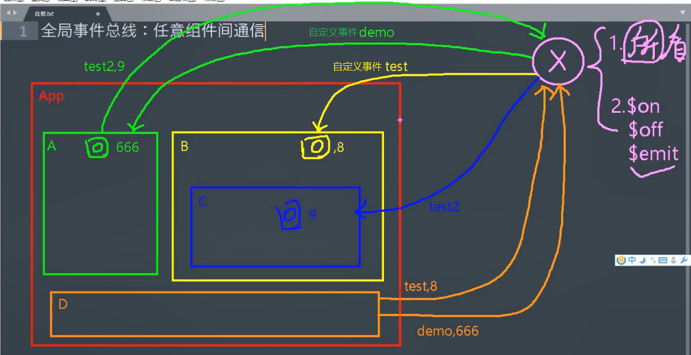

### 3.7.1 安装全局事件总线

因为要用到`Vue`的原型，那么就必须在入口文件`main.js`中写：

+ 通过组件实例vc，安装全局事件总线
+ 通过vm借助生命周期钩子函数，安装全局事件总线

```javascript
import Vue from 'vue'
import App from './App'

Vue.config.productionTip = false;
/* 全局事件总线 就是把第三者组件挂载到Vue原型上以供所有的vc使用 所以有两种方法：
	1、通过组件实例vc
    2、通过vm借助生命周期钩子函数
*/
//1、通过组件实例vc挂载
// const Bus =Vue.extend({});
// Vue.prototype.$bus=new Bus();
new Vue({
    render: h => h(App),
    // 2、通过vm借助生命周期钩子函数，更标准
    beforeCreate(){
        // 安装全局事件总线，$bus就是当前应用的vm
        Vue.prototype.$bus=this
    }
}).$mount('#app')
```

### 3.7.2 使用全局事件总线

#### 3.7.2.1 接受数据方组件绑定事件`$on`

```vue
<template>
  <div class="demo">
    <h4>学校：{{name}} </h4>
  </div>
</template>

<script>
export default {
    name:'School',
    data(){
        return {
            name: '弱智学院',
            stuName:""
        }
    },
    mounted(){
      // console.log(this);
      // $on 绑定事件 第二参数为事件被触发时的回调函数
      this.$bus.$on("studentName",(data)=>{
        this.stuName=data;
        alert("接受到来自student组件的数据:" + this.stuName);
      });
    },
    // 在销毁前解绑事件，更标准，因为这个是通用组件
    beforeDestory(){
      // 注意要指定解绑的事件名字
      this.$bus.$off('studentName')
    }
}
</script>
```

#### 3.7.2.2 发送方组件触发事件`$emit`

```vue
<template>
  <div>
    <h1 v-text="msg"></h1>
    <h4 class="demo">学生姓名：{{name}}</h4>
    <button @click="sendStudentNameToApp">点我给兄弟组件School传递学生名</button>
  </div>
</template>

<script>
export default {
    name:'Student',
    data(){
        return {
            msg: '欢迎，',
            name: '张三'
        }
    },
    methods:{
      sendStudentNameToApp(){
        // Vue的原型对象上属性可以通过原型链获取到
        this.$bus.$emit('studentName',this.name);
      }
    }
}
</script>
```

#### 3.7.2.3 运行测试

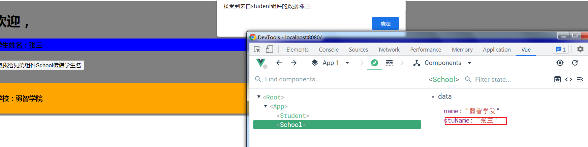

### 3.7.3 注意事项

+ **接受数据方组件`School`借助`mounted()`周期函数绑定全局事件**
+ **接受数据方组件`School`最好在销毁前`beforeDestory(){}`中解绑`$off`该组件绑定的全局事件，因为`$bus`是通用的**

## 3.8 消息订阅与发布

一种组件间通信的方式，适用于**任意组件间通信**。只是一种思想，没有标准的官方库，本次采用`pubsub-js`这个库。

### 3.8.1 原理

例子说是邮局订报纸，但是我觉得更像是广播

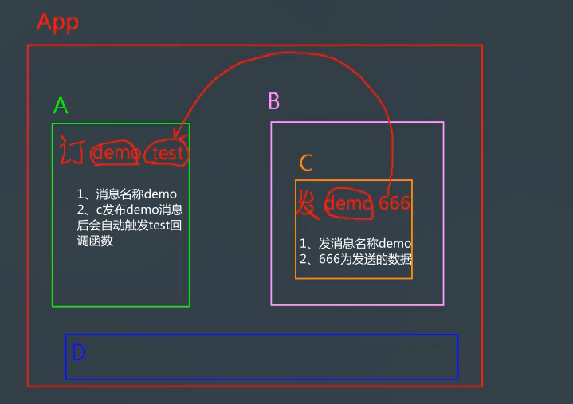

### 3.8.2 使用

#### 3.8.2.1 安装`pubsub-js`

```bash
npm i pubsub-js
```

#### 3.8.2.2 订阅者订阅指定消息

+ 引入第三方库`pubsub`
+ 使用`subscribe`订阅指定消息`demo`
+ 最好在组件销毁前，使用`unsubscribe`取消消息订阅

```vue
<template>
  <div class="demo">
    <h4>学校：{{name}} </h4>
  </div>
</template>

<script>
// 引入第三方库
import pubsub from 'pubsub-js'
export default {
    name:'School',
    data(){
        return {
            name: '弱智学院',
            stuName:""
        }
    },
    mounted(){
      // 订阅消息，第一个参数为消息名称，第二个参数为回调函数【发布者发布demo消息后会自动调用】
      // 回调函数有两个参数：1、消息名称，2、接受到的数据
      // 注意subscribe函数会返回一个pid，在取消订阅时使用
      this.pid=pubsub.subscribe('demo',(msgName,data)=>{
        // 常规函数方式里面this会丢失，箭头函数会自动找上一级
        this.stuName=data;
        console.log("接受到来自student组件的数据:" + this.stuName);
      })
    },
    beforeDestory(){
      // 取消订阅消息（注意这个和事件不一样），参数是pid而不是消息名称 
      pubsub.unsubscribe(this.pid);
    }
}
</script>
```

#### 3.8.2.3 发布者发布指定消息

+ 引入第三方库`pubsub`
+ 使用`publish`发布指定消息`demo`

```vue
<template>
  <div>
    <h1 v-text="msg"></h1>
    <h4 class="demo">学生姓名：{{name}}</h4>
    <button @click="sendStudentNameToApp">点我给兄弟组件School传递学生名</button>
  </div>
</template>

<script>
// 引入第三方库
import pubsub from 'pubsub-js'
export default {
    name:'Student',
    data(){
        return {
            msg: '欢迎，',
            name: '张三'
        }
    },
    methods:{
      sendStudentNameToApp(){
        // 发布指定消息 第一个参数为指定消息名，第二个参数为要传递的数据
        pubsub.publish('demo',this.name);
      }
    }
}
</script>
```

#### 3.8.2.4 测试运行

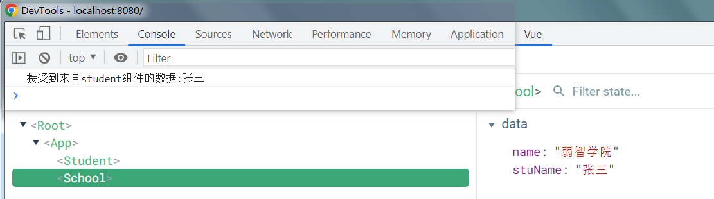

## 3.9 `$nextTick`

+ 语法：

  `this.$nextTick(回调函数)`

+ 作用：

  **在下一次DOM更新结束后自定执行该回调函数**

+ 什么时候用？ 

  **当改变数据后，要根据新dom中元素进行某些操作（如focus），要在$nextTick所指定的回调函数中执行**

+ 示例

  ```javascript
  edit(todo){ 
      //props属性最好不要直接改，用事件来操作(下面是直接操作的)
      // todo.isEdit=true;
      // 响应式数据添加$set  才会有对应get和set方法，才能使v-model生效 
      if(!todo.hasOwnProperty('isEdit')) this.$set(todo,'isEdit',true);
      else todo.isEdit=true;
      /*
            下面这样写不生效，这是因为当前input没有显示，所以让一个不生效的input获取焦点会失败的
            原理就是vue在edit这个函数完全执行完后才会重新解析模版，不是改一个立马生效
            解决方法：
              1、使用setTimeout定时器
              2、使用$nextTick函数，该函数内指定一个回调函数f，f会在下一次dom重新解析后执行
          */
      // this.$refs.inputBox.focus();//不生效
      // setTimeout(()=>{this.$refs.inputBox.focus()},200)//方法1
      this.$nextTick(function(){
          this.$refs.inputBox.focus()
      })
  }
  ```

## 3.10 过度与动画

在进入/离开的过渡中，会有 **6 个 class属性** 切换。

1. `v-enter`：定义进入过渡的开始状态。在元素被插入之前生效，在元素被插入之后的下一帧移除。
2. `v-enter-active`：定义进入过渡生效时的状态。在整个进入过渡的阶段中应用，在元素被插入之前生效，在过渡/动画完成之后移除。这个类可以被用来定义进入过渡的过程时间，延迟和曲线函数。
3. `v-enter-to`：**2.1.8 版及以上**定义进入过渡的结束状态。在元素被插入之后下一帧生效 (与此同时 `v-enter` 被移除)，在过渡/动画完成之后移除。
4. `v-leave`：定义离开过渡的开始状态。在离开过渡被触发时立刻生效，下一帧被移除。
5. `v-leave-active`：定义离开过渡生效时的状态。在整个离开过渡的阶段中应用，在离开过渡被触发时立刻生效，在过渡/动画完成之后移除。这个类可以被用来定义离开过渡的过程时间，延迟和曲线函数。
6. `v-leave-to`：**2.1.8 版及以上**定义离开过渡的结束状态。在离开过渡被触发之后下一帧生效 (与此同时 `v-leave` 被删除)，在过渡/动画完成之后移除。

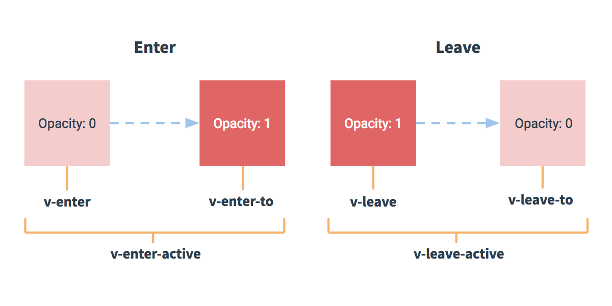

### 3.10.1 单元素`CSS3`动画

然后再配合函数动态修改`h1`的`class`属性即可

```vue
<template>
  <div>
    <button @click="isShow=!isShow">显示/隐藏</button>
    <br>
    <h1 v-show="isShow" class="come">你好啊！</h1>
  </div>
</template>

<script>
export default {
    name:"Test",
    data(){
        return{isShow:true}
    }
}
</script>

<style scoped>
h1{
    background-color: orange;
}

/* 使用动画  默认就是from*/
.come{
    animation: change 1s linear;
}
/* 使用动画  reverse就是to*/
.go{
    /* 播放动画：动画名 持续事件 平滑播放 反转播放 */
    animation: change 1s linear reverse;
}
/* 定义动画 */
@keyframes change {
    /* from是动画来的关键字 */
    from{
        transform: translateX(-100%) ;
    }
    /* to是动画去的关键字 */
    to{
        transform: translateX(0px);
    }
}
</style>
```


### 3.10.2 单元素过渡`Transition` + `CSS3`动画

细节太多了看官网文档把

官网链接：

+ https://v2.cn.vuejs.org/v2/api/#transition
+ https://v2.cn.vuejs.org/v2/guide/transitions.html

使用方法：

```vue
<template>
  <div>
    <button @click="isShow=!isShow">显示/隐藏</button>
    <br>
    <transition>
        <h1 v-show="isShow">你好啊！</h1>
    </transition>
  </div>
</template>

<script>
export default {
    name:"Test",
    data(){
        return{isShow:true}
    }
}
</script>

<style scoped>
h1{
    background-color: orange;
}

/* 进入的过程 */
.v-enter-active{
    animation: change 1s linear;
}

    /* 离开的过程*/
.v-leave-active{
    animation: change 1s linear reverse;
}
/* 定义动画 */
@keyframes change {
    /* from是动画来的关键字 */
    from{
        transform: translateX(-100%) ;
    }
    /* to是动画去的关键字 */
    to{
        transform: translateX(0px);
    }
}
</style>
```

### 3.10.3 单元素过渡`Transition`

```vue
<template>
  <div>
    <button @click="isShow=!isShow">显示/隐藏</button>
    <br>
    <transition name="show" appear>
        <h1 v-show="isShow">你好啊！</h1>
    </transition>
  </div>
</template>

<script>
export default {
    name:"Test",
    data(){
        return{isShow:true}
    }
}
</script>

<style scoped>
h1{
    background-color: orange;
}
/* 要求：从左侧滑入屏幕，再从屏幕滑出左侧 */
/* 使用过渡实现效果 过渡有6个阶段 即6个class属性值 */
/* 阶段1：进入起点 */
.show-enter{ 
    /* 定义起始位置 */
    transform: translateX(-100%);
}
/* 阶段2：进入的过程 */
.show-enter-active{
    /* 太快了，所以需要过程动画  注意关键字为：transition而不是animation */
    transition: .5s linear;
}
/* 阶段3：进入的终点 */
.show-enter-to{
    /* 定义终点位置 */
    transform: translateX(0);
}
/* 阶段4：离开的起点 */
.show-leave{
    /* 定义离开起始位置 */
    transform: translateX(0);
}
/* 阶段5：离开的过程  */
.show-leave-active{
     /* 太快了，所以需要过程动画 注意关键字为：transition而不是animation */
    transition: .5s linear;
}
/* 阶段6：离开的终点 */
.show-leave-to{
    /* 定义离开终点位置 */
    transform: translateX(-100%);
}

/*
    因为样式两两一样，所以可以合并写
    .show-enter,.show-leave-to{
        
    }

*/
</style>
```

### 3.10.4 多个元素过渡`transition-group`

官网：https://v2.cn.vuejs.org/v2/api/#transition-group

```vue
<template>
  <div>
    <button @click="isShow=!isShow">显示/隐藏</button>
    <br>
    <!-- 
        transition里面必须只能是一个标签
        方法1：用一个整体的div包裹
            <transition name="show" appear>
                <div>
                    <h1 v-show="isShow">你好啊！</h1>
                    <h1 v-show="isShow">张三</h1>
                </div>
            </transition>
        方法2：使用transition-group标签
     -->
    <transition-group name="show" appear>
        <!-- 必须搭配 key使用-->
        <h1 v-show="isShow" key="1">你好啊！</h1>
        <h1 v-show="isShow" key='2'>张三</h1>
    </transition-group>
  </div>
</template>

<script>
export default {
    name:"Test",
    data(){
        return{isShow:true}
    }
}
</script>

<style scoped>
h1{
    background-color: orange;
}
/* 要求：两个标签同时从左侧滑入屏幕，再从屏幕滑出左侧 */
.show-enter,.show-leave-to{ 
    transform: translateX(-100%);
}
.show-enter-active,.show-leave-active{
    transition: .5s linear;
}
.show-enter-to,show-leave{
    transform: translateX(0);
}


</style>
```

### 3.10.5 使用第三方动画库`animate.css`

+ 安装

  ```bash
  npm install animate.css --save
  ```

+ 引入

  ```java
  <script>
  // 引入动画库 animate.css
  import "animate.css"
  export default {
      name:"Test",
      data(){
          return{isShow:true}
      }
  }
  </script>
  ```

+ 使用

  ```vue
  <template>
    <div>
      <button @click="isShow=!isShow">显示/隐藏</button>
      <br>
      <!-- 选则自己喜欢动画 
      		去https://animate.style/ 查找 直接复制
  		1、写name属性 这个是固定的
  		2、选择进入动画 enter-active-class
  		3、选择离开动画 leave-active-class
      -->
      <transition-group 
          name="animate__animated animate__bounce" 
          appear
          enter-active-class="animate__bounce"
          leave-active-class="animate__rubberBand"
          >
          <h1 v-show="isShow" key="1">你好啊！</h1>
          <h1 v-show="isShow" key='2'>张三</h1>
      </transition-group>
    </div>
  </template>
  
  <script>
  // 引入动画库 animate.css
  import "animate.css"
  export default {
      name:"Test",
      data(){
          return{isShow:true}
      }
  }
  </script>
  
  <style scoped>
  h1{
      background-color: orange;
  }
  </style>
  ```

  


# 4、Vue中的ajax

## 4.0 引入

### 4.0.1 前端请求方式

浏览器发送请求的几种方式：

+ xhr即`XmlHttpRequest`
+ JQuery
+ Axios
+ 浏览器`window`自带的`fetch`

### 4.0.2  跨域问题

+ **问题产生的原因**

  > 同源策略导致的，即需要两个页面地址中的协议，域名，端口号一致，则表示同源。

  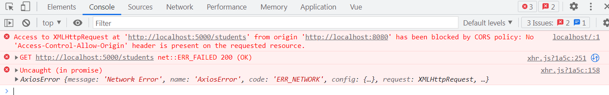

+ **跨域的特点**

  > 跨域时**请求能发送出去，服务端收到并且也有返回值，但是返回信息被自己的浏览器拦截了**

+ **跨域的解决方式**

  > 1、后端返回数据带特殊的响应头，表示运行跨域
  > 2、jsonp ，利用的是script标签的src属性不受同源策略的影响 只能解决get请求
  > 3、代理服务器，如nginx或者vue中的devServer

## 4.1 Axios简单使用

文档：https://www.axios-http.cn/docs/api_intro

+ 安装

  ```bash
  npm i axios
  ```

+ 导入使用

  本次API：`axios.get(url,[method,data:{}]).then(response=>{},err=>{}).catch(err=>{})`

  ```vue
  <template>
      <div>
        <button @click="getStuInfo">点我获取学生信息</button>
      </div>
  
  </template>
      
  <script>
  import axios from 'axios'
  export default {
      name: 'App',
      methods: {
        getStuInfo(){
          axios.get(
            'http://localhost:5000/students',
          ).then(
            response=>{
              console.log(response);
            },
            err=>{
              console.log(err);
            }
          )
        }
      }
  }
  </script>
  ```

## 4.2 vue中解决跨域问题`devServe`

文档：https://cli.vuejs.org/zh/config/#devserver-proxy

Vue中解决跨域问题就是在Vue的配置文件`vue.config.js`中开启`devServer`，其原理就是相当于开启一个同端口的服务器（如8080，当前vue项目端口也是8080），配置开启后会自动将跨域的请求转发到指定服务器上，利用的是HTTP请求，从而解决跨域问题。

### 4.2.0 vue代理服务器执行逻辑

> 前提：当前vue项目端口是8080，已开启代理服务`devServer`也是8080，目标数据服务器是5000端口

**8080代理服务器不是所有的请求都转发给5000服务器**

+ **如果请求的资源8080本身就有，则直接返回本地8080项目的（如静态资源）**
+ **如果请求的资源8080本身没有，才会转发到5000服务器上**

### 4.2.1 简单配置`vue.config.js`

这种方式：**配置简单，请求资源直接转发；但是不能配置多个代理，不能灵活的控制是否走代理；当访问到前端不存在的资源时，才会转发给服务器（优先匹配前端资源）。**

+ 配置`vue.config.js`，开启`devServer`

  ```javascript
  const { defineConfig } = require('@vue/cli-service')
  module.exports = defineConfig({
    transpileDependencies: true,
    //关掉js语法检查
    lintOnSave:false,
    devServer:{
      proxy: 'http://localhost:5000'
    }
  })
  ```

+ 修改请求的地址

  > 如本来请求的是：http://localhost:5000/students，则需要改成**配置的代理服务器地址+请求路径**即：http://localhost:8080/students（实际项目ip和请求协议都有可能改变）

  ```vue
  <template>
      <div>
        <button @click="getStuInfo">点我获取学生信息</button>
      </div>
  
  </template>
      
  <script>
  import axios from 'axios'
  export default {
      name: 'App',
      methods: {
        getStuInfo(){
          axios.get(
            // 'http://localhost:5000/students', //开启代理前
            'http://localhost:8080/students',//开启代理后
          ).then(
            response=>{
              console.log(response);
            },
            err=>{
              console.log(err);
            }
          )
        }
      }
  }
  </script>
  ```

+ 运行结果

  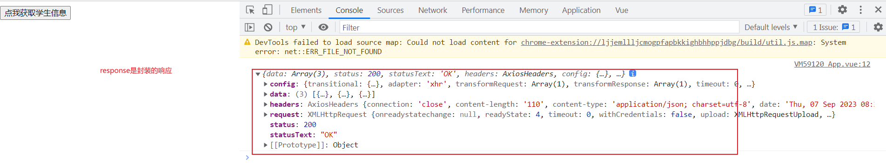

### 4.2.2 详细配置`vue.config.js`

```javascript
const { defineConfig } = require('@vue/cli-service')
module.exports = defineConfig({
  devServer: {
    proxy: {
      //这个/api前缀(紧跟端口后面的)自己加的，用于筛选
      '/api': { 
        target: 'http://localhost:5000',//后端服务器实际地址,根据实际要不要加路径
        ws: true,//是否使用websocket模式
        /*
          将请求路径重写，去掉自己加的前缀
          如：前端配的是http://localhost:8080/api/students，前缀是/api符合，
          就使用路径重写规则，将路径重写且转发变为http://localhost:5000/students
        */
        pathRewrite:{
          '^/api':''//key为请求路径（被替换的），支持正则，value为替换的值
        },
        /*
          是否改变请求头host的值
          false：不改变，仍为实际地址和端口
          true：改变，变为target路径的端地址和端口
        */
        changeOrigin: true
      }
    }
  }
})

```

## 4.3 `vue-resource`

同`axios`也是对`xhr`的封装，是vue **插件库(`vue.use使用`)**, vue1.x 使用广泛，官方已不维护。（了解）

### 4.3.1 使用

+ 安装

  ```bash
  npm i vue-resource
  ```

+ 入口文件`main.js`使用该插件

  ```javascript
  import Vue from 'vue'
  import App from './App'
  import vueResource from 'vue-resource'
  
  Vue.config.productionTip = false;
  // 使用插件 那么所有的vc和vm身上就有个$http对象
  Vue.use(vueResource);
  new Vue({
      render: h => h(App),
      beforeCreate(){
          Vue.prototype.$bus=this
      }
  }).$mount('#app')
  ```

  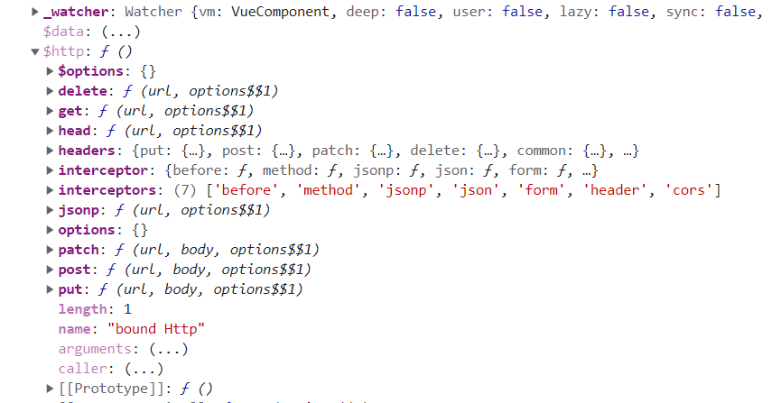

+ 使用方法和`axios`一样

  ```javascript
  this.$http.get(url,[config]).then(
  	res=>{},
     err=>{}
  ).catch(err=>{}
  ```

## 4.4 slot插槽

**作用：让父组件可以向子组件指定位置插入html结构，也是组件间通信的方式，适用于<font color='red'>父组件===>子组件</font>**

插槽就是子组件中的提供给父组件使用的一个占位符，用`<slot></slot> `表示，父组件可以在这个占位符中填充任何模板代码，如 HTML、组件等，填充的内容会替换子组件的`<slot></slot>`标签。

### 4.4.1 默认插槽

#### 4.4.1.1 介绍

**vue会将插槽代码在父组件先解析成dom元素（包括父组件的data，computed以及css样式等）整体带到子组件中。**

> + 如果**插槽样式在父组件中**，则就是先解析成dom（包含样式），带入子组件的插槽位置
> + 如果**插槽样式在子组件中**，则就是先解析成dom（不包含样式，因为父组件没有），带入子组件的插槽位置后再用子组件的样式
> + 如果父组件也有相同选择器的样式定义（如img样式），则**共存，冲突的以子组件的为准 **

#### 4.4.1.2 使用

就是一个`slot`标签，**通过将组件标签写成双标签，内部来传入要显示的dom元素**

+ 父组件`App,vue`，声明要传入子组件的dom元素

  ```vue
  <template>
    <div class="container">
      <!-- slot插槽之默认插槽，用于解决复用的多样性
        传递插槽值就是，将组件标签写成双标签，实际的元素写在其内部
         -->
      <Category :title="美食" :items="foods">
          <!-- 要显示的dom元素-->
        
      </Category>
      <Category :title="游戏" :items="games">
          <!-- 要显示的dom元素-->
        <ul>
          <li v-for="(item,index) in games" :key="index">{{item}}</li>
        </ul>
      </Category>
      <Category :title="电影" :items="films">
          <!-- 要显示的dom元素-->
        <video controls src="http://clips.vorwaerts-gmbh.de/big_buck_bunny.mp4"/>
      </Category>
    </div>
  </template>
      
  <script>
  import Category from './components/Category.vue'
  export default {
      name: 'App',
      components: {Category},
      data(){
        return {
          foods:['火锅','烧烤','小龙虾','牛排'],
  				games:['红色警戒','穿越火线','劲舞团','超级玛丽'],
  				films:['《教父》','《拆弹专家》','《你好，李焕英》','《尚硅谷》']
        }
      }
  }
  </script>
  <style>
  /* 设置三个并列 */
  .container{
    display: flex;
    justify-content: space-around;
  }
   /* 样式定义在父组件，那么插槽值（Category标签内元素）解析带有此样式，传入子组件Category中 */   
  video{
    width: 100%;
  }
  </style>
  ```

+ 子组件`Category.app`使用`<slot>`占位

  ```vue
  <template>
    <div class="category">
      <h3>{{title}}分类</h3>
      <!-- slot标签就是插槽，相当于占位符。可以不传递插槽值过来，那么默认就显示其内部元素 -->
      <slot>
          <font color="red">不传递插槽值，默认显示！</font>
      </slot>
    </div>
  </template>
  
  <script>
  export default {
      name:'Category',
      props:['title','items']
  }
  </script>
  
  <style scoped>
  .category{
      background-color: skyblue;
      width: 200px;
      height: 300px;
  }
  h3{
      text-align: center;
      background-color: orange;
  }
   /* 自带的样式，如果父组件也有img样式，则共存，冲突的以子组件的为准 */
  img{
      width: 100px;
      height: 100px
  }
  </style>
  ```

### 4.4.2 具名插槽

#### 4.4.2.1 介绍

**具名插槽即具有名字的插槽，由于解决多插槽无法定位的问题。**

#### 4.4.2.2 使用

+ 子组件`Category.vue`使用`<slot>`标签，并定义`name`属性

  ```vue
  <template>
    <div class="category">
      <h3>{{title}}分类</h3>
      <!-- slot标签就是插槽，相当于占位符。可以不传递插槽值过来，那么默认就显示其内部元素 -->
      <slot name='center'>
          <font color="red">不传递插槽值，默认显示！1</font>
      </slot>
      <slot name="bottom">
          <font color="red">不传递插槽值，默认显示！2</font>
      </slot>
    </div>
  </template>
  ```

+ 父组件`App.vue`使用插槽，并指定其`name`属性值（如果没有指定插槽name值，则会显示默认子组件slot标签结构）

  ```vue
  <template>
    <div class="container">
      <!-- slot插槽之具名插槽，通过name属性值用于使用指定插槽
         -->
      <Category :title="美食" :items="foods">
        <!-- dom元素中使用slot指定name值 -->
        
        <a href="#" slot="bottom">欢迎品尝</a>
      </Category>
      <Category :title="游戏" :items="games">
        <ul slot="center">
          <li v-for="(item,index) in games" :key="index">{{item}}</li>
        </ul>
        <!-- 父组件中多个slot属性值会叠加，不会覆盖 -->
        <a href="#" slot="bottom">单机游戏 &nbsp</a>
        <a href="#" slot="bottom">网络游戏</a>
      </Category>
      <Category :title="电影" :items="films">
        <video slot="center" controls src="http://clips.vorwaerts-gmbh.de/big_buck_bunny.mp4"/>
        <!-- 当有多个slot属性值时，可以使用template,没错就是template中使用template
            slot搭配template简写为:v-slot:name值 （没有引号，中间是冒号,只能搭配template使用）
           -->
          <template v-solt:bottom>
            <a href="#" >经典</a> 
            <a href="#" >推荐</a>
            <a href="#" >热销</a>
          </template>
  
          <!-- 比这种方法省了一层div结构 -->
          <!-- <div slot="bottom"> 
            <a href="#" >经典</a> 
            <a href="#" >推荐</a>
            <a href="#" >热销</a>
          </div> -->
      </Category>
    </div>
  </template>
  ```

### 4.4.3 作用域插槽

#### 4.4.3.1 介绍

**作用域插槽即数据保存在子组件中，但是父组件（子组件的使用者）需要根据子组件中的数据，以生成不同的样式。那么就可以借助作用域插槽实现**

> + 子组件借助`<slot>`标签，将自身的数据传递给插槽的使用者（父标签）
> + 父组件借助`<template scope='dataObj'>`(dataObj可为任意值，是一个对象)标签接收子组件的数据，生成不用的样式dom
> + `<template scope='dataObj'>`=`<template v-slot='dataObj'>`=`<template slot=scope='dataObj'>`
> + 可以直接结构赋值`<template v-slot='{games}'>`,要求有子组件传递过来games的属性值

#### 4.4.3.2 使用

+ 子组件`Category.vue`向父组件`App.vue`传递数据（类似于`props`）

  ```vue
  <template>
    <div class="category">
      <h3>{{title}}分类</h3>
      <!-- 作用域插槽，v-bind 传递数据给父组件 -->
      <slot :games="games">
          <font color="red">不传递插槽值，默认显示！1</font>
      </slot>
    </div>
  </template>
  
  <script>
  export default {
      name:'Category',
      props:['title'],
      data(){
        return {
          games:['红色警戒','穿越火线','劲舞团','超级玛丽']
        }
      }
  }
  </script>
  ```

+ 父组件`App.vue`接收子组件传递数据，必须是`template`标签加上`scope`属性（否则接收不到）

  ```vue
  <template>
    <div class="container">
      <!-- 作用域插槽 接受子组件数据 -->
      <Category :title="游戏">
          <!-- 必须是template+scope-->
        <template scope="dataObj">
          <ul>
            <li v-for="(item,index) in dataObj.games" :key="index">{{item}}</li>
          </ul>
        </template> 
      </Category>
      <!-- 个性化 同一数据 -->
      <Category :title="游戏">
           <!-- 必须是template+scope-->
        <template scope="dataObj">
          <ol>
            <li v-for="(item,index) in dataObj.games" :key="index">{{item}}</li>
          </ol>
        </template> 
      </Category>
      <!-- 个性化 同一数据 -->
      <Category :title="游戏">
           <!-- 必须是template+scope-->
        <template scope="dataObj">
          <ol>
            <h4 v-for="(item,index) in dataObj.games" :key="index">{{item}}</h4>
          </ol>
        </template> 
      </Category>
    </div>
  </template>
      
  <script>
  import Category from './components/Category.vue'
  export default {
      name: 'App',
      components: {Category}
  }
  </script>
  ```

+ 测试运行

  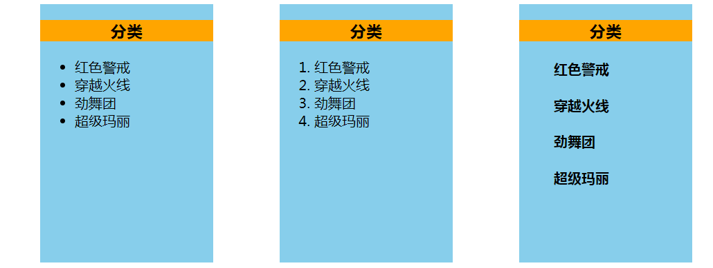

### 4.4.4 具名作用域插槽

> 具名作用域插槽=具名插槽+作用域插槽

# 5 vue小技巧

## 5.1 引入第三方样式

### 5.1.1 直接在HTML文件中引入

```html
<head>
  <meta charset="UTF-8">
  <title>Title</title>
  <link rel="stylesheet" href="./css/bootstrap.css">
</head>
```

### 5.1.2 在vue文件的`script`中引入

```vue
<script>
import '../../public/css/bootstrap.css'
</script>
```

> 如果引入的外部文件中有不需要资源（如字体），就可以使用这种方法。不会报错，下面几种方法都会报错

### 5.1.3 在vue文件的`style`中引入

+ `style`标签中引入

  ```vue
  <style scoped>
  @import '../../public/css/index.css';
  </style>
  ```

  > 使用@import引入样式文件，就算加scoped，其它没有引入的模块还是可以访问到你的样式，如果某个组件的类名一致，则就会被污染到。

+ `style`标签内引入

  ```vue
  //相对路径引入
  <style src='../../public/css/index.css' scoped> 
  </style>
  ```

  

# 6、Vuex

## 6.1 Vuex是什么？

**Vuex**：专门在Vue中实现**集中式状态（数据）管理**的一个Vue**插件**，对vue应用中的**多个组件的共享状态（数据）进行集中式的管理（读、写）**，也是**一种组件间通信的方式，且适用于任意组件间通信**。

地址：https://github.com/vuejs/vuex

文档：https://v3.vuex.vuejs.org/zh/

### 6.1.1 什么时候使用Vuex

+ 多个组件依赖于同一状态（数据）
+ 来自不同组件的行为需要变更同一状态

> 总结就是：方便不同组件间的**写操作**

### 6.1.2 多组件共享之`全局事件` vs `Vuex`

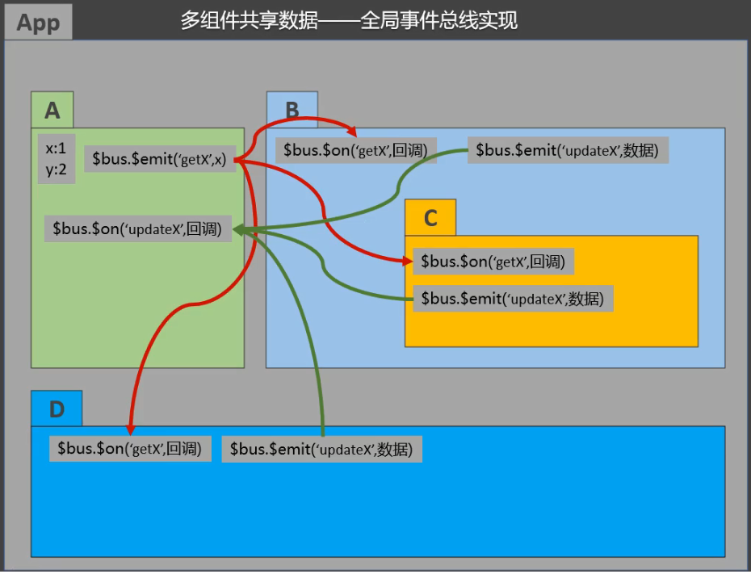

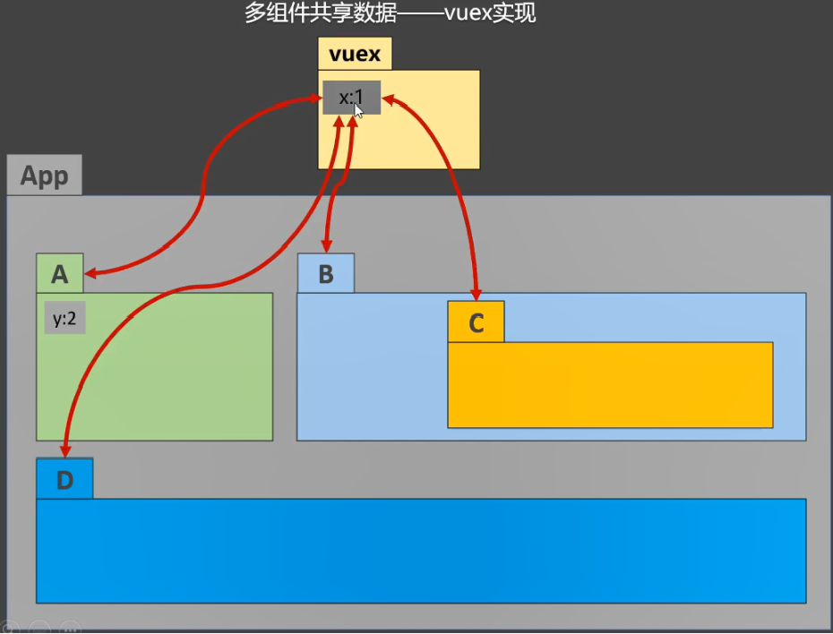

## 6.2 Vuex工作原理图

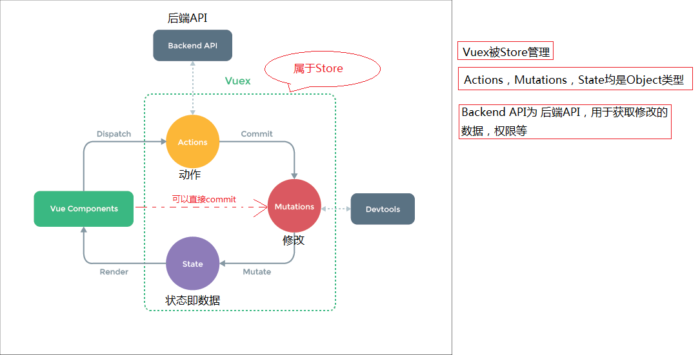

## 6.3 [Vuex核心配置项](https://v3.vuex.vuejs.org/zh/guide/state.html#%E5%8D%95%E4%B8%80%E7%8A%B6%E6%80%81%E6%A0%91)**

地址：https://v3.vuex.vuejs.org/zh/guide/state.html#%E5%8D%95%E4%B8%80%E7%8A%B6%E6%80%81%E6%A0%91

### 6.3.1 `State`

### 6.3.2 `Actions`

### 6.3.3 `Mutations`

### 6.3.4 `Getters`

当`State`中数据需要进行加工后再使用时，可以使用`getters`(可以不用)

```javascript
//vuex中创建并暴露
// 创建getters对象--用于加工数据
const getters={
    /*可以接受四个参数
    	第一个参数state 表示当前命名空间的state
    	第二个参数getters 表示当前命名空间的getters（包含里面所有方法）
    	第三个参数state	表示整个vuex的state，封装有namespace的
    	第四个参数getters	表示整个vuex的getters，封装有namespace的
    	*/
    bigSum(state){ //类似于computed
        return state.sum*10;
    }
}
// 创建并暴露store （注意是Store对象而不是Vuex）
export default new Vuex.Store({
    ...
    getters
})
//使用getters
this.$store.getters.bigSum
```

### 6.3.5 `mapState`

将`vuex`中的`state`数据映射为组件的计算属性`computed`

```vue
<template>
  <div>
    <h2>当前求和为：{{sum}}</h2>
    <h2>当前BigSum为：{{bigSum}}</h2>
</template>

<script>
// 注意必修带{}
import {mapState} from 'vuex'
import {mapGetters} from 'vuex'
export default {
    name:'Count',
    data(){
        return {number:1}
    },
    computed: {
        /*
        mapState借助计算属性映射到vuex的state
            第一种写法：对象写法  ...mapState({sum:'sum'})//类似于结构体赋值
            第二种写法：数组写法  ...mapState(['sum'])//即代表计算属性ming为sum且映射的state中sum
        */
       ...mapState(['sum']),
       ...mapGetters({bigSum:'bigSum'})
    }
}
</script>
```

> ...参考 [JS中三个点（...）是什么鬼？](https://blog.csdn.net/xqhys/article/details/105736902#:~:text=%E4%BB%80%E4%B9%88%E6%84%8F%E6%80%9D%EF%BC%9F,%E4%B8%89%E4%B8%AA%E7%82%B9%EF%BC%88...%EF%BC%89%E7%9C%9F%E5%90%8D%E5%8F%AB%E6%89%A9%E5%B1%95%E8%BF%90%E7%AE%97%E7%AC%A6%EF%BC%8C%E6%98%AF%E5%9C%A8ES6%E4%B8%AD%E6%96%B0%E5%A2%9E%E5%8A%A0%E7%9A%84%E5%86%85%E5%AE%B9%EF%BC%8C%E5%AE%83%E5%8F%AF%E4%BB%A5%E5%9C%A8%E5%87%BD%E6%95%B0%E8%B0%83%E7%94%A8%2F%E6%95%B0%E7%BB%84%E6%9E%84%E9%80%A0%E6%97%B6%EF%BC%8C%E5%B0%86%E6%95%B0%E7%BB%84%E8%A1%A8%E8%BE%BE%E5%BC%8F%E6%88%96%E8%80%85string%E5%9C%A8%E8%AF%AD%E6%B3%95%E5%B1%82%E9%9D%A2%E5%B1%95%E5%BC%80%EF%BC%9B%E8%BF%98%E5%8F%AF%E4%BB%A5%E5%9C%A8%E6%9E%84%E9%80%A0%E5%AD%97%E9%9D%A2%E9%87%8F%E5%AF%B9%E8%B1%A1%E6%97%B6%E5%B0%86%E5%AF%B9%E8%B1%A1%E8%A1%A8%E8%BE%BE%E5%BC%8F%E6%8C%89%E7%85%A7key-value%E7%9A%84%E6%96%B9%E5%BC%8F%E5%B1%95%E5%BC%80)

### 6.3.6 `mapGetters`

同`mapState`

将`vuex`中的`getters`数据映射为组件的计算属性`computed`

### 6.3.7 `mapMutations`

将`vuex`中的`mutations`中**指定函数**映射为组件vc的**对应名字函数**`methods`

```vue
<template>
  <div>
    <h2>当前求和为：{{sum}}</h2>
    <h2>当前BigSum为：{{bigSum}}</h2>
    <select v-model:value.number='number'>
        <option value="1">1</option>
        <option value="2">2</option>
        <option value="3">3</option>
    </select>
    <!-- $event获取当前事件，必须带参数不然是默认的事件 -->
    <button @click="ADD(number)">+</button>
    <button @click="sub">-</button>
  </div>
</template>

<script>
// 注意必修带{}
import {mapMutations} from 'vuex'
export default {
    name:'Count',
    data(){
        return {number:1}
    }
    methods:{
        // add(){
        //     // 不需要后端交互（额外处理），直接commit到Mutations
        //     this.$store.commit('ADD',this.number);
        // },
    
        /*
        mapMutations借助计算属性映射到vuex的mutations，即包含$store.commit()
            第一种写法：对象写法  ...mapMutations({ADD:'ADD'})//类似于结构体赋值
            第二种写法：数组写法  ...mapMutations(['ADD'])//即代表vc中有函数add且映射的mutations中有函数add（区分大小写，ADD不对）
        注意：vc中调用函数ADD必须带参数number，默认传递参数是event
        */
        ...mapMutations(['ADD']),
        sub(){
             // 不需要后端交互（额外处理），直接commit到Mutations
            this.$store.commit('SUB',this.number);
        }
    }
}
</script>
```

> 注意：`mapMutations`中映射的函数调用时必须带自己的参数，默认是$event
>
> 有两种方式：
>
> + dom中调用传递参数`<button @click="ADD(number)">`（推荐）
> + 创建一个中间函数，用于响应事件，然后调用`mapMutations`映射函数（脱裤子放屁，不推荐）

### 6.3.8 `mapActions`

同`mapMutations`

将`vuex`中的`actions`中**指定函数**映射为组件vc的**对应名字函数**`methods`

```vue
<template>
  <div>
    <h2>当前求和为：{{sum}}</h2>
    <h2>当前BigSum为：{{bigSum}}</h2>
    <select v-model:value.number='number'>
        <option value="1">1</option>
        <option value="2">2</option>
        <option value="3">3</option>
    </select>
    <!-- $event获取当前事件，必须带参数不然是默认的事件 -->
    <button @click="ADD(number)">+</button>
    <button @click="sub">-</button>
    <!-- $event获取当前事件，必须带参数不然是默认的事件 -->
    <button @click="addOdd(number)">当前求和为奇数再加</button>
  </div>
</template>

<script>
// 注意必修带{}
import {mapState,mapGetters,mapMutations, mapActions} from 'vuex'
export default {
    name:'Count',
    data(){
        return {number:1}
    },
    methods:{
        // addOdd(){
        //      // 可能后端交互（额外处理），分发到Actions
        //     this.$store.dispatch('addOdd',this.number);
        // },

        /*
        mapActions借助计算属性映射到vuex的mapActions，即包含$store.dispatch()
            第一种写法：对象写法  ...mapActions({addOdd:'addOdd'})//类似于结构体赋值
            第二种写法：数组写法  ...mapActions(['addOdd'])//即代表vc中有函数addOdd且映射的actions中有函数addOdd（区分大小写）
        注意：vc中调用函数addOdd必须带参数number，默认传递参数是event
        */
       ...mapActions(['addOdd']),
        }
    }
}
</script>
```

> 注意：`mapActions`中映射的函数调用时必须带自己的参数，默认是$event
>
> 有两种方式：
>
> + dom中调用传递参数`<button @click="addOdd(number)">`（推荐）
> + 创建一个中间函数，用于响应事件，然后调用`mapActions`映射函数（脱裤子放屁，不推荐）

## 6.4 Vuex的安装使用

**vuex被Store管理，而Store需要我们自己创建出来。**

### 6.4.1 简单安装使用

+ 安装`vuex`

  ```bash
  # vue2用的是vuex3
  npm i vuex@3
  ```

+ 创建并暴露`Store` （文件名`store/index.js`）

  ```javascript
  //文件名store/index.js
  import Vue from 'vue'
  import Vuex from 'vuex'
  
  // 必选在创建Store前使用vuex，否则会报错
  Vue.use(Vuex)
  
  // 创建actions对象--用于响应组件中的动作
  const actions ={}
  //创建mutations对象--用于操作状态/数据（state）
  const mutations ={}
  // 创建state对象--用于存储数据
  const state ={}
  
  // 创建并暴露store （注意是Store对象而不是Vuex）
  export default new Vuex.Store({
      actions,//es6同名赋值简写
      mutations,
      state
  })
  ```

  > 注意事项：
  >
  > + Store文件的存储方式
  >
  >   ```bash
  >   # 官网的写法，创建Store目录和index.js文件夹（推荐）
  >   D:.
  >   │  App.vue
  >   │  main.js
  >   ├─components
  >   │      Count.vue
  >   └─Store
  >           index.js
  >    # 自定义写法
  >    D:.
  >   │  App.vue
  >   │  main.js
  >   ├─components
  >   │      Count.vue
  >   └─vuex
  >           store.js
  >   ```
  >
  > + **使用vuex插件使用必须在创建Store对象前，否则会报错。**而`import`语句会最先执行，所以把`Vue.use(Vuex)`从入口文件`main.js`移动到`store/index.js`中
  >
  >   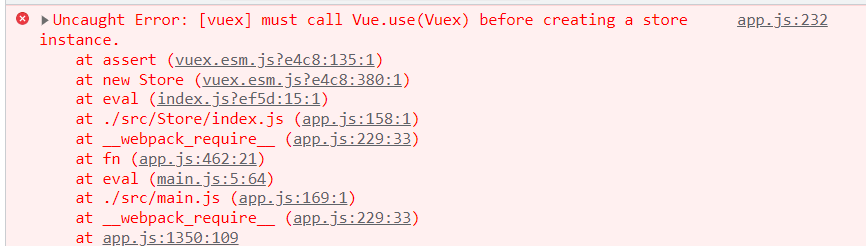
  >
  > + 创建并暴露的是`Vuex.Store`而不是`Vuex`,`new`的时候要看清

+ 入门文件`main.js`配置使用`Vuex`

  ```javascript
  import Vue from 'vue'
  import App from './App'
  // 导入Store 等价于import store from './Store/index'
  import store from './Store'
  
  new Vue({
      render: h => h(App),
      // 配置store
      store,////es6同名赋值简写 s必须小写
      beforeCreate(){
          Vue.prototype.$bus=this
      }
  }).$mount('#app')
  ```

  > 注意事项
  >
  > + Vue属性store首字母必须小写
  >
  > + **store仅在引入并使用vuex时才会被挂载到vm和所有的vc身上**，即如果使用vuex，那么配置了store属性也不会生效
  >
  > + `import`导入默认去找`index.js`文件,webpack的默认配置
  >
  >   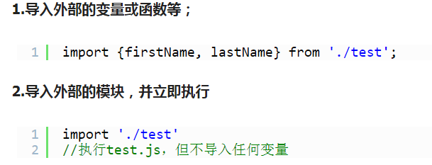

+ 运行

  可以看到vm和所有的vm身上多了一个`$store`

  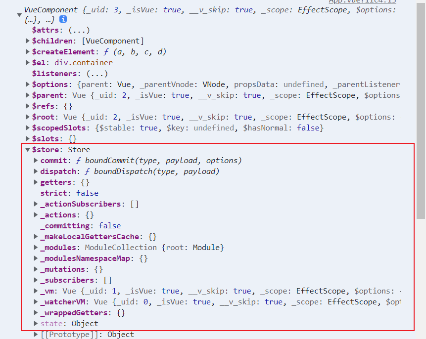

### 6.4.2 ***==详细使用==***

#### 6.4.2.1 创建并暴露Store文件

文件路径：src/store/index.js

```javascript
import Vue from 'vue'
import Vuex from 'vuex'

// 必选在创建Store前使用vuex，否则会报错
Vue.use(Vuex)

// 创建actions对象--用于响应组件中的动作
const actions ={
}
//创建mutations对象--用于操作状态/数据（state）
const mutations ={
}
// 创建state对象--用于存储数据
const state ={
}

// 创建并暴露store （注意是Store对象而不是Vuex）
export default new Vuex.Store({
    actions,//es6同名赋值简写
    mutations,
    state
})
```

#### 6.4.2.2 Vue配置开启Vuex

文件路径：src/main.js

```javascript
import Vue from 'vue'
import App from './App'
// 导入Store 等价于import store from './Store/index'
import store from './Store'

Vue.config.productionTip = false;
new Vue({
    render: h => h(App),
    // 配置store
    store////es6同名赋值简写 s必须小写
}).$mount('#app')
```

#### 6.4.2.3 组件中使用Vuex

文件路径：src/components/Count.js

```vue
<template>
  <div>
    <h2>当前求和为：{{this.$store.state.sum}}</h2>
    <select v-model:value.number='number'>
        <option value="1">1</option>
        <option value="2">2</option>
        <option value="3">3</option>
    </select>
    <button @click="add">+</button>
    <button @click="sub">-</button>
    <button @click="addOdd">当前求和为奇数再加</button>
    <button @click="addWait">等一等再加</button>
  </div>
</template>

<script>
export default {
    name:'Count',
    data(){
        return {
            number:1
        }
    },
    methods:{
        add(){
            // 不需要后端交互（额外处理），直接commit到Mutations
            this.$store.commit('ADD',this.number);
        },
        sub(){
             // 不需要后端交互（额外处理），直接commit到Mutations
            this.$store.commit('SUB',this.number);
        },
        addOdd(){
             // 可能后端交互（额外处理），分发到Actions
            this.$store.dispatch('addOdd',this.number);
        },
        addWait(){
            // 可能后端交互（额外处理），分发到Actions
            this.$store.dispatch('addWait',this.number);
        }
    }
}
</script>
<style scoped>
*{
    margin: 5px;
}
</style>
```

#### 6.4.2.4 配置Store文件中`Actions`,`Mutations`,`State`

文件路径：src/store/index.js

```javascript
import Vue from 'vue'
import Vuex from 'vuex'

// 必选在创建Store前使用vuex，否则会报错
Vue.use(Vuex)

// 创建actions对象--用于响应组件中的动作
const actions ={
    // 第一个参数可以理解为mini $store，含有commit和state
    addOdd(context,value){
        if(context.state.sum % 2) {
            context.commit('ADD',value);
        }
    },
    addWait(context,value){
        setTimeout(() => {
            context.commit('ADD',value);
        }, 1000);
    }
}
//创建mutations对象--用于操作状态/数据（state）
const mutations ={
    //函数名推荐大写，与action区分 
    // 第一个参数为state数据，第二个参数为增量
    ADD(state,value){
        state.sum += value;
    },
    SUB(state,value){
        state.sum -= value;
    }
}
// 创建state对象--用于存储数据
const state ={
    sum:0
}

// 创建并暴露store （注意是Store对象而不是Vuex）
export default new Vuex.Store({
    actions,//es6同名赋值简写
    mutations,
    state
})
```

> **Actions在承上启下的位置，其第一个参数context（小$store）的样子如下：**
>
> 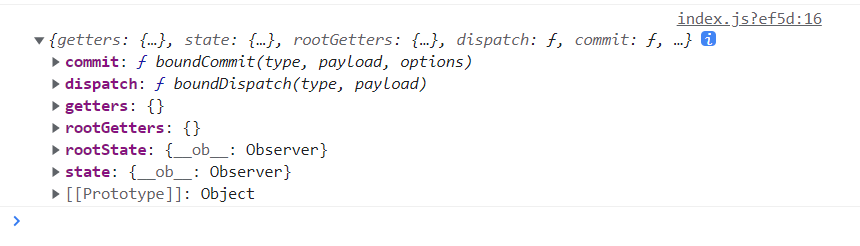

### 6.4.3 总结

+ 先创建vuex的store文件空架子
+ 配置开启vuex
+ 组件中使用vuex
+ 根据组件中的使用情况，去填充store文件`Actions`,`Mutations`,`State`

## 6.5 ==***vuex模块化编码***==

文档：https://v3.vuex.vuejs.org/zh/guide/modules.html#%E6%A8%A1%E5%9D%97%E7%9A%84%E5%B1%80%E9%83%A8%E7%8A%B6%E6%80%81

为了让代码更好维护，让多种数据分类更加明确，所以需要引入vuex模块化编码：

步骤：

+ 模块化，将vuex拆分为多个子文件

  ```bash
  D:.
  │  App.vue
  │  main.js
  │
  ├─components
  │      Count.vue
  │      Person.vue
  │
  └─Store
          Count.js #vuex主文件
          index.js # vuex模块化子文件1
          Person.js# vuex模块化子文件2
  ```

+ 子文件配置四大件`actions,mutations,state,getters`，并开启命名控件`namespaced:true`

  ```javascript
  //以index.js为例子
  export default{
      namespaced:true,
      actions:{},
      mutations:{},
      state:{},
      getters:{}
  }
  ```

+ veux主文件配置`modules`

  ```javascript
  import Vue from 'vue'
  import Vuex from 'vuex'
  // 引入模块组件
  import CountInfo from './Count' 
  import PersonInfo from './Person' 
  // 必选在创建Store前使用vuex，否则会报错
  Vue.use(Vuex)
  
  // 创建并暴露store （注意是Store对象而不是Vuex）
  export default new Vuex.Store({
      // 使用vuex 模块化
      modules:{
          CountInfo,
          PersonInfo
      }
  })
  ```

+ 开启命名空间后组件读取`State`数据

  ```javascript
  //方法1：常规方法
  this.$store.state.命名空间的值.属性
  //例 this.$store.state.CountInfo.sum
  
  //方法2; mapState映射
  import {mapState} from 'vuex'
  computed:{
      ...mapState('命名空间的值',{computed变量名:state属性})
      //例 ...mapState('CountInfo',['sum'])
  }
  ```

+ 开启命名空间后组件调用`Action`中`disatch`

  ```javascript
  //方法1：常规方法
  this.$store.dispatch('命名空间的值/actions方法名',参数)
  //例 this.$store.dispatch('CountInfo/addOdd',number)
  //方法2; mapXXX映射
  import {mapActions} from 'vuex'
  methods:{
      //缺点：必须在dom标签中调用时来传参
      ...mapActions('命名空间的值',{methods函数名字:actions中方法})
      //例 ...mapActions('CountInfo',['addOdd'])
  }
  ```

+ 开启命名空间后组件调用`Mutations`中`commit`

  ```javascript
  //方法1：常规方法
  this.$store.commit('命名空间的值/mutations方法',参数)
  //例 this.$store.commit('CountInfo/SUB',number)
  //方法2; mapXXX映射
  import {mapMutations} from 'vuex'
  medthods:{
      //缺点：必须在dom标签中调用时来传参
      ...mapMutations('命名空间的值',{medthods函数名字:mutations中函数名})
      //例 ...mapMutations('CountInfo',{sub:'SUB'})
  }
  ```

+ 开启命名空间后组件读取`getters`数据

  ```javascript
  //方法1：常规方法
  this.$store.getters['命名空间的值/getters中方法']
  //例 this.$store.getters['CountInfo/bigSum']
  //方法2; mapXXX映射
  import {mapGetters} from 'vuex'
  computed:{
      ...mapGetters('命名空间的值',{computed变量名字:getters中方法})
      //例 ...mapGetters('CountInfo',['bigSum'])
  }
  ```

+ vuex模块化后`$store`数据结构

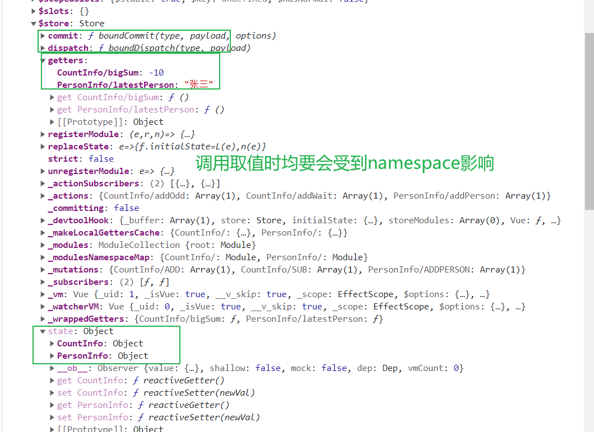

# 7、Vue-router

官网：https://router.vuejs.org/zh/introduction.html

## 7.1 简介

`vue-router`是vue的一个插件库，专门用于实现**SPA应用**

> ***SPA应用：***
>
> + SPA应用即Single Page Web Application，单页Web应用
> + 整个应用只有**一个完整的页面**
> + 点击页面中的导航连接**不会刷新页面**，只会做页面的**局部更新**
> + 数据需要通过ajax请求获取

## 7.2 路由

### 7.2.1 什么是路由

+ **路由其实就是一组映射关系（key-value）**
+ **key为路径，value是component组件或者function函数**

### 7.2.2 路由分类

+ ***后端路由 -- value为function***

  > 工作过程：服务器收到一个请求时，根据**请求路径**找到匹配的**函数**来处理请求，返回响应数据。

+ ***前端路由 -- value为component***

  > 工作过程：当浏览器的路径改变时，对应的组件就会更新显示

## 7.3 路由的使用

### 7.3.1 单级前端路由使用

+ `<router-link active-class='xxx' to='xxx'>`
+ `<router-view>`

#### 7.3.1.0 项目结构

```bash
D:.
│  App.vue
│  main.js
│
├─components
│      About.vue
│      Home.vue
│
└─route
        index.js
```

#### 7.3.1.1 安装`vue-router`

```bash
# vue2使用vue-router 3版本
npm i vue-router@3
```

#### 7.3.1.2 创建并暴露路由器文件`route/index.js`

```javascript
import Vue from 'vue'
// 引入插件
import vueRoute from 'vue-router'
// 引入组件，用于前端路由跳转
import About from '../components/About.vue'
import Home from '../components/Home.vue'

// 使用插件
Vue.use(vueRoute)

// 创建并暴露自己的路由器
export default new vueRoute({
    // 配置路由规则 ,必须是数组
    routes:[
        // 可以有多组路由规则
        {
            path:'/about',
            component: About
        },
        {
            path:'/home',
            component:Home
        }
    ]
})
```

#### 7.3.1.3 入口文件`main.js`配置路由器

```javascript
import Vue from 'vue'
import App from './App.vue'
// 必须引入自己的路由器
import router from './route/index.js'

new Vue({
    // h其实就是createElement
    render:h=>h(App),
    //配置自己的路由器
    router
}).$mount('#app')
```

#### 7.3.1.4 导航区（父组件）使用router标签

```vue
<template>
  <div>
    <div class="row">
      <div class="col-xs-offset-2 col-xs-8">
        <div class="page-header"><h2>Vue Router Demo</h2></div>
      </div>
    </div>
    <div class="row">
      <div class="col-xs-2 col-xs-offset-2">
        <div class="list-group">
            <!-- 原生的写法 -->
          <!-- <a class="list-group-item" href="./about.html">About</a>
          <a class="list-group-item active" href="./home.html">Home</a> -->
            
          <!-- 静态路由写法
            router-link本质就是a标签
			   to="路由中配置的路由的path"
            active-class是vueRoute中router-link特有的
             -->
          <router-link class="list-group-item" active-class="active" to="/about">About</router-link>
          <router-link class="list-group-item" active-class="active" to="/home">Home</router-link>
        </div>
      </div>
      <div class="col-xs-6">
        <div class="panel">
          <div class="panel-body">
                <!--占位符 类似于插槽，用于显示组件  -->
                <router-view></router-view>
          </div>
        </div>
      </div>
    </div>
  </div>
</template>

<script>
export default {
    name:'App'
}
</script>
```

#### 7.3.1.5 测试运行

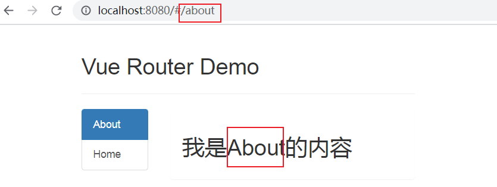

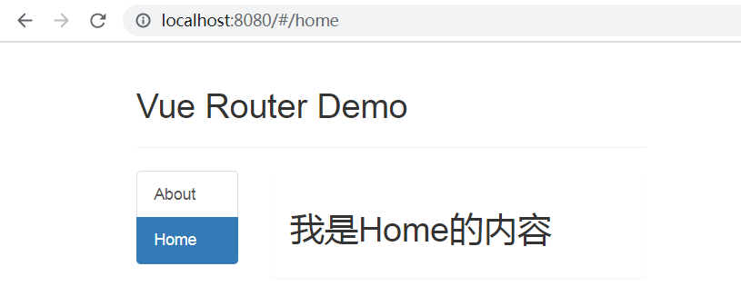

### 7.3.2 后端路由使用(编程式路由导航)

**编程式路由导航**借助的是vc身上的`this.$router`的相关API实现。不借助`<router-link>`标签实现路由跳转，让路由跳转更加灵活。

#### 7.3.2.1 API

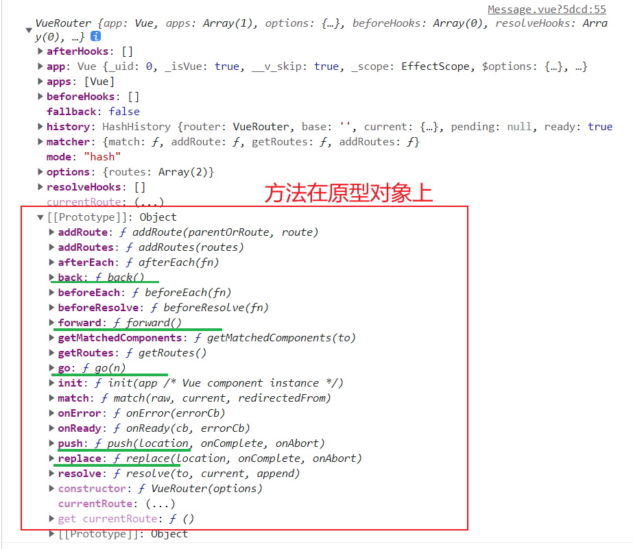

#### 7.3.2.2 使用

+ `this.$router.push({name,params{}})` 使用`push`风格的`<router-link>`（a标签）

  > 注意如果路由器配置了`props`那么就用`params`传参，所以路径必须要带`name`否则会报错。

+ `this.$router.replace({name,params{}})` 使用`replace`风格的`<router-link>`（a标签）

+ `this.$router.back()` 当前页面后退

+ `this.$router.forward()` 当前页面前进

+ `this.$router.go(step)` 当前页面走step步（正数为前进，负数为后退）

### 7.3.3 路由注意事项

+ **路由组件**（即通过路由映射的组件如`About.vue`和`Home.vue`）通常放在`pages`（和`components`同级别）目录下

+ **一般组件**（就是不通过路由映射的组件）通常放在`components`目录下（和`pages`同级别）

+ 通过切换，“隐藏”的路由组件默认是被销毁的，需要的时候再去挂载。（可以通过`beforeDestory()`和`mounted`函数验证）

+ 每个组件都有自己的`$route`属性，里面存着的是是自己的路由信息（即`About.vue`中的`$route`和`Home.vue`中的`$route`不一样）

+ 整个应用只有一个`$router`路由器，组件可以通过`this.$router`获取（即`About.vue`中的`$route`r和`Home.vue`中的`$router`完全一样，用于多级路由）

  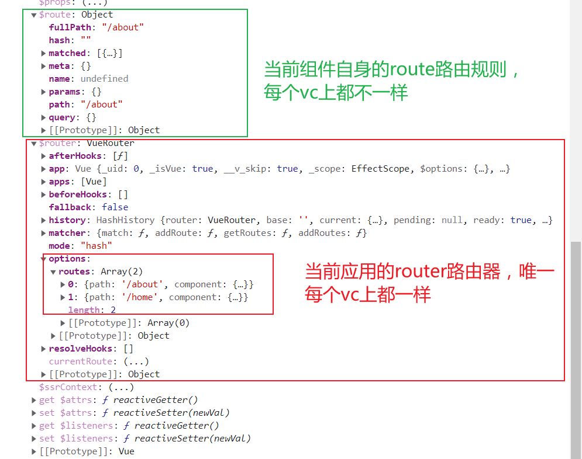


## 7.4 嵌套（多级）路由

+ 配置路由规则，使用`children`配置项

  ```javascript
  import Vue from 'vue'
  // 引入插件
  import vueRoute from 'vue-router'
  // 引入组件，用于路由跳转
  import About from '../pages/About.vue'
  import Home from '../pages/Home.vue'
  import News from '../pages/News.vue'
  import Message from '../pages/Message.vue'
  
  // 使用插件
  Vue.use(vueRoute)
  
  // 创建并暴露自己的路由器
  export default new vueRoute({
  
      // 配置路由规则 ,必须是数组 
      routes:[
          // 可以有多组路由规则  这种时普通的单级路由
          {
              path:'/about',
              component: About
          },
          {
              path:'/home',
              component:Home,
              // children配置多级路由 数组
              children:[
                  {
                      // 子路由不要从/开始，/代表根
                      path:'news',
                      component:News
                  } 
                  ,
                  {
                      path:'message',
                      component:Message
                  }
              ]
          }
      ]
  })
  ```

+ 跳转要写完整路径

  ```vue
  <template>
    <div>
      <h2>我是Home的内容</h2>
      <!-- 路由嵌套 即多级路由 -->
      <ul class="nav nav-tabs">
        <li>
          <router-link class="list-group-item" active-class="active" to="/home/news">News</router-link >
        </li>
        <li>
            <!-- 跳转要写完整路径 c从根路径/ 开始-->
          <router-link  class="list-group-item" active-class="active" to="/home/message">Message</router-link >
        </li>
      </ul>
      <router-view></router-view>
    </div>
  </template>
  ```

## 7.5 路由传参

### 7.5.1 路由器`query`传参（搭配path）

#### 7.5.1.1 原理

父组件借助`<router-link>`的`to`属性来指定传递的`query`参数，子组件借助vc上`this.$store.query`获取父组件传递过来的参数

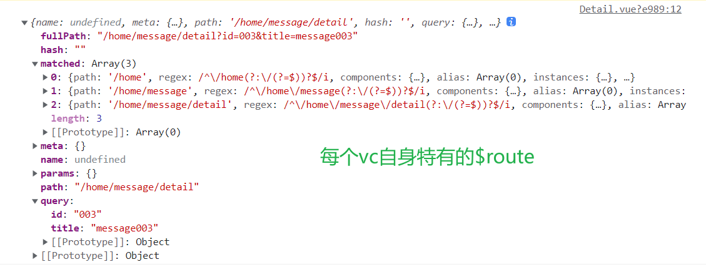

#### 7.5.1.2 使用方法

+ 路由器文件`route\index.js`中配置好路由规则

  ```javascript
  export default new vueRoute({
  
      // 配置路由规则 ,必须是数组 
      routes:[
          {
              path:'/home',
              component:Home,
              // children配置多级路由 数组
              children:[
                  {
                      path:'message',
                      component:Message,
                      // 用三级路由演示 参数query传递
                      children:[
                          {
                              path:'detail',
                              component:Detail,//组件名
                          }
                      ]
                  }
              ]
          }
      ]
  })
  ```

+ 父组件中借助`<router-link>`标签的`to`属性，传递query参数

  **记住`to`一定要加冒号 :s**

  ```vue
  <template>
      <div>
          <ul>
              <li v-for="message in messages" :key='message.id'>
                  <!-- query传参 简单写法 -->
                  <!-- <router-link :to="'/home/message/detail?id='+message.id+'&title='+message.title" >{{message.title}}</router-link > -->
                  
                  <!-- query传参 对象写法 -->
                  <router-link 
                      :to="{
                          path:'/home/message/detail',
                          query:{
                              id:message.id,
                              title:message.ti
                          }
                      }" >
                      {{message.title}}
                  </router-link >
  
              </li>
          </ul>
          <router-view></router-view>
      </div>
  </template>
  
  <script>
  export default {
      name:'Message',
      data(){
          return {
              messages:[
                  {id:'001',title:"message001"},
                  {id:'002',title:"message002"},
                  {id:'003',title:"message003"}
              ]
          }
      }
  }
  </script>
  ```

  > 注意：
  >
  > + 这里的query其实就是地址栏中?后面
  > + 有两种传参方式，推荐第二种**数组写法**

+ 子组件借助`this.$route.query`获取传参


  ```vue
  <template>
      <ul>
          <li>消息编号：{{this.$route.query.id}}</li>
          <li>消息标题：{{this.$route.query.title}}</li>
      </ul>
  </template>
  11
  <script>
  export default {
      name:'Detail',
      mounted(){
          console.log(this.$route);
      }
  }
  </script>
  ```

  > + 开启路由功能后每个组件实例vc身上都会有一个、唯一的和自己紧密相关`$route`
  > + `$router`是全局路由器每个vc都有一个，他们完全一样

+ 测试

  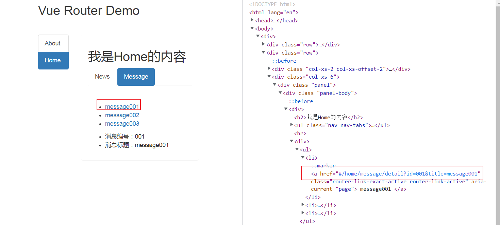

### 7.5.2 路由器params传参(搭配name)

#### 7.5.2.1 原理

通过在路由规则`path`中添加占位符，模仿restful风格传参

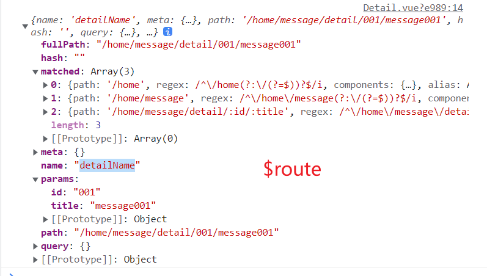

#### 7.5.2.2 使用方法

+ 路由器文件`route\index.js`中配置好路由规则，**设置占位符**

  ```javascript
  export default new vueRoute({
      routes:[
          {
              path:'/home',
              component:Home,
              children:[
                  {
                      path:'message',
                      component:Message,
                      // 用三级路由演示 参数params传递
                      children:[
                          {   
                              name:'detailName',
                              path:'detail/:id/:title', //这里用什么名字占位，实际参数名就是这个
                              component:Detail,
                          }
                      ]
                  }
              ]
          }
      ]
  })
  ```

+ 父组件中借助`<router-link>`标签的`to`属性，传递params参数

  ```vue
  <template>
      <div>
          <ul>
              <li v-for="message in messages" :key='message.id'>
                      <!-- params传参1  模版写法 -->
                  <!-- <router-link :to="`/home/message/detail/${message.id}/${message.title}`" >{{message.title}}</router-link > -->
                      <!-- params传参2  必须和name搭配 不能和path否则会出错，也没有提示 -->
                      <router-link 
                      :to="{
                          name:'detailName',
                          params:{
                              id:message.id,
                              title:message.title
                          }
                      }" >
                  
                      {{message.title}}
                  </router-link >
  
              </li>
          </ul>
          <!--用来显示路由组件 -->
          <router-view></router-view>
      </div>
  </template>
  ```

  > `:to`使用对象写法，则`params`传参必须和`name`搭配，不能和`path`搭配，否则会出现错误也不会报错（显示空白）

+ 子组件借助`this.$route.params`获取传参

  ```vue
  <template>
      <ul>
          <!-- <li>消息编号：{{this.$route.query.id}}</li>
          <li>消息标题：{{this.$route.query.title}}</li> -->
          <li>消息编号：{{this.$route.params.id}}</li>
          <li>消息标题：{{this.$route.params.title}}</li>
      </ul>
  </template>
  ```

  

## 7.6 命名路由

### 7.6.1 作用

用于给路由起名字，简化路由跳转的路径

### 7.6.2 使用

以**7.4的嵌套路由**为例子

+ 路由器文件`route/index.js`定义`name`属性

  每一个路由规则都可以定义一个`name`，确保其唯一

  ```javascript
  export default new vueRoute({
      routes:[
          {
              path:'/home',
              component:Home,
              children:[
                  {
                      path:'message',
                      component:Message,
                      children:[
                          {
                              name:'detailName'//避免混淆
                              path:'detail',
                              component:Detail,//组件名
                          }
                      ]
                  }
              ]
          }
      ]
  })
  ```

+ 使用路由的`name`

  ```html
  <!-- 路由路径 简化写法 用name代替path -->
  <router-link 
      :to="{
          name:'detailName',
          query:{
              id:message.id,
              title:message.title
      }
      }" >
  ```

  > 使用路由的`name`属性，则必须使用`:to`且是对象写法
  >
  > `<router-link :to='{name:'xxxxx'}'>`

## 7.7 路由的props属性

作用：为了让路由组件更方便的收到`params`参数，**如果使用了props则既不需要在`path`中使用参数占位符了**

***写法：***

+ 第一种写法，值为一个**对象**，该对象中所有的key-value的组合最终都会通过`props`属性，传递给子组件Detail

  ```javascript
  children:[
      {   
      name:'detailName',
      path:'detail/:id/:title', //这里用什么名字占位，实际参数名就是这个
      component:Detail,
      // props第一种写法
      props:{id:11111,title:"zhege是标题"}
      }
  ]
  ```

  > 缺点：key-value值固定了

+ 第二种写法，值为一个**布尔值**，布尔值为`true`，表示路由会把收到的所有`params`参数通过`props`传递给Detail组件

  ```javascript
  children:[
      {   
          name:'detailName',
          path:'detail/:id/:title', //这里用什么名字占位，实际参数名就是这个
          component:Detail,
          // 第一种写法
          // props:{id:11111,title:"zhege是标题"},
          // 第二种写法  布尔值
          props:true
      }
  ]
  ```

  > 缺点：只能搭配路由的`params`使用，`query`无效

+ 第三种写法，值为一个**函数**，有一个形参为`$route`，该函数返回一个对象里面的每一组key-value都会通过`props`属性传递给子组件Detail

  ```javascript
  children:[
      {   
          name:'detailName',
          path:'detail/:id/:title', //这里用什么名字占位，实际参数名就是这个
          component:Detail,
          // 第一种写法
          // props:{id:11111,title:"zhege是标题"},
          // 第二种写法  布尔值
          //props:true,
          // 第三种写法 函数
          props($route){
              return {
                  id:$route.query.id,
                  title:$route.query.title
              }
          }
      }
  ]
  ```

  > 通过函数`$route`可以获取当前路由的所有属性如`query`,`params`等，但是多少有点脱裤子放屁

***子组件Detail调用：***

```vue
//Detail.vue
<template>
    <ul>
        <li>消息编号：{{id}}</li>
        <li>消息标题：{{title}}</li>
    </ul>
</template>

<script>
export default {
    name:'Detail',
    //子组件通过props属性接收
    props:['id','title']
}
</script>
```

## 7.8 `router-link`的replace

### 7.8.1 浏览器历史记录的两种模式

+ 默认情况下`<router-link>`标签会在浏览器中留下历史痕迹，属于栈的`push`操作。特点就是可以使用前进→，后退←按钮

  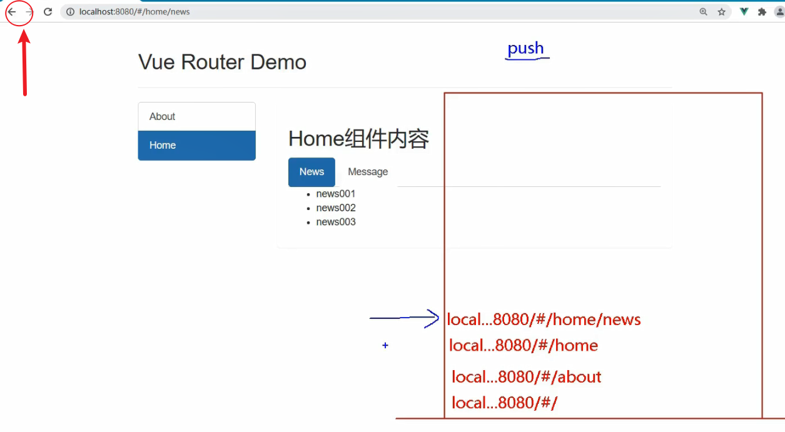

+ `<router-link>`标签还有一种`replace`模式，该模式下不会留下历史痕迹，即栈内控件只能存放一个当前页面

  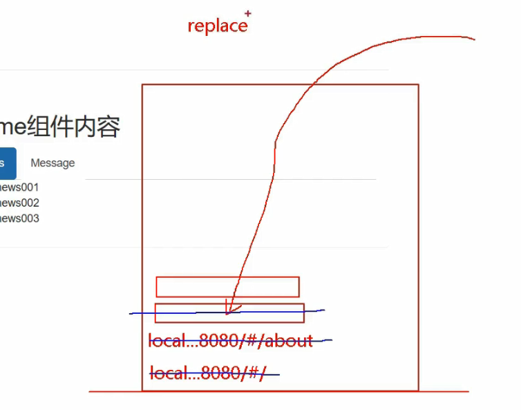

### 7.8.2 `router-link`的replace

`replace`替换浏览器的历史，只保存当前的。有以下两种写法：

```html
<router-link  replace class="list-group-item" active-class="active" to="/about">About</router-link>
<router-link  :replace="true" class="list-group-item" active-class="active" to="/home">Home</router-link> 
```


## 7.9 缓存路由组件

作用：为了让不展示的路由保存挂载状态，不被销毁。`<keep-alive>`

***使用：***

```html
<!-- 保证组件一直是挂载状态，即被缓存起来
       + 不加include默认是所有组件（News+message）
       + 加了include则只缓存指定组件
       + include中是组件的名字（News.vue中name属性）
       + 多个组件写成数组 :include="['News','Message']"
       -->
<keep-alive > //一般都是父组件中写这个标签
   <router-view></router-view>
 </keep-alive>
```

> ==include里面是组件的name属性==

## 7.10 路由特有的周期函数`activated`与`deactivated`

路由组件具有两个独有的生命周期函数（钩子），用于**捕获路由组件的激活状态**

+ `activated `路由组件被激活时触发
+ `deactivated `路由组件失活时触发
+ 这两个钩子函数和`methods,mounted()等同级别`

```javascript
   name:'News',
   data(){},
   methods:{},
	activated(){
        this.timer=setInterval(()=>{
            if(this.num>0){
                this.num -= 0.1
            }else {
                this.num =1
            }
            console.log('News 组件被激活了@');
        },100)
    },
    deactivated(){
        clearInterval(this.timer)
        console.log('News 组件失活活了@');
    }
```

> 一般搭配`<keep-alive>`使用，节省资源

## 7.11 全局前/后置路由守卫

用于鉴权，类似于过滤器

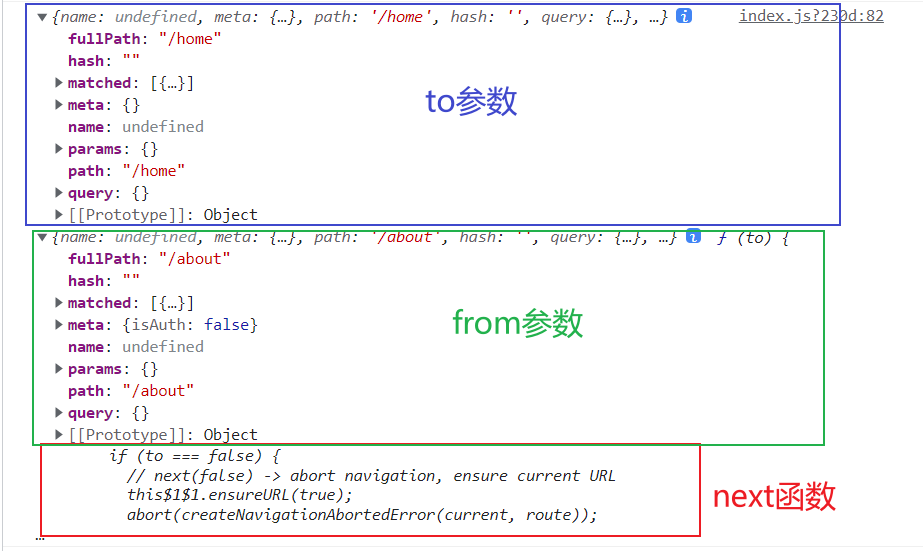

### 7.11.1 全局前置路由守卫

***调用时机：***

+ ==初始化时会被调用==
+ ==每次路由切换之前会被调用（如果没放行，地址栏地址都不会变化）==

**路由器文件`route/index.js`中使用`beforeEach()`函数**，注意位置，不是在配置属性中！

```javascript
const router=new vueRouter({...})
// 在new router后面
router.beforeEach((to,from,next)=>{
    console.log(to,from,next);
    //鉴权字段，看看那个需要鉴权
    if(to.meta.isAuth) {
        if(localStorage.getItem('id')==='002') {
            next();
        } else{
            alert("鉴权失败");
            return;
        }
    }
    // 放行
    next();
})

export default router
```


### 7.11.2 全局后置路由守卫

***调用时机：***

+ ==初始化时会被调用==
+ ==每次路由成功切换之**后**会被调用（切换之后，意味着`beforeEach`通过了）==

**路由器文件`route/index.js`中使用`afterEach()`函数**，注意位置，不是在配置属性中！

```javascript
const router=new vueRouter({...})
// 在new router后面                     
// 调用时机：初始化、路由组件成功切换之后
router.afterEach((to,from)=>{
    document.title = to.meta.title ||'Index'
})

export default router
```

## 7.12 单组件独享路由守卫

顾名思义，相对于全局的路由守卫，**独享路由守卫是针对某一个单独路由设置的**

==在`route/index.js`文件中的`routes`属性中配置的==

***调用时机：***

+ ==每次路由切换之前会被调用（如果没放行，地址栏地址都不会变化）==

```javascript
import vueRoute from 'vue-router'
const router=new vueRoute({
    routes:[
        {
            path:'/home',
            component:Home,
            meta:{title:'Home'},
            children:[
                {
                    path:'news',
                    component:News,
                    meta:{
                        isAuth:true,
                        title:'News'
                    },
                    //独享前置路由守卫
                    beforeEnter(to,from,next){
                        if(to.meta.isAuth) {
                            if(localStorage.getItem('id')==='002') {
                                next();
                            } else{
                                alert("鉴权失败");
                                return;
                            }
                        }
                        // 放行
                        next();
                    }
                }
            ]
        }
    ]
})
```

> 独享路由守卫只有前置，没有后置（**注意他和全局路由守卫定义的位置区别**）

## 7.13 组件内路由守卫

路由守卫（钩子函数）定义在组件内，而不是路由器文件`route/index.js`内。

***调用时机：***

+ ==`beforeRouteEnter(to,from,next)`**通过路由规则进入**组件时会被调用==（直接用组件不会触发）
+ ==`beforeRouteLeave(to,from,next)`**通过路由规则离开**组件时会被调用==（直接用组件不会触发）

```vue
<template>
  <h2>我是About的内容</h2>
</template>
<script>
export default {
    name:'About'
    // 组件内置路由 调用时机：进入组件前
    beforeRouteEnter(to,from,next){
      console.log(to,from);
      if(confirm("确定要进入About组件？")) {
        next();
      }
    },
    //调用时机：离开组件前
    beforeRouteLeave(to,from,next){
      console.log(to,from);
      if(confirm("确定要离开About组件？")) {
        next();
      }
    }
}
</script>
```

> - 注意和**全局前/后置路由守卫**的**调用时机区分**。
> - 注意和**单组件独享路由守卫**的**定义位置区分**
> - 类似于`activated,deactivated`的效果
> - **需要通过路由规则进入/离开才会触发**
> - `<About />`这样直接使用不会触发

## 7.14 路由器`hash`和`history`

### 7.14.1 引入

`http://localhost:8080/#/home/message/detail?id=001&title=message001`在vue路由中`#`代表hash，`#/xx`一直到后面的路径都成为hash值（非后端的hash加密），在发送http请求时`#`后面的都不会发送给服务器。即

+ `http://localhost:8080`
+ `http://localhost:8080/#/home/message/detail?id=001&title=message001`

后端收到的请求来自都是 `http://localhost:8080/`（是request.host的值）

### 7.14.2 `hash`和`history`

+ 对于一个url来说，什么是hash值？--`#`及其后面的内容就是hash值

+ hash值不会包含在HTTP请求中，即：**请求中hash值不会带给服务器**

+ ==***hash模式***==

  1. 地址中永远带着`#`号，不美观
  2. 若以后将地址通过第三方手机app分享，若app校验严格，则地址会被标记为不合法
  3. 兼容性好（刷新不会404）

+ ==***history模式***==

  1. 地址干净，美观
  2. 兼容性和hash模式比略差（有些点出来的路径如前端路由的，会404）
  3. 应用部署上线时需要后端人员支持，解决刷新页面服务端404问题

+ vue中默认使用`hash`模式

+ 路由器文件`route/index,js`中更改为`history`模式

  ```javascript
  import vueRouter from 'vue-router'
  ...
  const router=new vueRouter({
      mode:'history'//不写默认为hash模式
  })
  ```

+ 解决`history`模式下刷新请求404

  - 后端映射，正则匹配，第三方库
  - nginx
  - 前端服务器如`node`+`express`中使用库[`connect-history-api-fallback`](https://www.npmjs.com/package/connect-history-api-fallback)

# 9 vue项目打包

**打包后的项目需要容器启动才能查看，直接打开`index.html`不显示的（也可以手动改js引入路径）**

```bash
# 运行后会把当前vue项目下src目录下文件打包成静态资源放在dist目录下
npm run build
```

# 10、Vue UI组件库

## 10.1 组件库

### 10.1.1 移动端组件库

参考

+ Vant https://youzan.github.io/vant
+ Cube UI https://didi.github.io/cube-ui
+ Mint UI http://mint-ui.github.io

### 10.1.2 PC端组件库

参考

+ Element UI https://element.eleme.cn
+ IView UI https://www.iviewui.com

## 10.2 ElementUI简单使用

地址：https://element.eleme.cn/#/zh-CN/component/installation

### 10.2.1 完整引入

+ 安装ElementUI

  ```bash
  npm i element-ui
  ```

+ 入口文件`main.js`引入该插件

  ```javascript
  import Vue from 'vue'
  import App from './App.vue'
  // 引入全部的elementui库
  import ElementUI from 'element-ui';
  import 'element-ui/lib/theme-chalk/index.css';
  
  // 使用ElementUI插件库
  Vue.use(ElementUI);
  
  Vue.config.productionTip = false
  new Vue({
      // h其实就是createElement
      render:h=>h(App)
  }).$mount('#app')
  ```

+ `App.vue`组件中使用ElementUI

  ```vue
  <template>
  <div>
    原生按钮：<button></button> <br>
    <el-row>
      <el-button>默认按钮</el-button>
      <el-button type="primary">主要按钮</el-button>
      <el-button type="success">成功按钮</el-button>
      <el-button type="info">信息按钮</el-button>
      <el-button type="warning">警告按钮</el-button>
      <el-button type="danger">危险按钮</el-button>
    </el-row>
    <el-row>
      <el-button icon="el-icon-search" circle></el-button>
      <el-button type="primary" icon="el-icon-edit" circle></el-button>
      <el-button type="success" icon="el-icon-check" circle></el-button>
      <el-button type="info" icon="el-icon-message" circle></el-button>
      <el-button type="warning" icon="el-icon-star-off" circle></el-button>
      <el-button type="danger" icon="el-icon-delete" circle></el-button>
    </el-row>
  </div>
  </template>
  
  <script>
  export default {
      name:'App'
  }
  </script>
  ```

+ 运行测试

  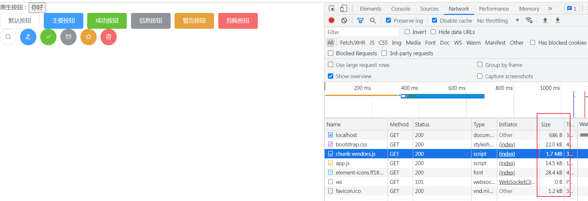

### 10.2.2 按需引入

+ 安装ElementUI

+ 修改`babel`配置

  文档：https://element.eleme.cn/#/zh-CN/component/quickstart

  + 安装`babel-plugin-component`组件

    ```bash
    npm install babel-plugin-component -D
    ```

  + 修改` .babelrc `（在vue中就是`babel.config.js`，追加而不是覆盖）

    ```javascript
    module.exports = {
      presets: [
        '@vue/cli-plugin-babel/preset',
        ["es2015", { "modules": false }]
      ],
      "plugins": [
        [
          "component",
          {
            "libraryName": "element-ui",
            "styleLibraryName": "theme-chalk"
          }
        ]
      ]
    }
    ```

+ 入口文件`main.js`引入需要的插件

  ```javascript
  import Vue from 'vue'
  import App from './App.vue'
  // 引入需要的elementui库(用到什么标签就去掉el然后首字母大写)
  import {Button,Row} from 'element-ui'
  //样式就不许单独引入了，会自动按需引入
  
  
  // 使用需要的插件库，注册为全局组件,
  //第一个为组件名，默认是<el-button>当然你可以自定义，那么使用时就需要保持一致
  Vue.component(Button.name,Button)
  Vue.component('ly-row',Row)
  
  
  Vue.config.productionTip = false
  new Vue({
      // h其实就是createElement
      render:h=>h(App)
  }).$mount('#app')
  ```

+ `App.vue`组件中使用

  ```vue
  <template>
  <div>
    原生按钮：<button>你好</button> <br>
    <!-- 注册什么组件用什么名字，就用什么 -->
    <ly-row>
      <el-button>默认按钮</el-button>
      <el-button type="primary">主要按钮</el-button>
      <el-button type="success">成功按钮</el-button>
      <el-button type="info">信息按钮</el-button>
      <el-button type="warning">警告按钮</el-button>
      <el-button type="danger">危险按钮</el-button>
    </ly-row>
    <ly-row>
      <el-button icon="el-icon-search" circle></el-button>
      <el-button type="primary" icon="el-icon-edit" circle></el-button>
      <el-button type="success" icon="el-icon-check" circle></el-button>
      <el-button type="info" icon="el-icon-message" circle></el-button>
      <el-button type="warning" icon="el-icon-star-off" circle></el-button>
      <el-button type="danger" icon="el-icon-delete" circle></el-button>
    </ly-row>
  </div>
  </template>
  
  <script>
  export default {
      name:'App'
  }
  </script>
  ```

+ 尝试启动，报错`Error: Cannot find module 'babel-preset-es2015'`，重新修改`babel-config.js`文件

  参考连接：[element-ui按需引入报错 Error: Cannot find module ‘babel-preset-es2015‘_element按需引入cannot find module '@element-plus/icons-CSDN博客](https://blog.csdn.net/zy21131437/article/details/108029284)

  ```javascript
  module.exports = {
    presets: [
      '@vue/cli-plugin-babel/preset',
      // ["es2015", { "modules": false }],
      ["@babel/preset-env", { "modules": false }]//替换上面的
    ],
    "plugins": [
      [
        "component",
        {
          "libraryName": "element-ui",
          "styleLibraryName": "theme-chalk"
        }
      ]
    ]
  }
  ```

+ 测试运行

  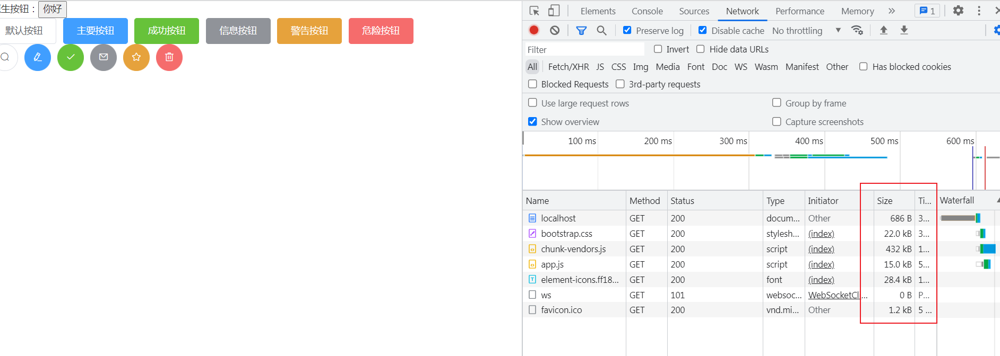

### 10.2.3 比较

**完整引入**会引入elementUI的所有组件，导致js文件过大，影响效率。而**按需引入**可以避免这个问题。
