# 1、Vue核心

## 1.1、Vue简介

### 1.1.1、Vue官网

中文：https://cn.vuejs.org/

英文： https://vuejs.org/

### 1.1.2、介绍

动态构建用户界面的渐进式 JavaScript 框架

### 1.1.3、Vue特点

+ 遵循 MVVM 模式
+ 编码简洁, 体积小, 运行效率高, 适合移动/PC 端开发
+ 它本身只关注 UI, 也可以引入其它第三方库开发项目

### 1.1.4、与其他JS框架关联

+ 借鉴 Angular 的模板和数据绑定技术
+ 借鉴 React 的组件化和虚拟 DOM 技术

### 1.1.5、Vue周边库

+ vue-cli: vue 脚手架
+ vue-resource
+ axios
+ vue-router: 路由
+ vuex: 状态管理
+ element-ui: 基于 vue 的 UI 组件库(PC 端

官网收录的插件库：

+ [vuejs/awesome-vue: 🎉 A curated list of awesome things related to Vue.js (github.com)](https://github.com/vuejs/awesome-vue)
+ [awesomejs.dev](https://awesomejs.dev/for/vue/)

## 1.2、Vue实例和容器的关系

Vue实例(`new Vue()`)和容器(挂载点`el`)必须一一对应：

+ 多对一，不行
+ 一对多，不行

## 1.3、*模版 语法*

html 中包含了一些 JS 语法代码，语法分为两种，分别为：

+ 插值语法（双大括号表达式{{}}）
+ 指令语法（以 v-开头）

### 1.3.1、插值语法

+ 功能: 用于解析标签体内容

+ 语法: {{xxx}} ，***xxxx 会作为 js 表达式解析，xxx为表达式***

  > xxx其实就是vue实例的属性，所以xxx可以为vue实例中的任何属性：
  >
  > 

### 1.3.2、指令语法

+ 功能：*** 解析标签属性、解析标签体内容、绑定事件***
+ 举例：v-bind:href = 'xxxx' ，***xxxx 会作为 js 表达式被解析***
+ 说明：Vue 中有有很多的指令，此处只是用 v-bind 举个例子

## 1.4、数据绑定

### 1.4.1、单向数据绑定

即vue中定义的变量值变化可以应用到dom页面元素中，但是**dom页面元素中值的变化不会影响到vue中的变量值**

+ 语法：`v-bind:xxx='***'`或者简写为`:xxx='***'`

  > 其中xxx表示标签属性，***为表达式

+ 特点：**指定从vue中的data流向页面**

### 1.4.2、双向数据绑定

即vue中定义的变量值变化可以应用到dom页面元素中，**dom页面元素中值的变化也会影响到vue中的变量值**

+ 语法：`v-model:value='xxx'`或者简写为`v-model='xxx'`

  > 注意：
  >
  > 1. xxx为变量，不能写表达式
  > 2. `v-model:value`只适用于表单类标签，有value属性的，能让用户输入的

+ 特点：**数据不仅可以从vue中data流向页面，当页面数据发生变化也会应用到vue中的data**

## 1.5、el与data的两种写法

### 1.5.1 el

#### 1.5.1.1 第一种写法

```html
 <script type="text/javascript">
        const app = new Vue({
            el: '#root', //挂载点在内部
            data: {name:'yaord'}   
        });
    </script>
```

#### 1.5.1.2 第二中写法

原理就是借助底层方法，推荐：

```html
<script type="text/javascript">
    const app = new Vue({
        //el: '#root', 
        data: {name:'yaord'}   
    });

    //可以使用函数玩花活,2秒后才会变化
    setTimeout(()=>{
        app.$mount('#root');
    },2000);
</script>
```

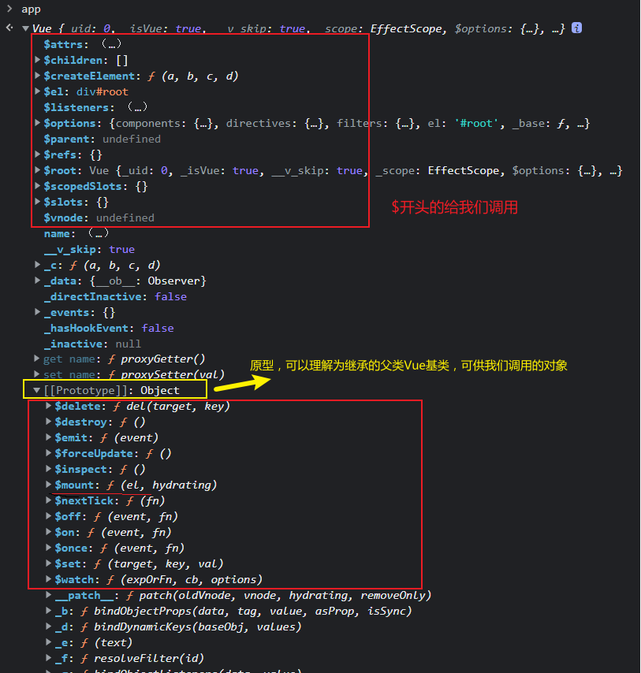

### 1.5.2 data

#### 1.5.2.1 第一种写法

```html
 <script type="text/javascript">
        const app = new Vue({
            el: '#root', //挂载点在内部
            data: {name:'yaord'}   
        });
    </script>
```

#### 1.5.2.2 第二种写法

```html
<script type="text/javascript">
    const app = new Vue({
        data: function(){ 
            //这里的this是app，即vue实例
            return {
                name: "yaord"
            }
        }
    });
    setTimeout(()=>{
        app.$mount('#root');
    },2000);
</script>
```

> **注意：**
>
> 1. 如果data后面的函数是箭头函数，即匿名函数，因为**箭头函数没有this指向**，所以内部的this会指向上一级，在浏览器中上一级就是window对象
>
> 2. data后面的函数可以简写为：
>
>    ```javascript
>    data(){ 
>        //这里的this是app，即vue实例
>        return {
>            name: "yaord"
>        }
>    }
>    ```

## 1.6、MVVM模型

+ M：模型(Model) ：对应 data 中的数据
+ V：视图(View) ：模板
+ VM：视图模型(ViewModel) ： Vue 实例对象


## 1.7 数据代理

### 1.7.1 Object.defineProperty

+ 正常定义对象：

​		**这样定义对象，里面的属性可以正常*遍历*，*修改*，*删除***

```javascript
let person = {
    name: "yaord",
    sex: "male",
    age: 18
}
```

​		控制台查看：


+ 通过Object.defineProperty定义属性

  ```javascript
  let person = {
      name: "yaord",
      sex: "male",
      //age: 18
  }
  
  /**
   * param1:需要修改的对象
   * param2:要添加的属性名
   * param3:属性的配置信息
   * 
   **/
  Object.defineProperty(person,'age',{
      value:18, //设置新属性的值
      enumerable:true,//设置新属性是否可以进行枚举，默认false，即通过in方法无法遍历到此属性
      writable:true,//设置新属性是否可以进行修改值，默认false，无法二次修改
      configurable:true//设置新属性是否可以删除，默认是false，无法将其删除
      ...//当然还有很多，
  })
  ```

  

### 1.7.2 属性定义方法（getter和setter方法）

```javascript
let number = 18;
let person = {
    name: "yaord",
    sex: "male",
    //age=number 如果直接这样赋值，则number更改了，age不会，因为这不是引用类型
}

Object.defineProperty(person,'age',{
    //当有人给person的age属性赋值，就会调用该方法
    set(value){
        console.log("正在进行赋值操作！");
        number = value;
    },
    //当有人访问到person的age属性，就会调用该方法
    get(){
        console.log("正在进行读取操作！");
        return number;
    }
})
```

**调用：**


### 1.7.3 数据代理**

***通过一个对象代理对另一个对象中属性进行读写的操作***

```javascript
let obj_1 = {x:100};
let obj_2 = {y:200};

//想要通过obj_2操作obj_1中的x属性
Object.defineProperty(obj_2,'x',{
	get(){
		return obj_1.x;
	},
	set(value){
		obj_1.x = value;
	}
})
```


### 1.7.4 vue中数据代理


## 1.8 *事件处理***

### 1.8.1 绑定监听

可以使用`v-on:xxx="函数"`或`@xxx="函数"`来实现事件监听绑定，其中xxx为事件监听如click等。

***`v-on:`支持原有js所有的事件，如`click,input,mouseover,mouseleave,...`***

+ 默认事件形参: event
+  隐含属性对象: $event

```html
<body> 
    <div id="root">
       <button v-on:click="func1">点我</button>
       <!-- 简化写法，如果传递参数不写$event会导致event丢失-->
       <button @click="func2(66,$event)">点我2</button>
    </div>

    <script type="text/javascript">
        //func(){}//写在这里不行，因为只能接受vue中的函数
        const vm = new Vue({
            el: '#root', 
            data: { 
                World: new Date().toLocaleDateString()
                //func(){}//可以写在这里，但是会对其进行数据代理操作，浪费性能
            },
            methods:{
                func1(event){ //默认传递一个event参数
                    console.log(event);
                    alert("hello 1");
                },
                func2(num,event){ //默认传递一个event参数
                    console.log(num);//第一个参数66
                    console.log(event); //第二个参数event
                    alert("hello 2");
                },
            }         
        });
    </script>  
</body>
```

### 1.8.2 事件修饰符

事件，即js原生事件如：click，mouseover，scroll等等。

修饰符就代表怎么处理事件的默认操作，如a标签，默认点一下会调转网页，如果我不想跳转就需要用到`*event*.preventDefault();`，而在vue中通过修饰符`prevent`来实现。

***Vue中的事件修饰符（必须在挂载点范围内）：***

***可以连着写`@click.prevent.stop=''`***

+ `pervent`：阻止事件的默认行为（常用）

  ```html
  <!-- 执行func函数后不会跳转网址--> 
  <a href="baidu.com" @click.prevent="func">友链</a>
  ```

+ `stop`：阻止事件冒泡（常用）

  + **事件捕获是从外到内**
  + **事件冒泡是由内到外**

  如父事件和子事件同时监听click操作，当点击子事件时，会先执行子事件的回调函数，然后再向上冒泡给父事件，父事件再调用回调函数

  ```html
  <div class="c1" @click="f1('c1')">
      1 <br>
      <!-- 如果不阻止事件冒泡，click事件会逐次上传-->
      <button @click.stop="f1('c2')">2</button>
  </div>
  ```

+ `once`：事件只触发一次（常用）

  ```html
  <button @click.once="f1(1)">只有第一次会生效</button>
  ```

+ `capture`：使用事件捕获模式

  + **事件捕获是从外到内**
  + **事件冒泡是由内到外**

  ```html
  <!-- 当点击按钮时，加上capture会先触发div的click-->
  <div class="c1" @click.capture="f1('c1')">
      1 <br>
      <button @click.stop="f1('c2')">2</button><!-- 此时可以不加stop，因为事件只会执行一次，且已经执行-->
  </div>
  ```

+ `self`：只有`event.target`是当前操作的元素时才触发事件

  ```html
  <!-- 此时点击按钮，这就是触发button的click事件，div的click不会触发
  这是因为 点了button  event.target是 button元素，由内向外冒泡后还是button元素
  不会发生变化，冒泡到div比较click事件不是self自身，所以不会触发
  -->
  
  <div class="c1" @click.self="f1('c3')">
      3 <br>
      <button @click="f1('c4')">4</button>
  </div>
  ```

+ `passive`：事件的默认行为立即执行，无需等待事件回调函数执行完毕

  ```html
  <!-- 加上passive可立刻向下滚动一次，无需等到onScroll执行完-->
  <div @scroll.passive="onScroll">...</div>
  ```

### 1.8.3 按键修饰符

就是对按键事件起的别名，一般用keyup事件

#### 1.8.3.1 vue中定义的键

+ `enter`：按下回车
+ `delete`：按下删除和退格键
+ `esc`：按下esc
+ `space`：按下空格键
+ `tab`：按下tab，必须配合keydown事件（因为tab本来有切换焦点的功能）
+ `up`：按上方向键
+ `down`：按下方向键
+ `left`：按左方向键
+ `right`：按右方向键

#### 1.8.3.2 vue中未定义的键

对于其他没有定义的键，可以使用`event.key`和`event.keycode`来查看键盘按键的名字及其对应的数字，

当然也可百度查看键码表查看

#### 1.8.3.3 系统修饰键

***可以连着写`@keyup.ctrl.y=''`,只有ctr+y才会生效***

以下系统修饰键的使用逻辑：

> 1. 配合keydown使用，正常触发
> 2. 配合keyup使用，按下修饰键的同时，再按别的键，再松开别的键，事件才会触发

+ `ctrl`
+ `alt`
+ `shift`
+ `win`或`meta`

#### 1.8.3.4 自定义按键别名

```javascript
Vue.config.keyCodes.huiche=13;//定义一个回车
```

## 1.9 计算属性 - computed

对vue中data属性计算而来，称之为计算属性，放在computed属性中：

***计算属性中get方法调用时机：***

+ 第一次读取计算属性时，然后会把该属性**保存在缓存中（下面再次调用会从缓存中取，而不会再次调用get方法）**
+ 当计算属性所依赖的数据如first发生变化时，也会调用get方法

```html
<body> 
    <div id="root">
        姓：<input type="text" v-model="first"> <br>
        名：<input type="text" v-model="last"> <br>
        全名：{{fullName}} <br>
        全名：{{fullName}}<!--从缓存中取-->
    </div>

    <script type="text/javascript">
        const vm = new Vue({
            el: '#root', 
            data: { 
               first:'',
               last:''
            },
            /**
             * 计算属性调用时机：
             *   1.第一次读取计算属性时，然后会把该属性保存在缓存中
             *   2.当计算属性所依赖的数据如first发生变化时，也会调用
             * */
            //计算属性
            computed:{
                //属性名，也会挂载到vm上，和data中属性数据一样
                fullName:{
                    //此处也是用 数据代理
                    get(){
                        //此处的this为vm
                        console.log(this);
                        return this.first + ' - ' + this.last;    
                    },
                    
                    /**
                     * set调用时机：
                     *    修改fullNam的值的时候
                     * @params value fullName修改后的值
                     * */
                    set(value){
                        //此处的this为vm
                        console.log(this);
                        this.first = value.split('-')[0].trim();
                        this.last = value.split('-')[1].trim();
                    }
                }
            }
        });

    </script>
    
</body>
```

***优点：*** 与methods实现相比，计算属性内部有缓存机制（复用），效率更高，调试方便

> ***备注：***
>
> + 计算属性最终会出现在vm上，直接读取使用即可
> + 如果计算属性要被修改，那必须要写set函数去响应修改，且set中要修改计算时依赖的data数据

### 1.9.1 计算属性简写

当确定计算属性只读取，不修改时，即只有get函数没有set函数，可以简写为：

```html
<script type="text/javascript">
    const vm = new Vue({
        el: '#root', 
        data: { 
            first:'',
            last:''
        },
        computed:{
            //对象中方法的简写形式（注意是函数的返回值）
            fullName(){
                console.log(this);
                return this.first + ' - ' + this.last;    
            }
        }
    });
</script>
```

## 1.10 监视属性 - watch

用于监视vue中属性及计算属性发生的变化，**属性必须存在**。

### 1.10.1 watch普通写法

```html
<body> 
    <div id="root">
        当前天气：{{info}} <br>
        <button @click="isHot = !isHot">点我切换</button>
    </div>
    <script type="text/javascript">
        const vm = new Vue({
            el: '#root', 
            data: { 
               isHot: true
            },
            computed:{
                info(){
                    return this.isHot?"炎热":"凉爽";
                }
            },
            //属性监视
            watch:{
                isHot: {
                    //立即监视，即初始化时就调用handler方法
                	immediate:true,
                    //用于监视属性和计算属性
                    handler(newValue,oldValue){
                        console.log('发生了变化，',newValue,oldValue);
                    }
                }
            }     
        });
    </script>
</body>
```

### 1.10.2 watch进阶写法

```javascript
const vm = new Vue({
    el: '#root', 
    data: { 
        isHot: true
    },
    computed:{
        info(){
            return this.isHot?"炎热":"凉爽";
        }
    }
});
// console.log(vm.isHot);//true
/**
 * watch参数
 * @params1 要监视的属性名，需要带引号，否则就是属性的值了
 * @params2 包含hadler配置属性对象
 **/	
//vm.$watch(vm.isHot,{ //这样是属性的值，而不是属性的名
vm.$watch('isHot',{
    immediate:true,
    handler(newValue,oldValue){
        console.log("isHot发生了变化 ",newValue,oldValue);
    }
})
```


### 1.10.3 深度监视 watch-deep

用于监视多级结构中的所有属性的变化（**而不是对象本身的内存地址**）

```html
<body> 
    <div id="root">
        当前天气：{{numbers.a}} <br>
        <button @click="numbers.a++">点我+1</button>
    </div>
    <script type="text/javascript">
        const vm = new Vue({
            el: '#root', 
            data: { 
               numbers:{
                a:1,
                b:1
               }
            }
        });
        vm.$watch('isHot',{
            ...
            }
        })
    </script>
</body>
```

+ **监视多级结构中的某个属性的变化**，如：numbers中的a

  ```javascript
  vm.$watch('numbers.a',{//多级结构
      handler(newValue,oldValue){
      console.log("a发生了变化 ",newValue,oldValue);
      }
  })
  ```

+ **监视多级结构中的所有属性的变化**，如：numbers中的a和b的值变化

  ```javascript
  //如果不加deep属性，监控的是numbers对象本身，而其本身是地址引用，内部值变化检测不到
  vm.$watch('numbers',{
      deep:true,//表示监控多级结构的属性，而不是多级结构对象本身
      handler(newValue,oldValue){
          console.log("numbers属性发生了变化 ",newValue,oldValue);
      }
  })
  ```

### 1.10.4 深度监视简写形式

不使用watch的其他配置属性：如immediate、deep属性时，可以用一下简写，即handler可以省略：

```javascript
//定义vue加watch
const vm = new Vue({
    el: '#root', 
    data: { 
        isHot: true
    },
    computed:{
        info(){
            return this.isHot?"炎热":"凉爽";
        }
    },
    watch:{
        //直接省略了handler，代价无法配置了
        isHot(newValue,oldValue){
            console.log(1,newValue,oldValue);
        }
    }
});


//$watch简写形式，即省略了handler
vm.$watch('isHot',function(newValue,oldValue){

});
```

### 1.10.5 computed与watch的区别

+ computed能完成的功能，watch都能完成
+ watch能完成的功能，computed不一定能完成，例如：watch可以进行异步操作

> 1. 所有被vue管理的函数，最好写成普通函数，这样this指向的才是vm 或 组件实例对象
> 2. 所有不被Vue所管理的函数（定时器的回调函数、ajax的回调函数、Promise的回调函数），最好写成回调函数，这样this指向才是vm或组件实例对象

## 1.11 class与style绑定

在应用界面中, 某个(些)元素的样式是变化的，class/style 绑定就是专门用来实现动态样式效果的技术

### 1.11.1 class绑定

+ **字符串用法，**适用于**样式的类名不确定，需要动态指定**
+ **数组用法，**适用于**要绑定的样式个数不确定，名字也不确定**
+ **对象用法，**适用于**要绑定的样式确定，个数确定，名字也确定，但是要动态决定用不用**

```html
<body> 
    <div id="root">
        <!-- 注意:class其实就是 v-bind:class的缩写
            :class里面加引号的是字符串，不加引号的是变量，注意区分
            -->
        <div class="demo" :class="'demo1'">
            string形式
        </div> <br>
        <!--  可以用数组，使用多个样式-->
        <div class="demo" :class="styleArr">
            arr形式
        </div> <br>
        <!--  可以用对象，使用多个样式-->
        <div class="demo" :class="styleObj">
            object形式
        </div> <br>
    </div>
    <script type="text/javascript">
        const vm = new Vue({
            el: '#root', 
            data: {
                //
                styleArr:['demo1','demo2'], 
                //对象用法
                styleObj:{
                    demo:false,
                    demo1:true,
                    demo2:true
                }
            }
        });
    </script>
    
</body>
```

### 1.11.2 style绑定

常用的就是object写法

```html
<body> 
    <div id="root">
        <!-- 就是v-bind-->
        <div class="demo" :style="styleObj">
            Style绑定object形式
        </div> <br>
    </div>
    <script type="text/javascript">
        const vm = new Vue({
            el: '#root', 
            data: {
                styleObj:{
                    //key必须是实际存在的
                    fontSize:40+'px',//对应style原本的属性 font-size 的驼峰写法
                    backgroundColor:'red'
                }
            }
        });
    </script>
</body>
</html>
```

## 1.12 条件渲染

### 1.12.1 条件渲染指令

+ `v-show='xxx'`，xxx为表达式，返回结果true或false决定当前元素是否显示

  ```html
  <!--底层原理就是 style='display:none'-->
  <h1 v-show="1 === 2">你好</h1>
  ```

+ `v-if='xxx'`，xxx为表达式，返回结果true或false决定当前元素是否显示

  ```html
  <!--dom中就没这个元素了，彻底删除 -->
  <h1 v-if="1 === 2">再见1</h1>
  <h1 v-else-if="1 === 2">再见2</h1>
  <!-- 无论v-else的条件是true 或false都会显示-->
  <h1 v-else>再见3</h1> 
  ```

  > ***注意：***使用`v-if`,`v-else-if`,`v-else`必须紧挨着
  >
  > ```html
  > <h1 v-if="1 === 2">再见1</h1>
  > <h1>@</h1> <!-- 不允许，后面不会显示，会报错-->
  > <h1 v-else-if="1 === 2">再见2</h1>
  > <h1 v-else>再见3</h1> 
  > ```

### 1.12.2 比较v-if和v-show

+ `v-if`会彻底删除dom节点
+ `v-show`只是通过style样式控制是否显示，频繁改变用`v-show`

### 1.12.3 template

***template必须配合`v-if`使用***

```html
<!-- 控制整体的显示，但是最终会在dom中多一层div，会影响css选择器的层次-->
<div v-show='1 ===2 '>
    <h1>再见1</h1>
	<h1>再见2</h1>
	<h1>再见3</h1>
</div>

<!-- vue中特有template标签，搭配v-if进行条件判断，最后dom中不会有template标签-，所以不会影响层次-->
<template v-show='1 ===2 '>
    <h1>再见1</h1>
	<h1>再见2</h1>
	<h1>再见3</h1>
</template>
```

### 1.12.4 动态添加属性

`:checked=true`表示给标签加上`checked`属性

`:checked='todo.done'`表示根据todo.done的值动态给标签加上`checked`属性

```html
  <div>
    <li>
      <label>
          <input type="checkbox" :checked='todo.done'/>
          <span>{{todo.title}}</span>
      </label>
      <button class="btn btn-danger" style="display:none">删除</button>
    </li>
    <!-- <input type="checkbox" /> test <button>删除</button> -->
  </div>
```


## 1.13 列表渲染

### 1.13.1 `v-for`

`v-for`可用于**数组，对象，字符串以及纯数字**

+ **数组**：第一个形参person就是值，第二个形参index就是序号、下标
+ **对象**：第一个形参person就是值value，第二个形参index就是key
+ **字符串**：第一个形参person就是值，第二个形参index就是下标、序号
+ **纯数字**：第一个形参person就是数值（从1开始），第二个形参index就是下标、序号（从0开始）

```html
<!-- 
	:key表示当前循环的唯一标志，不能重复，可以用对象person本身的id，也可以用序号index，肯定不会重复（必须加上）
	-->
<!-- item in items 等同于 item of items-->
<li v-for="(person,index) in persons" :key="index">
	{{person.name}} --- {{person.age}}
</li>
```

> 遍历纯数字：
>
> ```html
> <li v-for="(number,index) in 5" :key="index">
> 	{{number}} --- {{index}}
> </li>
> ```
>
> 

### 1.13.2 ==`v-for`中的key==

官网：https://v2.cn.vuejs.org/v2/api/#key

问题：如原来的顺序是：张三，李四，王五，现在要把赵六放在数组第一个，那么就会出现问题


+ **如果没有指定`v-for`中的key，vue默认会使用序号index**
+ **如果出现破环原有顺序的数据，如添加，删除等，使用index作为key则会导致虚拟dom复用失败，数据结构出现错乱**
+ **推荐使用唯一标识**


### 1.13.3 列表过滤*

```html
<body> 
    <div id="root">
        <h2>人员列表</h2>
        模糊搜索：<input type="text" placeholder="请输入人名" v-model:value="filter">
        <ul>
            <!-- 也可以用watch和computed写 -->
            <li v-for="(person,index) in persons" :key="person.id" v-show="person.name.indexOf(filter)>-1">
                {{person.name}} -- {{person.age}} -- {{person.sex}}
            </li>
        </ul>
    </div>
    <script type="text/javascript">
        const vm = new Vue({
            el: '#root', 
            data: {
                persons:[
                    {id:001,name:'马冬梅',age:18,sex:'女'},
                    {id:002,name:'周冬雨',age:19,sex:'女'},
                    {id:003,name:'周杰伦',age:20,sex:'男'},
                    {id:004,name:'温兆伦',age:21,sex:'男'}      
                ],
                filter:''
            }
        });
    </script>
</body>
```

### 1.13.4 列表排序

```html
<body> 
    <div id="root">
        <h2>人员列表</h2>
        模糊搜索：<input type="text" placeholder="请输入人名" v-model="filter">
        <button @click="sortType=2">年龄升序</button>
        <button @click="sortType=1">年龄降序</button>
        <button @click="sortType=0">原顺序</button>
        <ul>
            <!-- 也可以用watch和computed写 -->
            <li v-for="(person,index) in filPersons" :key="person.id">
                {{person.name}} -- {{person.age}} -- {{person.sex}}
            </li>
        </ul>
    </div>
    <script type="text/javascript">
        const vm = new Vue({
            el: '#root', 
            data: {
                persons:[
                    {id:001,name:'马冬梅',age:19,sex:'女'},
                    {id:002,name:'周冬雨',age:20,sex:'女'},
                    {id:003,name:'周杰伦',age:18,sex:'男'},
                    {id:004,name:'温兆伦',age:21,sex:'男'}      
                ],
                filter:'',
                sortType:0//0代表原顺序，1代表降序，2代表升序
            },
            computed:{
                filPersons(){
                    let arr = this.persons.filter((item)=>{
                            return item.name.indexOf(this.filter) > -1;
                        });
                    if(this.sortType) {
                        arr=arr.sort((x,y)=>{
                            //这样其实有个问题，每次都会比较
                            return this.sortType===1?y.age - x.age:x.age - y.age;
                        });
                    }
                    return arr;
                }
            }
        });
    </script>
</body>
```

## 1.14 ==vue检测到数据变化的原理==

+ 加工data，增加对应属性的get和set方法（内部增加响应式代码，用于在数据改变时重新生成dom）
+ 让vm._data=data
+ 页面渲染
+ data数据变化，就会调用对应属性的setter方法，然后setter内部重新解析模版
+ 生成新的虚拟dom
+ 虚拟dom和真实dom对比
+ 生成页面


### 1.14.1 vue中检测对象变化原理--对象**

```html
<!-- 
	核心是通过反向代理data的set函数中检测对象数据变化，下面进行模拟
-->

<script>
    let data = {
        name:"yaord",
        age:18
    }

    //创建一个监视 的实例对象，用于监视data中属性的变化【核心 new】
    const obj = new Observer(data);
    //console.log(obj);
    const vm = {};
    vm._data = data = obj;

    function Observer(obj){
        //汇总对象中所有的属性形成一个数组
        const keys = Object.keys(obj);
        //遍历
        keys.forEach((item)=>{
            //数据代理，代理在当前的Observer对象本身this，如果代理在data商会造成无限调用，导致栈溢出
            //console.log(this);
            Object.defineProperty(this,item,{
                enumerable:true,
                configurable:true,
                get(){
                    return obj[item];
                },
                set(val){
                    console.log("数据被改变，准备解析模版，生成虚拟dom。。。。");
                    obj[item] = val;
                }
            })
        }); 
    }
</script>
```

> 上面只是简单的模拟vue中的检测数据变化，且只能处理一层对象，对于**数组中的多重对象，多重对象都无法对内部的属性设置get和set**。**但vue中可以，因为底层是递归，直至最后一层不是对象**

### 1.14.2 `Vue.set()`**

在vue中，当我们底层没有定义一个属性变量，但是在运行时又想加入。如：student添加sex属性

```javascript
/*
	不会报错，且值存进去了，但是页面不会发生变化{{student.sex}},这是因为：
		这个我们新加的属性，没有被vue进行数据代理和数据劫持过，所以没有对应的getter和setter（里面进行页面渲染）方法，那么当我们修改，添加新属性是就无法动态响应新增加，修改的内容。
*/
vm._data.student.sex='男'；

//***解决方法 Vue.set(对象，键，值) 或者vm.$set(对象，键，值)
//vm._data.student === vm.student
Vue.set(vm._data.student,'sex','男');
vm.$set(vm.student,'sex','男
        //上面两个方法会自动添加getter和setter
```

> ***`Vue.set()`方法的局限*** 
>
> ```javascript
> const vm = new Vue({
>         el: '#root', 
>         data: {
>         person:{
>         name:'yaord',
>         age:18
>         }
>     }
> });
> ```
>
> https://v2.cn.vuejs.org/v2/api/#Vue-set
>
> 此方法只能给data中的对象，第二层级（第三层级，。。。）如person添加，不能给data添加
>
> ```javascript
> Vue.set(vm._data,'sex','male')//错误的
> Vue.set(vm,'sex','male')//错误的
> ```
>
> 

### 1.14.3 vue中检测数组变化原理--数组**

如下图，可以明显看出**vue中data中数组没有代理对应的getter和setter方法**

```javascript
//值会变，但页面不会重新渲染 因为没有触发
vue._data.student.hobby[0]='学习'
```


+ ***使用下面7大方法进行数组操作，可以页面可以自动渲染***

  ```javascript
  vue._data.student.hobby.pop();//删除最后一个元素
  vue.student.hobby.shift();//删除第一个元素
  ```

  

+ ***使用`Vue.set()`或`vm.$set()`

  ```javascript
  //此时 key就变成了数组的下标
  Vue.set(vue._data.student.hobby,1,'学习');
  vm.$set(vue._data.student.hobby,0,"打球");
  ```

### 1.14.4 数据劫持

数据劫持：数据中的每个数据都被vue代理了

如果有人修改了data中的属性，就会被setter劫持到

底层原理都是：`Object.defineProperty()`


### 1.14.4 Vue中数据检测总结**


## 1.15 v-model收集表单数据

***收集表单数据：***

+ 若：`<input type="text"/>`，则v-model收集的是value值，用户输入的就是value值。
+ 若：`<input type="radio"/>`，则v-model收集的是value值，且要给标签配置value值。
+ 若：`<input type="checkbox"/>`
  + 1.没有配置input的value属性，那么收集的就是checked（勾选 or 未勾选，是布尔值）
  + 2.配置input的value属性:
    + (1)v-model的初始值是非数组，那么收集的就是checked（勾选 or 未勾选，是布尔值）
    + (2)v-model的初始值是数组，那么收集的的就是value组成的数组

```html
<body>
    <div id="root">
        <form>
            <!-- 实现点击文字，实现聚焦input -->
            <label for="user">账号：</label>
            <input type="text" id="user" v-model="user"><br>
            密码：<input type="password" v-model="passwd"><br>
            年龄；<input type="number" v-model.number="age"><br>
            <br>
            性别：男<input type="radio" name="sex" value='male' v-model="sex"> 女 <input type="radio" name="sex" value="female" v-model="sex">
            <br>
            爱好：
                <!-- 如果不配置value属性，v-model默认读取checked属性值 -->
                抽烟<input type="checkbox" name="hobby" value="smoke" v-model="hobby"> 
                喝酒<input type="checkbox" name="hobby" value="drink" v-model="hobby">
                烫头<input type="checkbox" name="hobby" value="hair" v-model="hobby">

            <br>
            tag：<select name="tag" v-model="tag">
                    <option value="">请选择</option>
                    <option value="a">a</option>
                    <option value="ab">ab</option>
                    <option value="abc">abc</option>
                    <option value="abcd">abcd</option>
                </select>
            <br>
            其他信息：<textarea v-model.lazy="other"></textarea>
            <br>
            <!-- 如果不配置value属性，v-model默认读取checked属性值 -->
            <input type="checkbox" name="agree" v-model="agree"> 阅读并接受<a href="#">《用户协议》</a>
            <br>
            <button type="button" @click="print">提交</button>
        </form>
    </div>

    <script>
        const vm = new Vue({
            el:'#root',
            data:{
                user:'',
                passwd:'',
                age: '',
                sex:'',
                hobby:[],
                tag:'',
                other:'',
                agree:''
            },
            methods:{
                print(){
                    // 不推荐直接使用_data，建议封装成一个对象
                    console.log(JSON.stringify(this._data));
                }
            }
        });
    </script>
</body>
```


## 1.16 v-model绑定事件(修饰符)

+ `number`，规定输入的类型必须是数字

  ```html
  <!-- 不加修饰符.number则vue接受到数据类型是string，加了之后是number-->
  年龄；<input type="number" v-model.number="age"><br>年龄；<input type="text" v-model="age"><br>            
  ```

+ `lazy`，不会实时渲染数据，等到用户输入结束（失去焦点）才会渲染。提高性能

  ```html
  其他信息：<textarea v-model.lazy="other"></textarea>
  ```

+ `trim`，去掉字符串前后空格

## 1.15 过滤器

功能: 对要显示的数据进行特定格式化后再显示
注意: 并没有改变原本的数据, 是产生新的对应的数据

> https://bootcdn.cn第三方库
>
> + moment.js - 处理时间
> + day.js - 比moment.js轻量化

***用法：***

==*只能用于：*==

+ 插值语法，`{{}}`
+ 数据绑定，`v-bind:xxx=''[:xxx='']`

```html
<!-- 过滤器本质上是一个函数，通过将‘属性值’拿到，并把其当作参数，传递到过滤器1中-->
{{属性值 | 过滤器名字1 | 过滤器名字2 | 过滤器名字3 | ...}} <!-- | 是管道符-->
```

***用法：***

```html
<body>
    <div id="root">
        <h2>显示格式化后的时间</h2>
        时间戳：{{time}} <br>
        <!-- 多个过滤器 | 连续拼接，顺序执行， 前一个作为后一个参数，被vue自动调用
            如果响应传递别的参数，直接传递即可，但是底层默认第一个参数是|管道符前一个的值
            -->
        时间：{{time|datetime('YYYY-MM-DD HH:mm:sss ')|mySlice}} <br>
    </div>
    <script>
        //全局过滤器，任意组件都可以使用
        //过滤器名 参数
        Vue.filter('mySlice',function(value) {
            return value.slice(4,17)
        })

        const vm = new Vue({
            el:'#root',
            data:{
                time:Date.now()
            },
            //局部过滤器，此时别的组件无法使用这个过滤器
            filters:{
                //vue自动调用过滤器，并把第一个当作参数传递
                //多参数，第一个默认是管道符前一个的值 （es6新特性，参数默认值）
                datetime(value, str='YYYY年MM月DD日 HH时mm分ss秒'){
                    return dayjs(value).format(str);
                }
            }
        });
    </script>
</body>
```


## 2.16  ==*Vue内置指令*==

+ `v-text='xxx'`将xxx都当作该标签的文本内容，即便里面有html标签

  ```html
  <body>
      <div id="root">
          <!-- 最终页面会把 <h3> hello </h3> 全部显示-->
          <div v-text="text"></div>
      </div>
      <script>
          const vm = new Vue({
              el:"#root",
              data:{
                  text:'<h3> hello </h3>'
              }
          })
      </script>
  </body>
  ```

+ `v-html='xxx'`，会把xxx当成html进行解析。会引起跨站攻击

  ```html
  <body>
      <div id="root">
          <!-- 最终页面会把 hello 以3级标题显示-->
          <div v-text="text"></div>
      </div>
      <script>
          const vm = new Vue({
              el:"#root",
              data:{
                  text:'<h3> hello </h3>'
              }
          })
      </script>
  </body>
  ```

+ `v-cloak` 防止闪现, 与 css 配合(就是script阻塞，避免页面显示不正常)

  ```html
  <body>
      <div id="root" v-cloak>
          <!--v-once第一次渲染后，就视为静态内容，不再渲染 -->
          <h2 v-once>静态渲染：{{n}}</h2>
          <h2>动态渲染：{{n}}</h2>
          <button @click='n++'>点我n+1</button>
      </div>
  
      <script>
          const vm = new Vue({
              el:"#root",
              data:{n:1}
          })
      </script>
  </body>
  </html>
  ```

+ `v-once`所在的节点在初次动态渲染后，就视为静态内容（不会随着数据变化而变化了）

  ```html
  <body>
      <!-- 目的：就是v-cloak配合css选择器，在js堵塞时阻止不正确的显示
          原理：css给属性v-cloak添加不展示的属性，当vue创建出来就会立马接管root容器，从而删除所有的v-cloak属性，将数据进行展示
          -->
      <div id="root" v-cloak>
          {{hello}}
      </div>
  
      <!-- js阻塞，导致vue加载延迟，页面显示不好看 -->
      <script src="https://djiaj.jdiaj.js"></script>
      <script>
          const vm = new Vue({
              el:"#root",
              data:{
                  hello:'你好'
              }
          })
      </script>
  </body>
  ```

+ `v-pre` 跳过其所在节点/标签的渲染过程

  ```html
  <body>
      <div id="root" v-cloak>
          <!-- v-pre可以利用它跳过没有 指令语法，插值语法的节点，会加快编译 -->
          <h2 v-pre>我是完全静态内容</h2>
          <!-- 完全不解析 了-->
          <h2 v-pre>动态渲染：{{n}}</h2>
      </div>
      <script>
          const vm = new Vue({
              el:"#root",
              data:{n:1}
          })
      </script>
  </body>
  ```

## 2.17 ==*Vue外置指令*==

***注意事项**

+ 长指令用-连接，如：`v-bind-number`，那么directives中最好用对象形式（当然js函数简写也可以，但必须用引号包起来）

+ 所以指令相关的回调函数中（包括自定义指令函数），this为window

+ 下面定义在new Vue中的big和fbind都是局部指令，不能被其他容器或组件使用

  ```javascript
  //全局自定义指令 和过滤器完全一样
  Vue.directive('big',(element,bingding)=>{})
      Vue.directive('fbind',{
      bind(element,bingding){},
      inserted(element,bingding){},
      update(element,bingding){}
  })
  ```

+ 配置对象中常用的3个回调：

  + bind：指令与元素成功绑定时调用。
  + inserted：指令所在元素被插入页面时调用。
  + update：指令所在模板结构被重新解析时调用。

***例子：***

```html
<body>
    <div id="root">
        <!-- 
            需求1：定义一个v-big指令，和v-text功能类似。但会把绑定数值放大10倍
            需求2：定义一个v-fbind指令，和v-bind功能类似，但可以让其所绑定的input元素默认获取焦点
         -->

         <h2>
            当前的值是：
            <span v-text="n"></span>
         </h2>
         <h2>
            放大十倍后的值是：
            <span v-big="n"></span>
         </h2>
         <button @click="n++">点我+1</button>
         <hr>
         <input type="text" v-fbind:value="n">
    </div>
    <script>
        const vm = new Vue({
            el:"#root",
            data:{n:1},
            directives:{
                //两种形式：对象、函数
                /**
                 * <strong>
                 *     自定义指令调用的两次时机：
                 *       ① 指令与元素成功绑定时（一上来就执行）bind函数
                 *       ② 指令所在的模版template(如果没有应该是整个容器root)被重新解析时会被调用 update函数
                 * </strong>
                 * @param1 element 使用v-big的标签内容
                 * @param2 bingding vue中的绑定关系对象
                 **/
                big(element,bingding){
                    console.log(element,'@',bingding);
                    //列出标签所有的属性
                    console.dir(element);
                    element.innerText = bingding.value * 10;
                },
                //直接使用函数，无法实现自动聚焦，因为调用自动聚焦的时机不对
                fbind:{
                    //调用时机
                    //调用时机：指令和元素成功绑定时（一上来）
                    bind(element,bingding){
                        //内存准备阶段，一般用于属性的设置
                        element.value=bingding.value;
                    },
                    //调用时机：指令所在元素被插入页面时
                    inserted(element,bingding){
                        //常用于元素挂在后的逻辑，如focus，提前调用会失效
                        element.focus();
                    },
                    //调用时机：指令所在模版被重新解析时
                    update(element,bingding){
                        //更新时 的逻辑 ，用于动态渲染
                        console.log("*****"+bingding.value);
                        element.value=bingding.value;
                        element.focus();
                    }
                }
            }
        })
    </script>
</body>
</html>
```


> 备注：
> 1.指令定义时不加v-，但使用时要加v-；
> 2.指令名如果是多个单词，要使用kebab-case命名方式，不要用camelCase命名。

## 1.18 ==*Vue实例生命周期*==

### 1.18.1 引出生命周期

+ **生命周期**又名：**生命周期回调函数**、**生命周期函数**，**生命周期钩子**。

+ 生命周期**本质**就是：*Vue在关键时刻帮我们调用的一些特殊名称的函数**

+ **生命周期函数的名字不可更改**，但是函数的具体内容是程序员根据需求编写的

+ 生命周期函数中的**this**指向是**vm**或**组件实例对象**

  > ***只会在初始时将真实dom放入页面后，调用。（==即只会在刚开始调用一次==）***

代码：

```javascript
const vm = new Vue({
    el:"#root",
    data:{
        opacity:1
    },
    //Vue完成模版的解析并把初始的真实dom元素放入页面后（挂载完毕）调用mounted
    //核心点：只在第一次执行（挂载），以后都是修改值都是更新（不是挂载），不会再次调用mounted
    mounted(){//与data平级，是个函数
        console.log(this);
        setInterval(() => {
            this.opacity -= 0.01;
            if(this.opacity <= 0) this.opacity=1;
        }, 50);
    }
})
```

### 1.18.2 分析生命周期

一共四大流程，8个钩子函数

+ 创建流程

  ```javascript
  //不是vm，而是指数据代理和数据检测的创建
  beforeCreate(){}
  created(){}
  ```

+ 挂载流程

  ```javascript
  beforeMount(){}
  mounted(){}
  ```

+ 更新流程

  ```javascript
  beforeUpdate(){}
  updated(){}
  ```

+ 销毁流程

  ```javascript
  beforeDestroy(){}
  destroyed(){}
  ```

  

***代码实例：***

```html
<body>
    <div id="root">
        <h2>当前n值为：{{n}}</h2>
        <button @click="add">点我n+1</button>
    </div>
    <script>
        const vm = new Vue({
            el:"#root",
            //可以用这个存放root内部的子孙标签，但是前提必须是在只能有一个根节点
            template:``,
            data:{n:1},
            methods:{
                add(){
                    this.n++;
                }
            },
            //数据侦测和数据代理创建前
            beforeCreate(){
                console.log("1. beforeCreate");
                console.log(this);//此时还无法访问data中数据和methdos方法
                // debugger;
            },
            //数据侦测和数据代理创建后
            created(){
                console.log("2. created");
                console.log(this);//此时可以访问data中数据和methdos方法
            },
            beforeMount(){
                console.log("3. brforeMount");
                console.log(this);//此时对页面的dom进行操作，最终都会被vue覆盖掉
                // debugger
            },
            mounted(){
                console.log("4. mounted");
                console.log(this);//此时对页面的dom进行操作有效，但是不推荐自己操作dom
            },
            beforeUpdate(){
                console.log("5. brforeUpdate");
                console.log(this);//
            },
            updated(){
                console.log("6. updated");
                console.log(this);//
            },
            beforeDestroy(){
                console.log("7. beforeDestroy");
                console.log(this);//
            },
            destroyed(){
                console.log("8. destroy");
                console.log(this);//
            }
        })
    </script>
</body>
</html>
```

### 1.18.3 总结

**常用的生命周期钩子：**

+ `mounted`，此时发送ajax请求、启动定时器、绑定自定义事件、订阅消息【初始化操作】
+ `beforeDestroy`，此时清除定时器、解绑自定义事件、取消订阅消息等【收尾工作】

**关于销毁Vue实例：**

+ 销毁后借助Vue开发者工具看不到任何消息
+ 销毁后**自定义事件会失效，但是dom原生事件依然有效**
+ 一般不会在`beforeDestroy`操作数据，**因为即便操作数据，也不会触发更新（update）流程**

# 2、Vue 组件化编程

## 2.0 组件的引入

传统方式编写应用存在的问题：

+ 依赖关系混乱，不好维护
+ 代码复用率不高

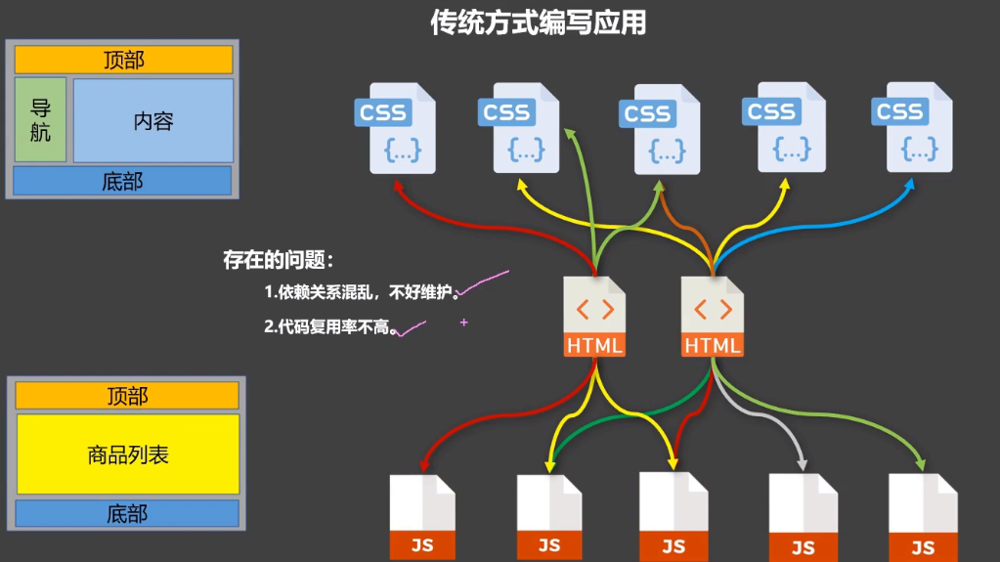

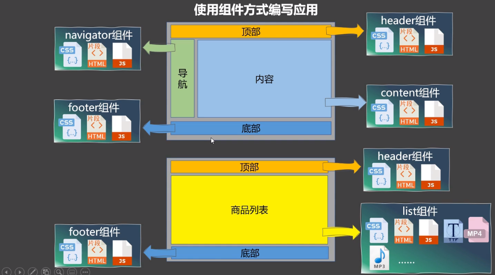

***组件：实现局部（特定）功能的==代码==和==资源==的==集合==***

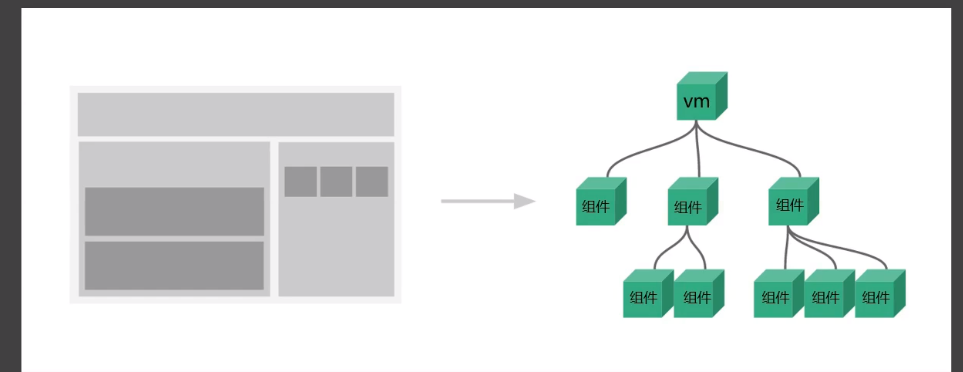

## 2.1 模块化与组件

### 2.1.1 模块

将一个js，按照功能模块进行划分成多个js文件，每个js文件就叫一个模块。

作用: 复用 js, 简化 js 的编写, 提高 js 运行效率

### 2.1.2 组件

实现局部（特定）功能的代码和资源的集合

作用: 复用编码, 简化项目编码, 提高运行效率

### 2.1.3 模块化

当应用中的 js 都以模块来编写的, 那这个应用就是一个模块化的应用。

### 2.1.4 组件化

当应用中的功能都是多组件的方式来编写的, 那这个应用就是一个组件化的应用。

## 2.2 非单文件组件

### 2.2.1 非单文件组件使用

一个文件里面包含很多组件

***Vue中使用组件步骤：***

+ *通过Vue.extend创建组件*

  > ==*data必须是一个函数*==

+ *vue中配置components注册组件 【分为全局/局部注册】*

+ *通过组件标签，使用组件【如果你的组件名为person 则`<perosn></person>`使用】*

**代码实例：**

```html
<body>
    <div id="root">
        <!--组件标签，只能使用全局组件和注册到root上的组件 -->
        <person></person>
        <hr>
        <hometown></hometown>
        <hr>
        <hello></hello>
    </div>
    <script>
        /**
         * vue中使用组件：
         *  1.通过Vue.extend创建组件
         *  2.vue中配置components注册组件
         *  3.通过组件标签，使用组件【如果你的组件名为person 则<perosn></person>使用】
         * 
         **/ 
        //创建 person组件  【组件是包含代码和资源的】
        const person = Vue.extend({
            //el:'#root'//组件可被任意文件引用，所以不需要有挂载点
            template:`
                <div>
                    <h2>姓名：{{name}} </h2> 
                    <h2>年龄：{{age}} </h2>
                </div>
            `,
            //data必须为函数，且返回一个data对象。
            //必须为函数这是因为如果和vue一样是一个对象，那么被其他文件引用时其实共享的是同一个地址，修改一下值，则都会发生变化
            data(){
                return {
                    name: '张三',
                    age: 18
                }
            }
        })
        //创建 hometown组件
        const hometown = Vue.extend({
            template:`
                <div>
                    <h2>城市：{{city}} </h2> 
                    <h2>国家：{{nation}} </h2>
                </div>
            `,
            data(){
                return {
                    city: '上海',
                    nation: '上海'
                }
            }
        })

        //全局注册组件
        const hello = Vue.extend({
            template: `
                <div>
                    <h2>你好</h2>
                </div>
            `
        })
        //参数1：组件名  参数2：hello组件
        Vue.component('hello',hello);

        const vm = new Vue({
            el:"#root",
            //注册组件（局部注册）
            components:{
                //key为组件名，value为创建的组件id 省略就是id默认为组件名
                person,
                hometown,
            }
        })
    </script>
</body>
```

### 2.2.2 组件使用注意事项

#### 2.2.2.1 组件名

**单个单词：**

+ `school`
+ 推荐`School`

**多个单词：**

+ `my-school`
+ 推荐`MySchool` 【但是必须在脚手架搭建的项目才能用】

**注意：**

+ 组件名尽量避免和HTML中的元素名称（大写的也不行）。如`h2`，`H2`

+ 使用`name`属性可以指定vue开发者工具中该组件的名字，**实际用还是注册的那个**

  ```javascript
  const hello = Vue.extend({
      name:'vueTool-hello',
      template: `
                  <div>
                      <h2>你好</h2>
                  </div>
              `
  })
  
  const vm = new Vue({
      el:"#root",
      //注册组件（局部注册）
      components:{
          //key为组件名，value为创建的组件id
          hello //实际页面用还是这个名字
      }
  })
  ```

#### 2.2.2.2 组件标签使用

+ 双标签`<hello></hello>`
+ 单标签`<hello/>` **只能用于vue脚手架环境下，不然会出现错误**

#### 2.2.2.4 组件声明的简写形式

原理底层vue在对组件进行注册时，会先判断一下组建的类型，如果只是object对象，则自动调用`Vue.extend()`

```javascript
const hello = Vue.extend({})
//简写形式 直接一个对象
const hello = {}
```

### 2.2.3 组件嵌套

组件A内部使用了组件B，组件B内部使用了组件C，..，这种层级关系就叫做组件的嵌套。

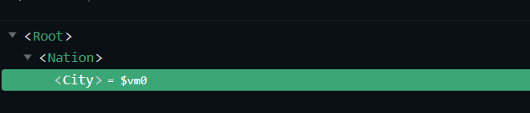

```html
<body>  
    <!-- 空的，里面内容由vm中的template决定-->
    <div id="root"> </div>
    <script>
        //子组件  必须先与父组件
        const city = Vue.extend({
            name: 'city',
            template:`
            <div>
                <h2>
                    {{captionName}}
                </h2>
            </div>
            `,
            data(){ return { captionName:'北京' } }
        });
        //父组件
        const nation = Vue.extend({
            name: 'nation',
            //子组件在父组件中的使用位置
            template:`
            <div>
                <h2>
                    {{nationName}}
                </h2>
                <city></city> 
            </div>
            `,
            data(){ return { nationName:'中国'}},
            //注册子组件，局部
            components:{ city }
        });

        const vm = new Vue({
            template:`<nation></nation>`,
            el:"#root",
            //组件注册（局部）
            components:{
                nation
            }
        })
    </script>
</body>
```

### 2.2.4 VueComponent

+ `Vue.extend(options)`我们定义组件的本质，是一个名为`VueComponent`的构造函数，且不是程序员定义的，是Vue.extend生成的

  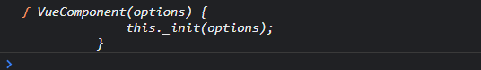

+ 我们使用组件时`<hello></hello>`，**Vue解析时会帮我们创建hello组件的实例对象**，即**Vue帮我们执行的`new VueComponent(options)`**

  > 每次创建一个组件，都调用new关键字，则从此处可以看出每个组件实例对象`VueComponent`不一样。

+ **特别注意：每次调用Vue.extend，返回的都是一个全新的VueComponent！！！！**

+ **关于this指向：**

  + `Vue.extend(options)`,组件配置options中 **`data函数`,`methods对象`,`watch中函数`,`computed中的函数`他们的this指向都是【VueComponent的实例对象】**
  + `new Vue(options)`，vue实例配置options中，**`data函数`,`methods对象`,`watch中函数`,`computed中的函数`他们的this指向都是【vue的实例对象】**
  + **vue实例对象和VueComponent的实例对象结构是完全一样的，VueComponent可以理解为小vm**

+ VueComponent的实例对象，以后简称vc（也可称之为：组件实例对象）。Vue的实例对象，以后简称vm。

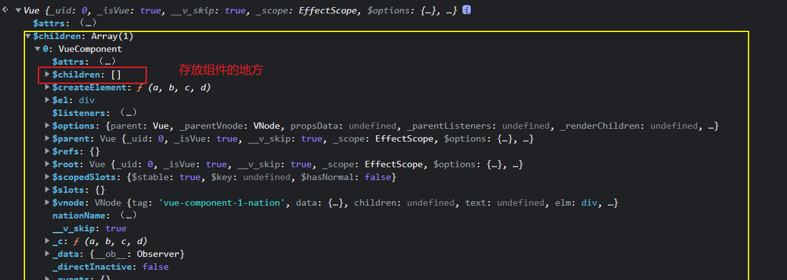

### 2.2.5 原型对象

原型对象链的自动调用

```javascript
function Demo(){
    this.a=1;
    this.b=2;
}
const d1 = new Demo();
//显式原型属性和隐式原型属性指向同一个 【原型对象】
console.log(Demo.prototype);//这个是显式原型属性
console.log(d1.__proto__);//这个是隐式原型属性

console.log(Demo.prototype === d1.__proto__);
//程序员通过显式原型属性操作原型对象，追加一个x，值为99
Demo.prototype.x = 99;
//因为是同一个原型对象，d1自身没有，会自动取__proto__上找x
console.log(d1.x);//等于d1.__proto__.x
```


### 2.3.6 ==***Vue和VueComponent的关系***==

***实例的隐式原型属性，永远指向自己缔造者的原型对象***

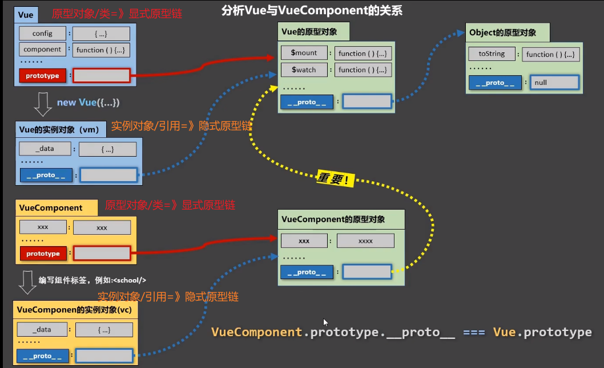

> ***注意，我们写的组件名hello，school等都是原型对象（==可以理解为类，不是实例==），dom标签中的==`<hello></hello>`==才是实例对象***

```javascript
const hello = Vue.extend(options);
hello.prototype.__proto__ === Vue.prototype === vm.__proto__
```

## 2.3 ***==单文件组件==***

一个文件里面只包含1个组件，且后缀名是vue。里面允许写以下三个标签：

+ `<template></template>` 里面用于写html内容
+ `<script></script>` 里面用于写js脚本
+ `<style></style>` 里面用于写css样式

> 注：vscode需要安装插件，用于提示代码

### 2.3.1 创建组件`School.vue`

```vue
<template>
    <div class="demo">
        <h2>学校名称：{{name}} </h2>
        <h2>学校地址：{{address}} </h2>
    </div>
</template>

<script>
    //分别暴露  Vue.extend可以省略
    export const school = Vue.extend({
        name:'School',
        data(){
            return {
                name: '蓝翔',
                address: '中国 山东'
            }
        }
    });

    /**
     * 默认暴露导入方式：
     *  import xxx from xxxx;
     * 统一或分别暴露导入方式：
     *  import {xxx} from xxxx;
     */
    //统一暴露
    //export {school};
    //默认暴露
    //export default school; 
</script>
<style>
    .demo{
        background-color: skyblue;
    }
</style>
```

### 2.3.2 创建`App.vue`

```vue
<template>
  <div>
    <School/>
  </div>
</template>

<script>
    //导入没有后缀（写不写都可以）
    import { School } from './School';
    //默认暴露，且省略Vue.extend()
    export default {
        name: 'App',
        components: {
            School
        }
    }
</script>
```

### 2.3.3 创建入口文件`main.js`

```javascript
//浏览器不直接支持es6语法
import App from './App.vue'

new Vue({
    el: "#root",
    template: `<App/>`,
    components: {
        App
    }
})
```

### 2.3.4 创建首页文件`index.html`

```html
<!DOCTYPE html>
<html lang="en">
<head>
    <meta charset="UTF-8">
    <meta http-equiv="X-UA-Compatible" content="IE=edge">
    <meta name="viewport" content="width=device-width, initial-scale=1.0">
    <title>Vue单文件组件</title>
</head>
<body>
    <div id="root">
        
    </div>
    <script src="../../lib/vue.js"></script>
    <script src="./main.js"></script>
</body>
</html>
```

### 2.3.5 运行

运行失败，提示`Uncaught SyntaxError: Cannot use import statement outside a module (at main.js:2:1)`

即：单组件需要使用vue脚手架`vue-cli`，直接运行会报错。因为浏览器不能直接运行es6语法`import`

# 3、使用Vue脚手架

## 3.1 初始化脚手架

### 3.1.1 说明

+ Vue脚手架是Vue官方提供的标准化开发工具（开发平台）
+ 最新的版本是4.x
+ 文档 https://cli.vuejs.org/zh/

### 3.1.2 使用步骤

+ 全局安装vue-cli `npm install -g @vue/cli`
+ **切换到要创建vue项目的目录，执行`vue create xxx`**
+ 启动项目 `npm run serve`(不是server)

> ***备注：***
>
> + 如果网速慢，设置淘宝镜像`npm config set registry https://registry.npm.taobao.org`
> + vue脚手架隐藏了所有webpac相关的配置，若想查看具体的webpack配置，请执行:`vue inspect > output.js`

### 3.1.3 模版项目的结构


### 3.1.4 index.html文件说明

```html
<!DOCTYPE html>
<html lang="">
  <head>
    <meta charset="utf-8">
    <!-- 针对ie浏览器的设置，告诉ie浏览器以最高级别（兼容）进行渲染 -->
    <meta http-equiv="X-UA-Compatible" content="IE=edge">
    <!-- 开启移动端的理想视口 -->
    <meta name="viewport" content="width=device-width,initial-scale=1.0">
    <!-- 网站favicon图标  <%= BASE_URL %>代表public目录（以/结尾）-->
    <link rel="icon" href="<%= BASE_URL %>favicon.ico">
    <!-- 配置网页标头 webpack获取package.json中的项目名name -->
    <title><%= htmlWebpackPlugin.options.title %></title>
  </head>
  <body>
    <!-- 当浏览器不支持js时，该标签内容会显示 -->
    <noscript>
      <strong>We're sorry but <%= htmlWebpackPlugin.options.title %> doesn't work properly without JavaScript enabled. Please enable it to continue.</strong>
    </noscript>
    <!-- 容器 -->
    <div id="app"></div>
    <!-- built files will be auto injected -->
  </body>
</html>

```

### 3.1.5 main.js解析之render()

```javascript
/**
 * mauin.js为vue项目的入口文件
 */
//导入Vue
import Vue from 'vue'
//导入App组件，是所有组件的父组件
import App from './App.vue'
//关闭vue生产提示
Vue.config.productionTip = false

//创建Vue实例对象
new Vue({
  //将App组件放入root容器中
  render: h => h(App),
}).$mount('#app')
```

#### 3.1.5.1 使用模版`template`配置项

+ 使用`template`配置项

  ```javascript
  import Vue from 'vue'
  new Vue({
    template:'<h1>你好</h1>'
    //render: h => h(App),
  }).$mount('#app')
  ```

+ 运行，发现报错

  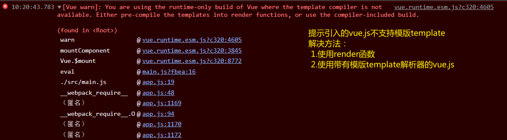

+ 找到导入的vue,在`node_modules/vue`文件夹中

+ 查看vue的配置文件`package.json`的`main`配置项

  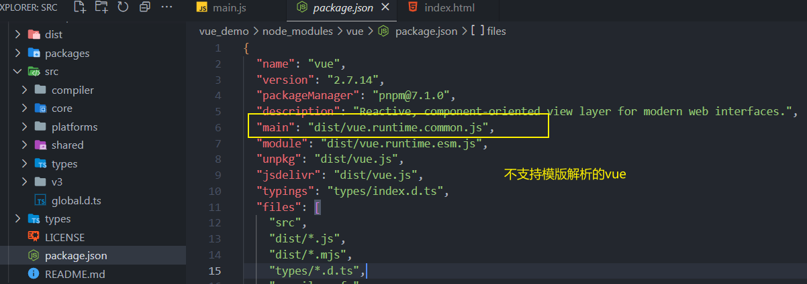

+ **解决方法1：在main.js中将vue更改为完整的vue.js**

  ```javascript
  //原理是 import Vue from 'vue'
  import Vue from 'vue/dist/vue'
  
  new Vue({
    template:'<h1>你好</h1>'
    //render: h => h(App),
  }).$mount('#app')
  
  ```

  成功解决

+ **解决方法2：使用render函数**

  ```javascript
  new Vue({
    render(createElement){
      console.log(createElement);
      /***
       * createElement是一个函数，用于创建页面元素
       * 参数可以是组件，html元素
       */
      //render必须有返回值,且是创建的元素
      return createElement('h1','你好');
    }
    //render: h => h(App), //简写形式
  }).$mount('#app')
  ```

#### 3.1.5.2 不同版本的vue

+ `vue.common.xxx.js`是CommonJS语法
+ `vue.esm.xxx.js`是EScript语法，m代表modules
+ `vue.js`是完整版的vue， （包含：核心功能+模版解析器）
+ `vue.runtime.esm/commom.js`是运行时的vue，（只包含：核心功能）

> 因为`vue.runtime.commom.js`没有模版解析器，所以不能用template配置项，需要使用render函数接受到`createElement`去创建html内容

### 3.1.6 修改vue-cli的全局配置

```shell
# 用于查看vue的webpack的配置
vue inspect > vue.config.webpack.json
```

比如想要修改入口文件名为`index.js`

配置参考指令：https://cli.vuejs.org/zh/config/

**示例：**

```javascript
//vue.config.js文件 和src目录平级
const { defineConfig } = require('@vue/cli-service')
module.exports = defineConfig({
  transpileDependencies: true,
  pages: {
    index: {
      //重置入门文件
      entry: 'index.js'
    }
  },
  //关掉js语法检查
  lintOnSave:false
})
```

## 3.2 ref与props属性

### 3.2.1 ==*ref标签属性*==

类似于与dom标签中原生的`id`属性，都是用来定位元素的。

+ ref被用来给元素或**子组件**注册引用信息（id的替代者）
+ ref应用在html标签上获取的是真实DOM元素，应用在**组件标签**上是组件实例对象vc（理解为java类的实例）

```javascript
//dom定位元素
document.getElementById(xx)
//this 是当前组件的VueComponent（显示原型链条） 用于在组件中代替原生dom操作扎到元素
console.log(this.$refs.stu);
```

***注意：***

+ ref用在html标签上，和id属性完全一样，**获取的是标签元素**

  ```html
      <h1 v-text="msg" ref="title" id='title'></h1>
  ```

+ **ref用在组件上，则ref获取到的是组件的实例对象vc（隐式原型链条），而id获取到的是整个组件html的标签元素(==主要用于组件间通信==)**

  ```html
  <School ref="stu" id='stu'/>
  ```

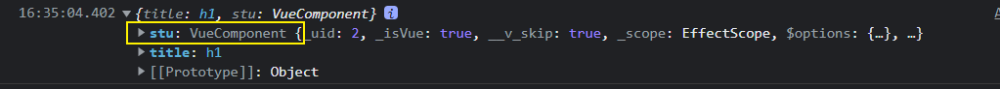

### 3.2.2 ==*props属性*==

用于***父组件向子组件传递属性***。子组件的数据由父组件在组件标签中，声明传递。

#### 3.2.2.1 简单使用props

+ 子组件

  ```vue
  <template>
    <div>
      <h1 v-text="msg"></h1>
        <!-- age name sex被挂载到当前组件的的实例 可以用this.name获取到-->
      <h4>学生姓名：{{name}} </h4>
      <h4>学生性别：{{sex}} </h4>
      <h4>学生年龄：{{age}} </h4>
    </div>
  </template>
  
  <script>
  export default {
      name:'Student',
      data(){
          return {
              msg:'欢迎，'
          }
      }, 
      //props的简单配置 必须加引号，因为不加引号是变量
      props: ['age','name','sex']
  }
  </script>
  ```

  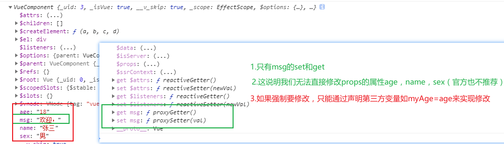

+ 父组件使用子组件

  ```vue
  <template>
      <div>
          <!-- 
  			1.所有的props属性必须通过标签属性的方式传递到子组件
  			2.父子组件 props属性中prop必须名称（变量名相同）
  			3.prop必须带引号，即key="value"
  			4.最重要的一点，这样传递的属性最后都是String类型的，如果想要传递 js表达式或数字，其他类型数据必须，使用指令v-bind(里面的就是表达式了) 简写为 :age='18',那么子组件接受到的就是Number类型的18
  		-->
          <Student name="张三" sex="男" age="18" /> <hr>
      </div>
  </template>
  ```

+ 运行，页面成功显示数据

#### 3.2.2.2 进阶使用props

+ 子组件

  ```vue
  <template>
    <div>
      <h1 v-text="msg"></h1>
      <h4>学生姓名：{{name}} </h4>
      <h4>学生性别：{{sex}} </h4>
      <h4>学生年龄：{{age}} </h4>
    </div>
  </template>
  
  <script>
  export default {
      name:'Student',
      data(){
        console.log(this);
          return {
              msg:'欢迎，'
          }
      }, 
      	//props的简单配置 props: ['age','name','sex']
      //props的进阶配置,声明变量的同时指定类型，如果传递的类型不一致，会报错
      props:{
        name:String,//指定为String类型
        sex:String,
        age:Number//指定为NUmber类型
      }
  }
  </script>
  ```

+ 父组件

  ```vue
  <template>
      <div>
          <!-- 由于子组件指定了 age为Number类型，则必须要用到v-bind指令-->
          <Student name="张三" sex="男" :age="18"/> <hr>
      </div>
  </template>
  ```

+ 成功运行

#### 3.2.2.3 高级使用props

+ 子组件

  ```vue
  <template>
    <div>
      <h1 v-text="msg"></h1>
      <h4>学生姓名：{{name}} </h4>
      <h4>学生性别：{{sex}} </h4>
      <h4>学生年龄：{{age}} </h4>
    </div>
  </template>
  
  <script>
  export default {
      name:'Student',
      data(){
        console.log(this);
          return {
              msg:'欢迎，'
          }
      },
      //props的高级配置
      props:{
          //prop属性 
        name:{
          type: String, //类型 String
          required: true,//必须
        },
        sex:{
          type: String,
          required: true,
        },
        age: {
          type: Number,
          default: 22 //不必须 默认为值
        }
      }
  }
  </script>
  ```

+ 父组件

  ```vue
  <template>
      <div>
          <Student name="张三" sex="男" /> <hr>
      </div>
  </template>
  ```

+ 成功运行

> 备注：props是只读的，Vue底层会监测你对props的修改，如果进行了修改，就会发出警告，若业务需求确实需要修改，那么请复制props的内容到data中一份，然后去修改data中的数据。

#### 3.2.2.4 怎么传递Object对象？？

+ 将对象转化为json字符串，然后子组件中声明其为对象

  - 父组件

    ```vue
    // props使用
    <template>
        <div>
            <Student name="张三" sex="男" :object="object" :json="{'value':'i am  props object value by json string','text':'...'}" /> <hr>
        </div>
    </template>
    
    ```

  - 子组件

    ```vue
    // props使用
    <template>
      <div>
        <h4>object:{{object}}</h4>
        <h4>object.value:{{object.value}}</h4>
        <br>
        <h4>json:{{json}}</h4>
        <h4>json.value:{{json.value}}</h4>
      </div>
    </template>
    
    <script>
    export default {
        name:'Student',
        props:{
          object: {
            type: Object
          },
          json: {
            type: Object
          }
        }
    }
    </script>
    ```

  - 运行结果

    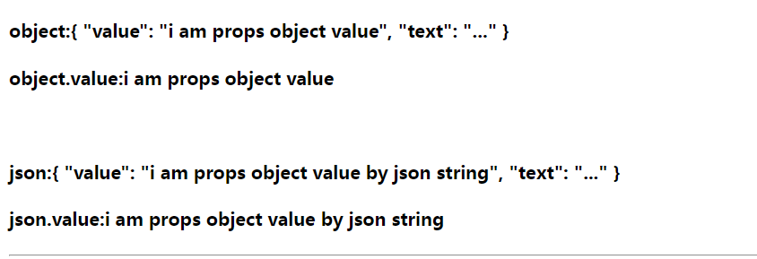

+ 父组件通过data直接将对象传递过去，子组件中声明其为对象

  - 父组件

    ```vue
    <template>
        <div>
            <Student name="张三" sex="男" :object="object"/> <hr>
        </div>
    </template>
        
    <script>
        import Student from './components/Student.vue'
        export default {
            name: 'App',
            data(){
                return {
                    object:{
                        value: "i am  props object value",
                        text: "..."
                    }
                }
            },
            components: {Student}
        }
    </script>
    ```

  - 子组件

    ```vue
    <template>
      <div>
        <h4>学生年龄：{{age}} </h4>
        <br>
        <h4>object:{{object}}</h4>
        <h4>object.value:{{object.value}}</h4>
      </div>
    </template>
    
    <script>
    export default {
        name:'Student',
        props:{
          age: {
            type: Number,
            default: 22
          },
          object: {
            type: Object //指定prop属性为Object
          }
        }
    }
    </script>
    ```

  - 运行结果

    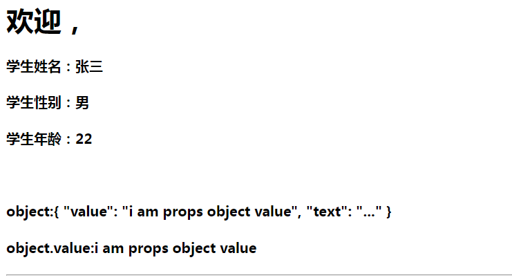


## 3.3 混入(Mixin)

### 3.3.1 引入

​	如多个组件具有相同的methods函数（或其余配置如组件等），则可以将其相同函数抽出来放在额外的配置文件中（如mixin.js），然后引用。这个过程就叫做混入。

### 3.3.2 *数据冲突*

+ 对于==***methods，data数据***==当前组件中没有，混合mixin文件中有的，以mixin文件为准。
+ 对于==***methods，data数据***==当前组件中有，混合mixin文件中也有的，以当前组件的配置为准（忽略mixin）。
+ 对于==***vue周期函数如：mounted***==，则是叠加。如果都有则都会执行，不会只执行一个。**对于同名周期函数：先执行mixin中的周期函数，然后才会执行自己组件中的同名周期函数**。

### 3.3.3 分类

#### 3.3.3.1 局部混合

**局部混合**：组件引入混合mixin文件并使用

**范围**：只对当前组件生效

+ 定义混入文件如`mixin.js`，编写公共配置

  ```javascript
  //mixin使用 分别暴露方式
  export const mixin = {
      //这里可以写vc中的methods，data,mounted等(vc中可以写的配置，这里都可以)
      methods: {
          showAlert(){
              alert(this.name);
          }
      },
      //一挂载好就执行的生命周期函数
      mounted(){
          console.log("已经挂载完成！");
      }
  }
  ```

+ 组件中引入使用

  ```vue
  // mixin使用
  <template>
    <div>
      <h1 v-text="msg"></h1>
      <h4 @click='showAlert'>学生姓名：{{name}} </h4>
    </div>
  </template>
  
  <script>
  //引入混合mixin文件
  import {mixin} from '../mixin'
  //mixin使用
  export default {
      name:'Student',
      data(){
          return {
              msg: '欢迎，',
              name: '张三'
          }
      },
      mixins:[mixin]//必须是数组
  }
  </script>
  ```

+ 测试运行

  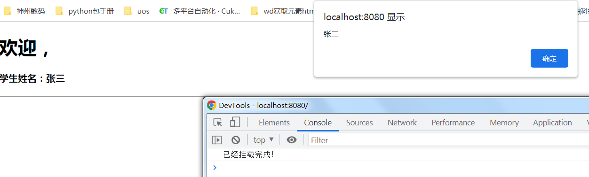

#### 3.3.3.2 全局混合

**全局混合**：入口文件`main.js`中引入并使用

**范围**：对vm和所有组件实例都有效，即`vm+所有的vc`

+ 定义混入文件如`mixin.js`，编写公共配置（和混合使用的完全一样）

+ 入口文件`main.js`引入使用

  ```javascript
  import Vue from 'vue'
  import App from './App'
  //引入mixin文件
  import {mixin} from './mixin'
  
  Vue.config.productionTip = false;
  //挂载到全局vue上
  Vue.mixin(mixin)
  
  new Vue({
      render: h => h(App)
  }).$mount('#app')
  ```

+ 测试运行

  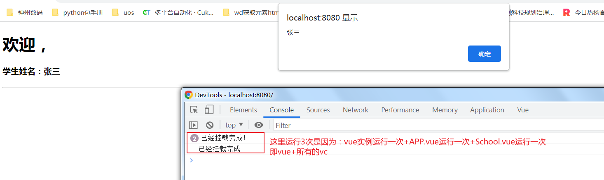

  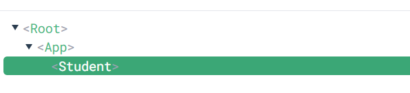

## 3.4 插件

### 3.4.1 功能

用于增强Vue，插件文件可以定义如下几种功能：

+ **定义Vue全局过滤器（vm和所有的vc都能使用）**
+ **定义Vue全局自定义指令（vm和所有的vc都能使用）**
+ **定义Vue全局混入mixin（vm和所有的vc都能使用）**
+ **向Vue原型上添加数据和函数（vm和所有的vc都能使用）**

### 3.4.2 本质

插件本质上就是包含install方法的对象，**install内部第一个参数为Vue原型（不是vm，vue传递）**，第二个以及以后的参数为开发者传递的参数。

### 3.4.3 使用

+ 定义插件文件如`plugins.js`

  ```javascript
  //插件本质上是 包含install方法的对象
  export default { //默认暴露的简写方式
      install(Vue,x,y,z){
          console.log(Vue,x,y,z);
          //1.可以定义全局的过滤器 （vm和所有的vc都能使用）
          Vue.filter('myFilter',function(value){
              return value + "~";//功能：加个~
          })
          //2.可以定义全局的自定义指令 （vm和所有的vc都能使用）
          Vue.directive('fbind',{
              //功能：实现v-bind功能并实现自动聚焦
              //指令与元素成功绑定时（一上来）
              bind(element,binding){
                  element.value=binding.value;
              },
              //指令所在的元素被插入页面时（生成dom元素时）
              inserted(element,binding){
                  element.focus();
              },
              //指令所在的模版被重新解析时
              update(element,binding){
                  element.value=binding.value;
              }    
              
          })
          //3.定义全局的混入mixin （vm和所有的vc都能使用）
          Vue.mixin({
              data(){
                  return {
                      x: 100,
                      y: 200
                  }
              }
          })
          //4.给Vue原型上添加一个方法（vm和所有的vc都能使用）
          Vue.prototype.hello=() =>{alert("你好！")}
      }   
  }
  ```

+ 入口文件`main.js`中使用`Vue.use(xxx)`

  ```javascript
  import Vue from 'vue'
  import App from './App'
  //引入插件
  import plugins from './plugins'
  
  Vue.config.productionTip = false;
  //使用插件并传递参数
  Vue.use(plugins,22,111,333)
  
  new Vue({
      render: h => h(App)
  }).$mount('#app')
  ```

+ 组件`School`使用插件定义的功能

  ```vue
  
  <template>
    <div>
      <h1 v-text="msg"></h1>
      <!-- 使用自定义过滤器 已经挂载到Vue原型上了 -->
      <h4>学生姓名：{{name|myFilter}} </h4>
        <!-- 使用自定义指令 -->
      <input type="text" v-fbind:value="name" />
      <!-- hello=this.hello这里的this就是vc -->
      <button @click="hello">hello</button>
    </div>
  </template>
  
  <script>
  
  export default {
      name:'Student',
      data(){
          return {
              msg: '欢迎，',
              name: '张三'
          }
      }
  }
  </script>
  ```

+ 测试运行

  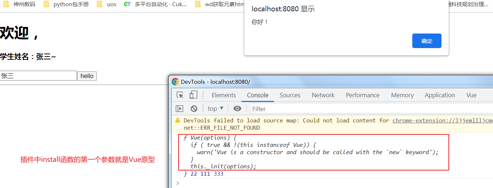

  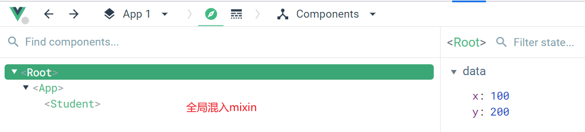

## 3.5 scoped样式

### 3.5.1 引入

在vue中的所有组件定义的样式（`<style>`标签中），最终都会汇总到`App.vue`这个最顶层的组件中。这就有可能导致**css样式冲突**，加入**scoped**（代表只在当前组件中有效）就可以解决这种情况。

### 3.5.2 css冲突

+ 定义`School.vue`组件，声明样式

  ```vue
  <style>
  .demo{
    background-color: orange;
  }
  </style>
  ```

+ 定义`Student.vue`组件，声明样式

  ```vue
  <style>
  .demo{
    background-color: blue;
  }
  </style>
  ```

+ 顶级组件`App.vue`中使用`Student.vue`和`School.vue`

  ```vue
  <template>
      <div>
          <Student class="demo" /> <hr>
      </div>
  </template>
      
  <script>
      //School组件和Student组件的样式style最终都会汇总到顶级组件中，就存在样式冲突
      //School后引入就覆盖了Student组件 demo样式
      import Student from './components/Student.vue'
      import School from './components/School.vue'
      export default {
          name: 'App',
          components: {Student}
      }
  </script>
  <style>
  
  </style>
  ```

+ 测试运行

  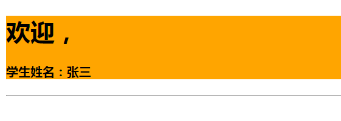

### 3.5.3 解决方法

解决组件css样式冲突方法：**在每个组件中加上`scoped`属性，表示该样式只在当前组件中使用**

```vue
<style scoped>
.demo{
  background-color: blue;
}
</style>
```

### 3.5.4 原理

每个组件的`style`打上`scoped`标签后，那么最后会被vue添加随机唯一的标签属性如：`data-v-xxxx`

+ `data-v-7ba5bd90` 代表是最外层的组件`App.vue`中`style`
+ `data-v-22321ebb` 代表是组件`Student.vue`中`style`
+ `data-v-3375b0b8` 代表是组件`School.vue`中`style`

那么如果想定位某个元素比如下面圈：

- class选择器+标签属性选择器 `.demo[data-v-22321ebb]`

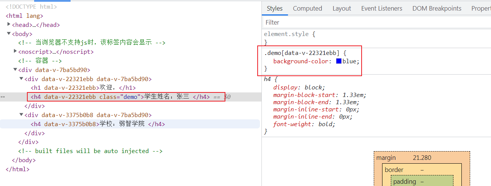

### 3.5.5 注意事项

vue中可以指定样式语法`css`或`less`

+ `css`

  ```vue
  //不加lang默认就是css  scoped表示作用域
  <style lang='css' scoped>
  .demo{
    background-color: blue;
  }
  </style>
  ```

+ `less`

  ```vue
  <style lang='less' scoped>
  .demo{
    background-color: blue;
  }
  </style>
  ```

  > 使用`less`如果出现报错`Module not found: Error: Can't resolve 'less-loader' in 'D:\0\JWork\vscode\Vue\src\vue_demo'`则表示需要安装`less-loader`插件
  >
  > 温馨提示：注意`less-loader`要兼容`vue`中`webpack`版本

### 3.5.6 顶层组件`App.vue`中`scoped`

由于所有组件中`style`最后都会汇总在`App.vue`中，所以直接在`App.vue`中声明的`style`**对子组件内及自身都有效**，如果`App.vue`中指定了`scoped`，那么其自身的`style`**只对自身有效，对子组件内无效**。

> 子组件内：就是`school.vue`中
>
> 自身：就是`App.vue`中，包括子组件的标签`<School />`

## 3.6 组件化编码流程

+ 实现静态组件

  抽取组件，使用组件实现静态页面效果

+ 展示动态数据

  - 数据的类型，名称是什么？
  - 数据保存在哪个组件？

+ 交互-从绑定事件监听开始

## 3.7 Todo-list项目

### 3.7.1 分析

将项目拆分为如下5个组件：

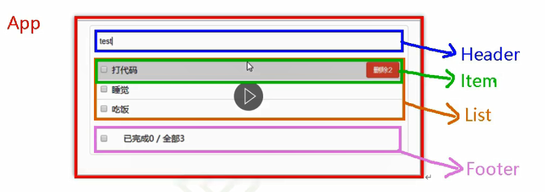

### 3.7.2 实现静态组件

见代码

### 3.7.3 展示动态数据

> 注意：vc中`data`,`methods`,`props`,`computed`这些中的名字一定不能重复，否则会报错

#### 3.7.3.1 数据的类型，名称是什么？

+ 数据类型：事件Item用**数组+对象**的类型存储
+ 名称： todos

#### 3.7.3.2 数据保存在哪个组件？

+ 一个组件在用：**放在自身**
+ 一些组件在用：**放他他们的父组件**（如这次是`App.vue`，即状态提升）

在哪里展示，就放到哪里是`TodoList.vue`。但是由于没有学习到组件间通信，所以将数据保存在`App.vue`。

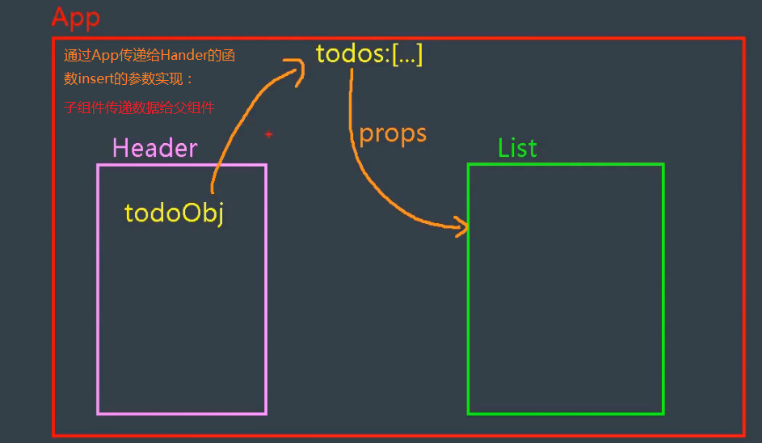


### 3.7.4 实现交互

见代码

### 3.7.5 注意事项

+ `props`属性适用于：
  - 父组件 ==> 子组件 通信
  - 子组件 ==> 父组件 通信（需要父先给子一个函数）
+ 使用`v-model`时要切记：`v-model`绑定的值不能是`props`传递过来的，因为**`props`的值是不允许修改**的！
+ 若`props`传递过来的值是**对象类型（引用类型）**的值，修改对象中的属性时Vue不会报错，但是不推荐这样做！


## 3.8 浏览器本地存储`webStorage`

+ 存储大小一般支持5M左右（不同浏览器会不一样）
+ 以**键值对**方式存储，且**均是字符串类型**（其余类型需要自己转换成字符串）

### 3.8.1 `localStorage`

是在`window`身上的，即可以简写：`window.localStorage=localStorage`

#### 3.8.1.1 API

+ `localStorage.setItem(key,value)`存储一个数据
+ `localStorage.getItem(key)`读取一个数据
+ `localStorage.removeItem(key)`删除一个数据
+ `localStorage.clear()`清空当前域名下所有`localStorage`数据

#### 3.8.1.2 生命周期

默认是没有生命周期的

+ 可以存储附加信息来设置生命周期
+ 清除所有数据`ctrl+alt+del`

#### 3.8.1.3 示例

```html
<!DOCTYPE html>
<html lang="en">
<head>
    <meta charset="UTF-8">
    <meta http-equiv="X-UA-Compatible" content="IE=edge">
    <meta name="viewport" content="width=device-width, initial-scale=1.0">
    <title>LocalStorage</title>
</head>
<body>
    <h2>LocalStage演示</h2>
    <button onclick="saveData()">存储数据</button>
    <button onclick="readData()">读取数据</button>
    <button onclick="deleteData()">删除一个数据</button>
    <button onclick="clearData()">清空数据</button>
    <script>
        function saveData(){
            // window.localStorage 可以简写为 localStorage
            var person = {name:"张三",age:18};
            localStorage.setItem('test','hello!');
            // 只能存储字符串
            localStorage.setItem("zs",JSON.stringify(person));
        }
        function readData(){
            console.log(localStorage.getItem("test"));
            // 读取不存在的返回null而不是undefined
            console.log(localStorage.getItem("hello"));
            var obj=localStorage.getItem("zs");
            console.log(JSON.parse(obj));
        }
        function deleteData(){
            localStorage.removeItem("test");
        }
        function clearData(){
            localStorage.clear();
        }
    </script>
</body>
</html>
```

### 3.8.2 `sessionStorage`

是在`window`身上的，即可以简写：`window.sessionStorage=sessionStorage`

#### 3.8.2.1 API

+ `sessionStorage.setItem(key,value)`存储一个数据
+ `sessionStorage.getItem(key)`读取一个数据
+ `sessionStorage.removeItem(key)`删除一个数据
+ `sessionStorage.clear()`清空当前域名下所有`sessionStorage`数据

#### 3.8.2.2 生命周期

默认是当前会话（当前标签页）

+ 可以存储附加信息来设置生命周期
+ 关闭当前浏览器会话窗口（标签页），直接关闭浏览器没用
+ 清除所有数据`ctrl+alt+del`

> 1. 页面会话在浏览器打开期间一直保持，**并且重新加载或恢复页面仍会保持原来的页面会话（即直接关闭浏览器，再打开就是恢复页面即依然存在）**。
> 2. 在新标签或窗口打开一个页面时会复制顶级浏览会话的上下文作为新会话的上下文，这点和 session cookies 的运行方式不同（**即如果是从一个页面打开一个新的窗口或者一个新的 tab 页`<a href="./demo2.html" target="_blank" >跳转到页面  2</a>`，那么这个页面会复制一个顶级窗口的 sessionStorage。**）。
> 3. 打开多个相同的URL的Tabs页面，会创建各自的sessionStorage。
> 4. 关闭对应浏览器tab，会清除对应的sessionStorage。

#### 3.8.2.3 示例

```html
<!DOCTYPE html>
<html lang="en">
<head>
    <meta charset="UTF-8">
    <meta http-equiv="X-UA-Compatible" content="IE=edge">
    <meta name="viewport" content="width=device-width, initial-scale=1.0">
    <title>sessionStorage</title>
</head>
<body>
    <h2>sessionStorage演示</h2>
    <button onclick="saveData()">存储数据</button>
    <button onclick="readData()">读取数据</button>
    <button onclick="deleteData()">删除一个数据</button>
    <button onclick="clearData()">清空数据</button>
    <script>
        function saveData(){
            // window.sessionStorage 可以简写为 sessionStorage
            var person = {name:"张三",age:18};
            sessionStorage.setItem('test','hello!');
            // 只能存储字符串
            sessionStorage.setItem("zs",JSON.stringify(person));
        }
        function readData(){
            console.log(sessionStorage.getItem("test"));
            // 读取不存在的返回null而不是undefined
            console.log(sessionStorage.getItem("hello"));
            var obj=sessionStorage.getItem("zs");
            console.log(JSON.parse(obj));
        }
        function deleteData(){
            sessionStorage.removeItem("test");
        }
        function clearData(){
            sessionStorage.clear();
        }
    </script>
</body>
</html>
```


## 3.9 ==***组件自定义事件***==

**组件自定义事件**是一种组件间通信的方式，适用于：**<font color='red'>子组件==>父组件</font>**。如：A是父组件，B是子组件，**B想给A传递数据，那么就要在A中给B绑定自定义事件**（<font color='red'>事件的回调在A中</font>）。

类似`props`属性

### 3.9.0 注意事项

+ 给谁(组件实例vc)绑定的事件，就用谁（那个vc）**触发`$emit`、解绑`$off`**这个自定义事件

+ `$emit(eventName,...data)`表示触发事件

+ `$on(eventName,func)`和`$once(eventNsme,func)`表示给事件绑定回调函数，触发了就调用，`$once`表示只触发一次

+ 组件标签上也可以绑定原生dom事件，使用`native`修饰符即

  ```vue
  <template>
  	<div>
          <!-- 
  				ref方式绑定事件
  				@即v-bind常规绑定事件
  				
  				@click.native原生的dom事件
  			-->
          <School ref="school" @secondEvent="demo" @click.native="show"/>
      </div>
  </template>
  ```

+ 在`mounted()`中通过`this.$refs.xxx.$on('事件名',回调函数)`绑定自定义事件时,回调函数**要么配置在`methods`中，要么用箭头函数**否则会出现`this`指向问题。

### 3.9.1 ==***绑定***==组件自定义事件

#### 3.9.1.1 常规绑定

+ **父组件绑定事件**

  ```vue
  <template>
      <div class="demo1">
          <!-- 1.借助props属性实现子组件给父组件传递信息-->
          <Student :receiveStudentName="receiveStudentName" />
  
          <!-- 2.借助自定义组件实现子组件给父组件传递信息
                      这样就是父组件将自定义事件绑定给子组件的实例(即vc)
                  第一种方法：标准写法
                  v-on:sendToUp=""简写 @sendToUp=""
              -->
          <School v-on:sendToUp.once="receiveSchoolName"/>
      </div>
  </template>
  <script>
      import School from './components/School.vue'
      export default {
          name: 'App',
          components: {School},
          methods:{
              //...args是es6语法 表示args数组接受其余参数
              receiveSchoolName(name,..args){
                  console.log("接收到学院名：",name);
              }
          }
      }
  </script>
  ```

+ **子组件触发事件**

  ```vue
  <template>
    <div class="demo">
      <h4>学校：{{name}} </h4>
      <!-- 自定义事件绑定到子组件实例上(即vc) -->
      <button @click="sendSchoolNameToApp">点我给App传递学院名</button>
    </div>
  </template>
  
  <script>
  
  export default {
      name:'School',
      data(){
          return {
              name: '弱智学院'
          }
      },
      methods:{
        sendSchoolNameToApp(){
          // this.$emit(自定义事件名,data1,data2,..) 这是触发事件动作
          this.$emit('sendToUp',this.name);
          // this.$emit('secondEvent');
          // this.$emit('click');
        }
      }
  }
  </script>
  ```

#### 3.9.1.2 `ref` + `mounted()`方式绑定

`ref`用于定位vc，`mounted()`用于确定在什么时机绑定事件

+ **父组件绑定事件**

  ```vue
  <template>
      <div class="demo1">
          <!-- .native表示dom原生事件-->
          <School ref="school" @click.native="show"/>
      </div>
  </template>
  <script>
      import School from './components/School.vue'
      export default {
          name: 'App',
          components: {School},
          methods:{
              //...args是es6语法 表示args数组接受其余参数
              receiveSchoolName(name,..args){
                  console.log("接收到学院名：",name);
              },
              mounted(){
                  // 这里school就是标签上ref="school" 不是组件的名字 
                  // $on表示当触发xxx事件，就执行回调函数
                  //$once和$on功能一样，但是只触发一次
                  this.$refs.school.$on("sendToUp",this.receiveSchoolName);
                  // this.$refs.school.$once("sendToUp");   
          }
      }
  </script>
  ```

+ **子组件触发事件**

  ```vue
  <template>
    <div class="demo">
      <h4>学校：{{name}} </h4>
      <!-- 自定义事件绑定到子组件实例上(即vc) -->
      <button @click="sendSchoolNameToApp">点我给App传递学院名</button>
    </div>
  </template>
  
  <script>
  
  export default {
      name:'School',
      data(){
          return {
              name: '弱智学院'
          }
      },
      methods:{
        sendSchoolNameToApp(){
          // this.$emit(自定义事件名,data1,data2,..) 这是触发事件动作
          this.$emit('sendToUp',this.name);
          // this.$emit('secondEvent');
          // this.$emit('click');
        }
      }
  }
  </script>
  ```

#### 3.9.1.3 `ref` + `mounted()`方式绑定的坑

##### I this指向问题

```vue
<template>
    <div>
        <School ref="school" @secondEvent="demo"/>
    </div>
</template>
<script>
    import School from './components/School.vue'
    export default {
        name: 'App',
        components: {School},
        methods:{
            receiveSchoolName(name){
                console.log("接收到学院名：",name);
            },
            demo(){
                console.log("第二个自定义事件触发了...");
            }
        },
        mounted(){
            //1.正确的没问题 此处this指向App组件实例
            this.$refs.school.$on("sendToUp",this.receiveSchoolName);
            //2.有问题，函数内部this为调用的者vc的执行（即）School
            this.$refs.school.$on("sendToUp",function (name) {
                //此处this指向School组件实例
                 console.log("接收到学院名：",name,this);
            });
            //3.没问题，箭头函数没有this指向上级this
            
        }
    }
</script>
```

##### II 组件标签中事件与原生dom事件冲突

```vue
<template>
	<div>
        <!-- 这样写，vue会把click当作是自定义事件解析，点击标签无法触发 需要 在被绑定的vc上执行this.$emit-->
        <School ref="school" @secondEvent="demo" @click="show"/>
        <!-- 使用原生dom事件的正确绑定方法  @click.native="" native关键字表示原生的  -->
        <School @click.native="show"/>
    </div>
</template>
<script>
    import School from './components/School.vue'
    export default {
        name: 'App',
        components: {School},
        methods:{
            receiveSchoolName(name){
                console.log("接收到学院名：",name);
            },
            demo(){
                console.log("第二个自定义事件触发了...");
            },
            show(){
                alert(123);
            }
        },
        mounted(){
            // this.$refs.school.$on("sendToUp",this.receiveSchoolName);
            // this.$refs.school.$on("sendToUp",function (name) {
            //      console.log("接收到学院名：",name,this);
            // });
            this.$refs.school.$on("sendToUp",(name)=>{
                console.log("接收到学院名：",name,this);
            });

        }
    }
</script>
```

### 3.9.2 ==***解绑***==组件自定义事件

+ **父组件绑定事件**

  ```vue
  <template>
      <div class="demo1">
          <School ref="school" @secondEvent="demo" @click.native="show"/>
      </div>
  </template>
  <script>
      import School from './components/School.vue'
      export default {
          name: 'App',
          components: {School},
          methods:{
              //  ...args是es6语法 表示args数组接受其余参数
              receiveSchoolName(name,...args){
                  console.log("接收到学院名：",name);
              },
              demo(){
                  console.log("第二个自定义事件触发了...");
              },
              show(){
                  alert(123);
              }
          },
          mounted(){
              // this.$refs.school.$on("sendToUp",this.receiveSchoolName);
              // this.$refs.school.$on("sendToUp",function (name) {
              //      console.log("接收到学院名：",name,this);
              // });
              this.$refs.school.$on("sendToUp",(name)=>{
                  console.log("接收到学院名：",name,this);
              });
  
          }
      }
  </script>
  ```

+ **子组件解绑事件`$off`**

  ```vue
  <template>
    <div class="demo">
      <h4>学校：{{name}} </h4>
      <!-- 自定义事件绑定到子组件实例上(即vc) -->
      <button @click="sendSchoolNameToApp">点我给App传递学院名</button>
        <!-- 解绑-->
      <button @click="unbindSchool">点我解绑School的自定义事件</button>
    </div>
  </template>
  
  <script>
  export default {
      name:'School',
      data(){
          return {
              name: '弱智学院'
          }
      },
      methods:{
        sendSchoolNameToApp(){
          // this.$emit(自定义事件名,data1,data2,..) 这是触发事件动作
          this.$emit('sendToUp',this.name);
          this.$emit('secondEvent');
          // this.$emit('click');
        },
        unbindSchool(){
          // $off解绑
           this.$off('sendToUp');//解绑一个自定义事件，即secondEvent事件还是会被触发
          // this.$off(['sendToUp','secondEvent']);//解绑多个自定义事件 数组
          //this.$off();//解绑当前组件的所有自定义事件
        }
      }
  }
  </script>
  ```

+ 

## 3.7 全局事件总线

## 3.8 消息订阅与发布

## 3.9 过度与动画


# 4、Vue中的ajax


# 5、Vuex


# 6、Vue-router

# 7、Vue UI组件库


